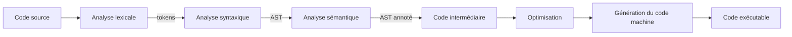
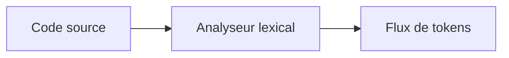
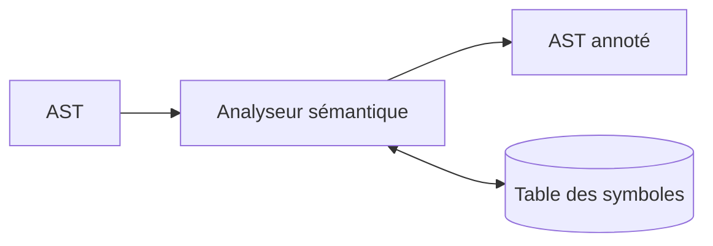
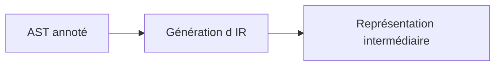
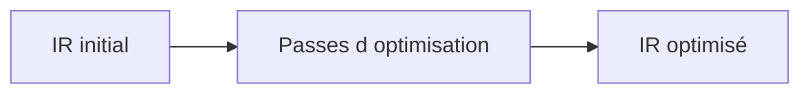
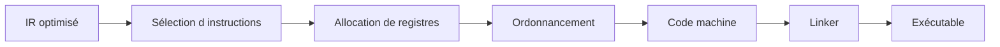
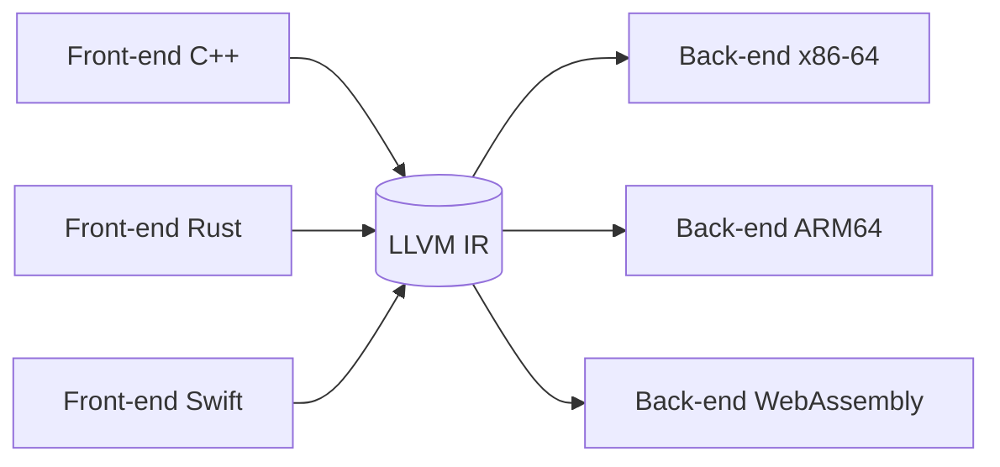

# [Tansoftware](https://www.tansoftware.com) - Fonctionnement d'un compilateur [](README.md)

[](LICENSE) [](#) [](#)

## Table des matières

- [Introduction](#introduction)
- [Vue d'ensemble du pipeline](#vue-densemble-du-pipeline)
- [Analyse lexicale](#analyse-lexicale)
- [Analyse syntaxique](#analyse-syntaxique)
- [Analyse sémantique](#analyse-sémantique)
- [Génération de code intermédiaire](#génération-de-code-intermédiaire)
- [Optimisation du code](#optimisation-du-code)
- [Génération du code machine](#génération-du-code-machine)
- [Les compilateurs modernes](#les-compilateurs-modernes)
- [Pour aller plus loin](#pour-aller-plus-loin)

## Introduction

Un compilateur est un programme qui traduit un texte écrit dans un *langage source* (un langage de programmation) vers un *langage cible*, le plus souvent du code machine exécutable, mais parfois un autre langage source (transpilation), du *bytecode* d'une machine virtuelle, ou une représentation intermédiaire.

Le pipeline classique suit une succession d'étapes que l'on regroupe en deux familles :

- le **front-end** comprend le code source (analyses lexicale, syntaxique, sémantique) ;
- le **back-end** produit du code optimisé pour une cible matérielle donnée.

Entre les deux, une *représentation intermédiaire* (IR) découple les deux familles : un même front-end peut viser plusieurs cibles, et un même back-end peut accepter plusieurs langages source. C'est l'architecture de [LLVM](https://llvm.org/) et de [GCC](https://gcc.gnu.org/).

[🔝 Retour en haut de page](#table-des-matières)

## Vue d'ensemble du pipeline



À chaque étape, le compilateur peut détecter des erreurs et arrêter la compilation : caractère illégal au lexer, structure incorrecte au parser, type incompatible au vérificateur sémantique, et ainsi de suite.

[🔝 Retour en haut de page](#table-des-matières)

## Analyse lexicale

L'analyse lexicale (*lexing* ou *scanning*) découpe le flux de caractères du code source en une suite de **tokens** (lexèmes typés). Chaque token est une paire `(type, valeur)` : `(IDENT, "ma_variable")`, `(NOMBRE, 42)`, `(MOT_CLE, "if")`, `(SYMBOLE, "+")`.

### Exemple

Pour l'expression source `int x = 42;`, le lexer produit :

```text
(KEYWORD, "int")  (IDENT, "x")  (OP, "=")  (NUMBER, 42)  (PUNCT, ";")
```

### Étapes

1. **Lecture caractère par caractère** du flux source.
2. **Reconnaissance des lexèmes** à l'aide d'expressions régulières ou d'un automate fini.
3. **Classification** : à chaque lexème reconnu, on associe un type de token.
4. **Émission** : le lexer renvoie une séquence de tokens au parser, généralement à la demande (interface itérateur).

Les outils classiques (`lex`, `flex`, `re2c`) génèrent ce code à partir d'une grammaire régulière.



[🔝 Retour en haut de page](#table-des-matières)

## Analyse syntaxique

L'analyse syntaxique (*parsing*) consomme le flux de tokens et construit un **arbre syntaxique abstrait** (AST) qui représente la structure du programme selon la grammaire du langage. Si la séquence de tokens ne respecte pas la grammaire, le parser émet une erreur de syntaxe.

### Exemple

Pour `2 + 3 * 4`, l'AST respecte les priorités d'opérateurs :

```text
       (+)
      /   \
    (2)    (*)
          /   \
        (3)   (4)
```

### Familles d'analyseurs

| Famille | Caractéristique |
|---------|-----------------|
| LL(*k*), récursif descendant | Lecture de gauche à droite, dérivation gauche, *k* tokens d'anticipation. Simple à écrire à la main. |
| LR(*k*), LALR(1) | Plus puissants, générés par des outils (`yacc`, `bison`, `menhir`). |
| PEG | *Parsing Expression Grammars* ; pas d'ambiguïté grammaticale par construction. |
| Pratt parser | Combine récursif descendant et précédence d'opérateurs ; populaire dans les langages dynamiques. |


[🔝 Retour en haut de page](#table-des-matières)

## Analyse sémantique

L'analyse sémantique vérifie ce que la grammaire ne peut exprimer : portée des identifiants, compatibilité des types, déclarations préalables, signatures de fonctions, contrôle d'accès. Elle consomme l'AST et produit un **AST annoté** (chaque nœud porte son type, sa portée, ses références résolues).

### Vérifications typiques

- chaque identifiant utilisé est-il déclaré dans une portée visible ?
- l'expression `x + y` est-elle bien définie pour les types de `x` et `y` ?
- la fonction appelée existe-t-elle ? avec la bonne arité et les bons types ?
- les contrôles d'accès (`private`, `protected`) sont-ils respectés ?

### Table des symboles

L'analyseur sémantique s'appuie sur une **table des symboles** structurée par portée (souvent une pile de tables, une par bloc). Elle associe à chaque identifiant ses métadonnées : type, position de déclaration, mutabilité, visibilité.



[🔝 Retour en haut de page](#table-des-matières)

## Génération de code intermédiaire

L'AST annoté est traduit en une **représentation intermédiaire** (IR) plus simple, indépendante du langage source et de la machine cible. Les IR usuelles :

- **Three-Address Code** (TAC) : `t1 = a + b; t2 = t1 * c;`
- **Static Single Assignment** (SSA) : chaque variable n'est affectée qu'une seule fois ; les fusions de chemins utilisent des fonctions φ. Forme privilégiée pour l'optimisation.
- **LLVM IR**, **bytecode JVM**, **WebAssembly** : IR portables, parfois publiées comme cibles à part entière.

### Pourquoi une IR ?

- découplage front-end / back-end (*N* langages × *M* cibles → *N + M* implémentations au lieu de *N × M*) ;
- abstraction propice aux optimisations (analyse de flot de données, propagation de constantes) ;
- portabilité.



[🔝 Retour en haut de page](#table-des-matières)

## Optimisation du code

L'optimisation transforme l'IR pour réduire le temps d'exécution, l'empreinte mémoire ou la taille du binaire, **sans changer le comportement observable** du programme.

### Optimisations courantes

| Optimisation | Effet |
|--------------|-------|
| Propagation de constantes | Remplace `x = 2; y = x + 3;` par `y = 5`. |
| Élimination de code mort | Supprime les calculs dont le résultat n'est pas utilisé. |
| Élimination de sous-expressions communes | Calcule `a + b` une seule fois si la valeur ne change pas. |
| Inlining | Remplace l'appel par le corps de la fonction (voir plus bas). |
| Déroulage de boucle | Réduit le coût des tests de boucle au prix d'une taille de code accrue. |
| Vectorisation (SIMD) | Effectue plusieurs opérations scalaires en une seule instruction. |
| LICM (*Loop-Invariant Code Motion*) | Sort les calculs invariants du corps de la boucle. |
| Allocation de registres | Affecte les variables vivantes à des registres physiques. |

Une optimisation est **valide** si elle préserve la sémantique du langage. Les optimisations agressives reposent sur les propriétés du langage source (ex. : pas d'aliasing en Rust, *strict aliasing* en C).



[🔝 Retour en haut de page](#table-des-matières)

## Génération du code machine

Le back-end traduit l'IR optimisée en instructions de la cible (x86-64, ARM, RISC-V, WebAssembly, etc.).

### Étapes

1. **Sélection d'instructions** : à chaque opération de l'IR, choisir l'instruction machine qui l'implémente.
2. **Allocation de registres** : décider quelles variables vivent en registre, lesquelles sont *spillées* en pile.
3. **Ordonnancement** : ordonner les instructions pour exploiter le pipeline du processeur, masquer les latences mémoire.
4. **Émission** : produire un fichier objet (`.o`), puis l'éditeur de liens (*linker*) résout les symboles externes pour produire l'exécutable.



[🔝 Retour en haut de page](#table-des-matières)

## Les compilateurs modernes

Les compilateurs actuels exploitent ce pipeline en y ajoutant des techniques avancées.

### Inlining

L'*inlining* remplace un appel de fonction par le corps de la fonction appelée. On évite le coût de l'appel (sauvegarde de registres, saut, retour) et on ouvre la voie à d'autres optimisations (propagation de constantes au-delà des frontières d'appel).

```c
// Avant inlining
static inline int carre(int x) { return x * x; }
int hypothenuse_carree(int a, int b) { return carre(a) + carre(b); }

// Après inlining (équivalent vu par l'optimiseur)
int hypothenuse_carree(int a, int b) { return a * a + b * b; }
```

L'inlining excessif gonfle la taille du binaire ; les compilateurs appliquent des heuristiques (taille, fréquence d'appel, profil d'exécution).

### Vectorisation

La vectorisation utilise des instructions **SIMD** (*Single Instruction, Multiple Data* : SSE, AVX, NEON) pour appliquer la même opération à plusieurs éléments en parallèle.

```c
// Boucle scalaire
for (int i = 0; i < n; i++) a[i] = b[i] + c[i];

// Vectorisée par le compilateur (SIMD AVX, 4 floats par instruction)
//   *((__m128*)(a+i)) = _mm_add_ps(*(__m128*)(b+i), *(__m128*)(c+i));
```

À ne pas confondre avec le *déroulage de boucle* (loop unrolling), qui duplique le corps de boucle sans utiliser d'instruction vectorielle.

### Parallélisation et compilation distribuée

La parallélisation au sens du compilateur reste limitée : les vrais gains de parallélisme sont souvent à la charge du programmeur ou d'extensions comme [OpenMP](https://www.openmp.org/). En revanche, la compilation **distribuée** (le code source est compilé en parallèle sur plusieurs machines) accélère les gros projets ([icecc](https://github.com/icecc/icecream), [distcc](https://www.distcc.org/)).

### Profile-Guided Optimization (PGO)

Une compilation classique ne connaît pas les fréquences d'exécution réelles. La PGO exécute d'abord un binaire instrumenté sur des données représentatives, collecte un profil, puis recompile en exploitant ce profil pour orienter inlining, ordre des branches, agencement du code.

### Compilation à la volée (JIT)

Les machines virtuelles modernes (HotSpot, V8, .NET CLR, PyPy) compilent les sections chaudes du programme **pendant** son exécution, ce qui leur donne accès au profil réel et aux types vus à l'exécution. Le compilateur Just-In-Time est donc à la fois un compilateur classique et un système d'optimisation adaptative.

### Multi-cibles

Des projets comme [LLVM](https://llvm.org/) ou [GraalVM](https://www.graalvm.org/) factorisent les optimisations au niveau de l'IR et déclinent un même front-end vers plusieurs cibles (x86-64, ARM64, WebAssembly, GPU).



[🔝 Retour en haut de page](#table-des-matières)

## Pour aller plus loin

- *Compilers: Principles, Techniques, and Tools* (le « Dragon Book ») — Aho, Lam, Sethi, Ullman
- *Engineering a Compiler* — Keith D. Cooper, Linda Torczon
- *Modern Compiler Implementation in Java/ML/C* — Andrew W. Appel
- *Crafting Interpreters* — Robert Nystrom ([disponible en ligne](https://craftinginterpreters.com/))
- [LLVM Project](https://llvm.org/) — l'infrastructure de compilation moderne
- [GCC Internals manual](https://gcc.gnu.org/onlinedocs/gccint/)
- [Stanford CS143 — Compilers (cours en ligne)](https://web.stanford.edu/class/cs143/)

## Licence

Distribué sous licence [MIT](LICENSE).

## Auteur

**Tansoftware - Tanguy Chénier** · [LinkedIn](https://www.linkedin.com/in/tanguy-chenier) · [Tan-Software](https://github.com/Tan-Software) · [Compte personnel (derniers outils)](https://github.com/tanguychenier) · [tansoftware.com](https://www.tansoftware.com)
