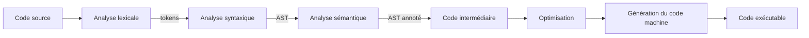
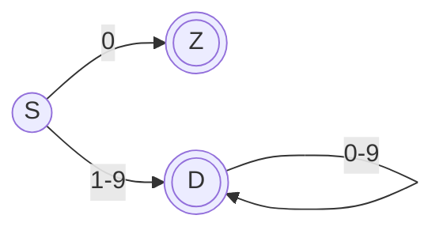
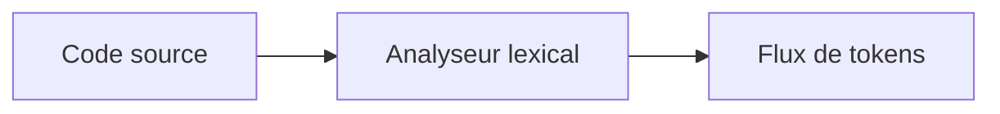
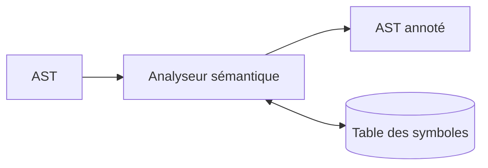
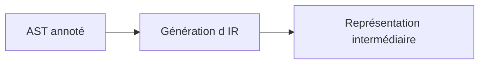
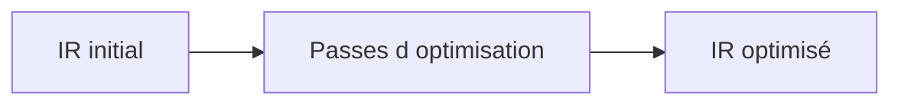
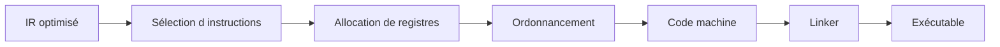
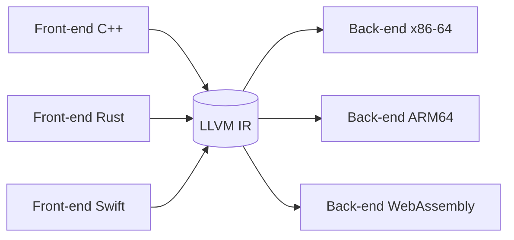

# [Tansoftware](https://www.tansoftware.com) - Fonctionnement d'un compilateur [](README.md)

[](LICENSE) [](#) [](#)

> Cours de référence en français sur le fonctionnement d'un compilateur, de la lecture du source jusqu'à l'éditeur de liens. Public visé : étudiants en informatique, développeurs curieux, ingénieurs souhaitant comprendre ce qui se passe « sous le capot » de `gcc`, `clang`, `rustc`, `javac`, `v8` ou `hotspot`.

## Table des matières

- [Introduction](#introduction)
- [Glossaire express](#glossaire-express)
- [Vue d'ensemble du pipeline](#vue-densemble-du-pipeline)
- [Analyse lexicale](#analyse-lexicale)
- [Analyse syntaxique](#analyse-syntaxique)
- [Arbre syntaxique abstrait (AST)](#arbre-syntaxique-abstrait-ast)
- [Analyse sémantique](#analyse-sémantique)
- [Génération de code intermédiaire](#génération-de-code-intermédiaire)
- [Forme SSA](#forme-ssa)
- [Optimisation du code](#optimisation-du-code)
- [Allocation de registres](#allocation-de-registres)
- [Génération du code machine](#génération-du-code-machine)
- [Éditeur de liens et chargement](#éditeur-de-liens-et-chargement)
- [Les compilateurs modernes](#les-compilateurs-modernes)
- [JIT, AOT et compilation adaptative](#jit-aot-et-compilation-adaptative)
- [Étude de cas : C → AST → 3-adresses → assembleur](#étude-de-cas--c--ast--3-adresses--assembleur)
- [Gestion de la mémoire et runtime](#gestion-de-la-mémoire-et-runtime)
- [Diagnostics et messages d'erreur](#diagnostics-et-messages-derreur)
- [Bootstrapping et confiance](#bootstrapping-et-confiance)
- [WebAssembly et générateurs de code alternatifs](#webassembly-et-générateurs-de-code-alternatifs)
- [Pour aller plus loin](#pour-aller-plus-loin)

## Introduction

Un compilateur est un programme qui traduit un texte écrit dans un *langage source* (un langage de programmation) vers un *langage cible*, le plus souvent du code machine exécutable, mais parfois un autre langage source (transpilation), du *bytecode* d'une machine virtuelle, ou une représentation intermédiaire.

Le pipeline classique suit une succession d'étapes que l'on regroupe en deux familles :

- le **front-end** comprend le code source (analyses lexicale, syntaxique, sémantique) ;
- le **back-end** produit du code optimisé pour une cible matérielle donnée.

Entre les deux, une *représentation intermédiaire* (IR) découple les deux familles : un même front-end peut viser plusieurs cibles, et un même back-end peut accepter plusieurs langages source. C'est l'architecture de [LLVM](https://llvm.org/) et de [GCC](https://gcc.gnu.org/).

Ce document est un cours, pas un recueil d'exercices. Chaque section introduit le vocabulaire essentiel, donne une définition opérationnelle, puis l'illustre par un exemple minimal. Les lecteurs avancés trouveront, en fin de section, un encart « pour creuser » renvoyant aux références canoniques (Dragon Book, Tiger Book, *Crafting Interpreters*).

[Retour en haut de page](#table-des-matières)

## Glossaire express

Un compilateur manipule un vocabulaire technique dense. Voici les définitions courtes utilisées tout au long du document. Chaque terme est repris et développé dans la section correspondante.

| Terme | Définition courte |
|-------|-------------------|
| **Lexème** | Sous-chaîne du source qui forme une unité atomique (`while`, `42`, `==`, `foo`). |
| **Token** | Lexème classé par catégorie : paire `(type, valeur)`, par exemple `(MOT_CLE, "while")`. |
| **Expression régulière (regex)** | Description compacte d'un langage régulier ; sert à spécifier les tokens. |
| **NFA** | *Nondeterministic Finite Automaton*. Automate fini où, depuis un état, plusieurs transitions peuvent porter le même symbole (ou des transitions vides ε). |
| **DFA** | *Deterministic Finite Automaton*. Automate fini déterministe : un seul état suivant possible par symbole. Forme exécutable d'un lexer. |
| **Grammaire hors contexte (CFG)** | *Context-Free Grammar*, ensemble de règles `A → α` qui définit la syntaxe du langage. **Attention : même acronyme que le graphe de flot de contrôle.** Le contexte lève l'ambiguïté : *grammaire CFG* (syntaxe) vs *graphe CFG* (flot). |
| **PEG** | *Parsing Expression Grammar* : grammaire ordonnée à choix prioritaire, sans ambiguïté par construction. |
| **Pratt parser** | Parser top-down piloté par des *binding powers* gauche/droite ; gère élégamment les opérateurs préfixes, infixes, postfixes et mixfix. |
| **LL(1)** | Parser top-down qui lit la source de gauche à droite (*Left-to-right*) et produit une dérivation gauche (*Leftmost*) avec **1** token d'anticipation. |
| **LR(1)** | Parser bottom-up *Left-to-right* + dérivation droite inverse (*Rightmost in reverse*) avec 1 token d'anticipation. |
| **LALR(1)** | *Look-Ahead LR(1)*. Variante compacte de LR(1) utilisée par `yacc`/`bison`. |
| **AST** | *Abstract Syntax Tree* : arbre représentant la structure logique du programme, débarrassé du sucre syntaxique. |
| **IR** | *Intermediate Representation* : forme intermédiaire entre source et code machine. |
| **SSA** | *Static Single Assignment* : forme d'IR dans laquelle chaque variable est affectée exactement une fois. |
| **Bloc de base** | Suite maximale d'instructions sans branchement entrant ailleurs qu'au début, ni branchement sortant ailleurs qu'à la fin. |
| **Graphe de flot de contrôle (CFG)** | *Control-Flow Graph* : graphe orienté dont les sommets sont les blocs de base et les arêtes les transferts de contrôle. **Homonyme acronymique** de la grammaire hors contexte ; dans la suite, on écrira *grammaire CFG* ou *graphe CFG* lorsque le risque de confusion existe. |
| **MIR / HIR / LIR** | Représentations intermédiaires de niveau respectivement moyen, haut et bas. Pipeline canonique : AST → HIR → MIR → LIR → assembleur. |
| **Bootstrapping** | Auto-compilation : un compilateur écrit dans son propre langage (le compilateur Rust est écrit en Rust, GCC en C/C++, ocamlopt en OCaml). |
| **Dominateur** | Dans un CFG, le nœud `D` *domine* `N` si tout chemin du point d'entrée à `N` passe par `D`. |
| **Allocation de registres** | Affectation des variables vivantes à un nombre fini de registres physiques. |
| **Peephole optimization** | Optimisation locale sur une fenêtre de quelques instructions consécutives. |
| **Convention d'appel** | Contrat sur la façon de passer arguments et résultats (registres, pile, ordre, alignement). |
| **ABI** | *Application Binary Interface* : ensemble des règles d'interopérabilité binaire (convention d'appel + format de structures + symboles). |
| **Linker** | *Éditeur de liens* : combine plusieurs fichiers objets et résout les symboles externes. |
| **Liaison dynamique** | Résolution différée à l'exécution via une bibliothèque partagée (`.so`, `.dll`, `.dylib`). |

[Retour en haut de page](#table-des-matières)

## Vue d'ensemble du pipeline



À chaque étape, le compilateur peut détecter des erreurs et arrêter la compilation : caractère illégal au lexer, structure incorrecte au parser, type incompatible au vérificateur sémantique, et ainsi de suite.

### Les sept phases canoniques (Aho et al.)

| # | Phase | Entrée | Sortie | Erreurs typiques |
|---|-------|--------|--------|------------------|
| 1 | Analyse lexicale | flux de caractères | flux de tokens | caractère interdit, littéral mal formé |
| 2 | Analyse syntaxique | tokens | arbre syntaxique (concret puis AST) | parenthèse non fermée, mot-clé manquant |
| 3 | Analyse sémantique | AST | AST annoté + table des symboles | type incompatible, variable non déclarée |
| 4 | Génération d'IR | AST annoté | IR (TAC, SSA, LLVM IR…) | rare ; plutôt des invariants à respecter |
| 5 | Optimisation | IR | IR transformée | aucune (sinon le passe est buggé) |
| 6 | Génération de code | IR | assembleur / fichier objet | contraintes de cible (registre, alignement) |
| 7 | Édition de liens | objets `.o` | exécutable / bibliothèque | symbole non résolu, ABI incompatible |

[Retour en haut de page](#table-des-matières)

## Analyse lexicale

L'analyse lexicale (*lexing* ou *scanning*) découpe le flux de caractères du code source en une suite de **tokens** (lexèmes typés). Chaque token est une paire `(type, valeur)` : `(IDENT, "ma_variable")`, `(NOMBRE, 42)`, `(MOT_CLE, "if")`, `(SYMBOLE, "+")`.

> **Définition opérationnelle.** Le lexer **produit** les tokens, le parser les **consomme**. Cette frontière est un contrat unidirectionnel : le lexer ne sait rien de la grammaire du langage (au-delà du *maximal munch* et de la table des mots-clés), le parser ne sait rien des caractères d'origine (au-delà éventuellement des positions, conservées pour les diagnostics). Confondre les deux niveaux est l'erreur la plus fréquente des cours d'introduction : *analyser la syntaxe* signifie reconnaître la structure d'un programme à partir de tokens, pas à partir de caractères.

### Vocabulaire

- **Lexème** : la sous-chaîne effective trouvée dans le source (`"42"`).
- **Token** : la classe attribuée au lexème (`NOMBRE`) plus son attribut (la valeur entière `42`).
- **Mot-clé** : lexème dont la chaîne est réservée par le langage (`if`, `while`, `return`).

### Exemple lexical

Pour l'expression source `int x = 42;`, le lexer produit :

```text
(KEYWORD, "int")  (IDENT, "x")  (OP, "=")  (NUMBER, 42)  (PUNCT, ";")
```

### Étapes du lexer

1. **Lecture caractère par caractère** du flux source.
2. **Reconnaissance des lexèmes** à l'aide d'expressions régulières ou d'un automate fini.
3. **Classification** : à chaque lexème reconnu, on associe un type de token.
4. **Émission** : le lexer renvoie une séquence de tokens au parser, généralement à la demande (interface itérateur).

Les outils classiques (`lex`, `flex`, `re2c`) génèrent ce code à partir d'une grammaire régulière.

### De la regex au DFA : Thompson + construction par sous-ensembles

La construction d'un lexer suit deux étapes algorithmiques fondamentales, décrites en détail par Aho, Lam, Sethi & Ullman.

**1. Construction de Thompson (regex → NFA).** Chaque opérateur régulier se traduit par un patron d'automate avec ε-transitions :

- `a` : un état initial → état final via `a`.
- `r1 r2` (concaténation) : on relie l'état final de `r1` à l'état initial de `r2` par ε.
- `r1 | r2` (alternative) : un nouvel état initial part par ε vers `r1` et `r2` ; un nouvel état final reçoit par ε.
- `r*` (étoile de Kleene) : ε vers `r` et ε de retour, plus un raccourci ε.

**2. Construction par sous-ensembles (NFA → DFA).** Chaque état du DFA est un *ensemble* d'états du NFA atteignables. La fermeture ε et la fonction de transition sont calculées itérativement jusqu'à saturation.

### Exemple concret : un littéral entier décimal

Regex : `0 | [1-9][0-9]*`

DFA correspondant (états : `S` start, `Z` zero, `D` digit) :



`Z` et `D` sont des états acceptants (double cercle). Le lexer adopte la **règle du plus long préfixe** (*maximal munch*) : il lit tant qu'une transition existe, mémorise le dernier état acceptant traversé, et y revient si la lecture suivante mène à une impasse. La règle de **priorité** départage les ambiguïtés (`if` reconnu comme mot-clé plutôt que comme identifiant).



### Pour creuser

- *Dragon Book*, ch. 3 « Lexical Analysis ».
- *Crafting Interpreters*, ch. 4 « Scanning ».

[Retour en haut de page](#table-des-matières)

## Analyse syntaxique

L'analyse syntaxique (*parsing*) consomme le flux de tokens et construit un **arbre syntaxique abstrait** (AST) qui représente la structure du programme selon la grammaire du langage. Si la séquence de tokens ne respecte pas la grammaire, le parser émet une erreur de syntaxe.

> **Note terminologique.** « LL(1) » n'est *pas* « le parser » : c'est une **classe** de parsers, c'est-à-dire un sous-ensemble de grammaires reconnaissables par un certain algorithme. Une même grammaire peut être LL(1), LL(*k*), LALR(1), LR(1), GLR ou PEG selon les outils utilisés. Choisir une famille, c'est arbitrer entre puissance grammaticale, qualité des diagnostics, vitesse de compilation et facilité d'implémentation.

### Grammaires hors contexte (CFG)

Une CFG est un quadruplet `(N, T, P, S)` :

- `N` : symboles non terminaux (catégories syntaxiques, en majuscule par convention) ;
- `T` : symboles terminaux (les tokens) ;
- `P` : règles de production `A → α` où `α` est une suite de symboles ;
- `S` : symbole de départ.

### Top-down vs bottom-up

| Approche | Idée | Difficulté | Outils |
|----------|------|-----------|--------|
| **Top-down** | Part de `S` et essaie de dériver le flux de tokens. | Échoue sur la récursivité gauche, sensible à l'ambiguïté. | Récursif descendant, LL(*k*), PEG, packrat. |
| **Bottom-up** | Part des tokens et tente de les réduire vers `S`. | Plus puissant mais plus opaque. | LR(*k*), LALR(1), GLR. |

### Exemple : grammaire arithmétique LL(1) factorisée

Une grammaire naïve :

```text
E → E + T | T
T → T * F | F
F → ( E ) | nombre
```

est **récursive à gauche** : un parser LL(1) bouclerait. On la transforme par **élimination de la récursivité gauche** :

```text
E  → T E'
E' → + T E' | ε
T  → F T'
T' → * F T' | ε
F  → ( E ) | nombre
```

### Recursive descent en pseudo-code

```text
fonction parseE():
    n = parseT()
    tant que peek() == '+':
        consume('+')
        droit = parseT()
        n = Plus(n, droit)
    retourner n

fonction parseT():
    n = parseF()
    tant que peek() == '*':
        consume('*')
        droit = parseF()
        n = Mul(n, droit)
    retourner n

fonction parseF():
    si peek() == '(' :
        consume('(') ; n = parseE() ; consume(')') ; retourner n
    sinon :
        retourner Num(consume_number())
```

Ce parser est **LL(1)** : une seule lecture en avant suffit à choisir la production.

### Pour `2 + 3 * 4`, l'AST respecte les priorités

```text
       (+)
      /   \
    (2)    (*)
          /   \
        (3)   (4)
```

### LR(1) et LALR(1) — l'intuition

Là où un LL(1) décide *à l'avance* quelle règle appliquer, un LR(*k*) lit les tokens, les empile, et reconnaît un membre droit de règle (un *handle*) au sommet de la pile pour le **réduire**. L'analyse est pilotée par une table d'états — calculée à partir des **items LR(0)** étendus par un *lookahead*.

- **LR(1)** : tables potentiellement énormes (un état par contexte de lookahead).
- **LALR(1)** : fusionne les états LR(1) qui ne diffèrent que par le lookahead. Tables réduites, légère perte d'expressivité, suffisant pour la quasi-totalité des langages réels. C'est l'algorithme de `yacc`, `bison`, `menhir`.
- **GLR** (*Generalized LR*) : conserve plusieurs piles d'analyse en parallèle pour explorer les ambiguïtés. Utilisé par Bison `%glr-parser`, Elkhound (le parser C++ de Mozilla en son temps), Tree-sitter (pour les éditeurs).

#### LL vs LR : compromis pratiques

| Critère | LL(1) / récursif descendant | LR(1) | LALR(1) | PEG / Pratt |
|---------|-----------------------------|-------|---------|-------------|
| Implémentation à la main | facile | hostile | hostile | facile |
| Puissance grammaticale | la moins étendue | la plus étendue | proche de LR(1) | différente (ordonnée) |
| Récursivité gauche | interdite (à factoriser) | gérée nativement | gérée nativement | interdite (à factoriser) |
| Diagnostics d'erreur | excellents (contrôle total) | moyens (table opaque) | moyens | bons |
| Vitesse de génération | n/a (codé à la main) | longue | rapide | n/a (mémoïsation packrat) |
| Exemples industriels | gcc, clang, rustc, Roslyn, V8 | rare en l'état | yacc/bison historique, OCaml/menhir | Python ≥ 3.9, Lua, Pest |

Conclusion pragmatique : **commencez en récursif descendant + Pratt**. Passez à un générateur (menhir, lalrpop) si la grammaire devient ingérable à la main, ou à un GLR si elle est franchement ambiguë.

### Récursif descendant + *precedence climbing* : l'approche industrielle

C'est la voie effectivement empruntée par `gcc`, `clang`, le front-end de Roslyn (C#) et `rustc` (avant `chumsky`). On écrit un parser récursif descendant à la main et on délègue les expressions à un sous-parser à **escalade de précédence** (*precedence climbing*) ou Pratt. Avantages décisifs :

- **diagnostics sur mesure** : à chaque appel récursif, on contrôle exactement le contexte ;
- **récupération d'erreurs** : on peut écrire `recover_until(SEMICOLON)` et continuer ;
- **code lisible** : le parser ressemble à la grammaire ;
- **pas d'outil externe** : pas de génération, pas de débogage à travers une table d'états opaque.

Inconvénient : les langages très ambigus (C++ avec son *most vexing parse*, Fortran sans mots réservés) deviennent inconfortables à parser à la main et peuvent tirer parti d'un GLR.

### Précédence d'opérateurs et Pratt parsing

Pour les langages à expressions riches (Python, JavaScript, Swift), un **Pratt parser** (Vaughan Pratt, 1973) combine récursif descendant et précédence d'opérateurs : chaque token porte une *binding power* (puissance gauche / droite). L'algorithme est concis, élégant, et naturellement extensible aux opérateurs préfixes, postfixes et mixfix.

#### Exemple Pratt sur `1 + 2 * 3`

Table de précédence (binding power) :

| Token | LBP (left binding power) |
|-------|---:|
| `+` | 10 |
| `*` | 20 |
| nombre, fin | 0 |

Pseudo-code minimal :

```text
fonction expr(rbp = 0):
    g = nud(consume())                     # null-denotation : feuille
    tant que lbp(peek()) > rbp:
        op = consume()
        g = led(op, g, expr(lbp(op)))      # left-denotation : binaire
    retourner g

nud(NOMBRE n) -> Num(n)
led(+ , g, d) -> Plus(g, d)
led(* , g, d) -> Mul(g, d)
```

Trace pour `1 + 2 * 3` (rbp initial = 0) :

1. `expr(0)` : `nud(1)` donne `Num(1)`. `peek() = +`, `lbp(+) = 10 > 0` : on entre dans la boucle.
2. On consomme `+` et appelle `expr(10)` pour le membre droit.
3. `expr(10)` : `nud(2)` donne `Num(2)`. `peek() = *`, `lbp(*) = 20 > 10` : on entre.
4. On consomme `*` et appelle `expr(20)`. `nud(3)` donne `Num(3)`. `peek()` = fin, `lbp = 0 ≤ 20` : on sort, retour `Num(3)`.
5. `led(*, Num(2), Num(3))` = `Mul(Num(2), Num(3))`. `peek()` = fin, on sort, retour `Mul(2,3)`.
6. `led(+, Num(1), Mul(2,3))` = `Plus(Num(1), Mul(Num(2), Num(3)))`. Fin, retour.

Arbre obtenu, avec `*` lié plus fort que `+` :

```text
       (+)
      /   \
   Num(1) (*)
          /  \
       Num(2) Num(3)
```

L'**associativité** se code par une nuance de 1 sur la précédence droite : un opérateur **droit-associatif** (par exemple `^`) appelle `expr(lbp(op) - 1)` pour autoriser un opérateur de même précédence à se rebrancher à droite ; un opérateur **gauche-associatif** appelle `expr(lbp(op))`.

### PEG et packrat parsing

Une **PEG** (*Parsing Expression Grammar*, Bryan Ford 2004) ressemble à une CFG, mais le choix `|` est **ordonné** : la première alternative qui réussit gagne, sans retour arrière. Conséquence : pas d'ambiguïté grammaticale par construction, mais aussi des langages reconnus parfois contre-intuitifs (`a | ab` ne reconnaît jamais `ab`).

Le **packrat parsing** mémoïse chaque tentative `(règle, position)` : la complexité tombe à *O(n)* au prix d'une consommation mémoire proportionnelle à `|grammaire| × |entrée|`. Lua et CPython depuis la 3.9 utilisent un parser PEG, écrit à la main pour Python (Guido van Rossum, *PEP 617*), généré par `pegen`.

### Familles d'analyseurs

| Famille | Caractéristique |
|---------|-----------------|
| LL(*k*), récursif descendant | Lecture de gauche à droite, dérivation gauche, *k* tokens d'anticipation. Simple à écrire à la main. |
| LR(*k*), LALR(1) | Plus puissants, générés par des outils (`yacc`, `bison`, `menhir`). |
| PEG | *Parsing Expression Grammars* ; pas d'ambiguïté grammaticale par construction. |
| GLR | *Generalized LR* : explore les ambiguïtés en parallèle (utilisé par Elkhound, Bison `%glr-parser`). |
| Pratt parser | Combine récursif descendant et précédence d'opérateurs ; populaire dans les langages dynamiques. |


### Pour creuser

- *Dragon Book*, ch. 4 « Syntax Analysis ».
- *Modern Compiler Implementation in ML* (Appel), ch. 3 « Parsing ».

[Retour en haut de page](#table-des-matières)

## Arbre syntaxique abstrait (AST)

L'**AST** est la représentation arborescente du programme dans laquelle on a oublié les détails purement syntaxiques (parenthèses redondantes, points-virgules, espaces). Il s'oppose à l'**arbre syntaxique concret** (CST ou *parse tree*) qui matérialise toutes les règles de grammaire utilisées.

### CST vs AST

Pour `(2 + 3)`, le CST porte un nœud par règle traversée (`E → ( E )`, `E → E + T`, etc.). L'AST se réduit à `Plus(Num(2), Num(3))` : la parenthèse a déjà rempli son rôle (regrouper), elle disparaît.

### Pourquoi un AST plutôt qu'un CST ?

- La taille du CST est dominée par les règles structurelles ; l'AST ne garde que la structure logique.
- Toutes les passes ultérieures (sémantique, IR) ne s'intéressent qu'à cette structure logique.
- L'AST se prête naturellement au **patron Visiteur**.

### Le patron Visiteur

Chaque nœud expose une méthode `accept(v)`. Le visiteur `v` implémente `visit_Plus`, `visit_Num`, `visit_If`… Ajouter une nouvelle passe revient à écrire un nouveau visiteur, sans toucher aux types de nœuds. C'est le mode opératoire de la quasi-totalité des compilateurs orientés objet (`javac`, `roslyn`, `tsc`).

```text
classe Visiteur:
    fonction visit(noeud):
        appeler la méthode visit_<TypeDuNoeud> correspondante

classe Évaluateur hérite de Visiteur:
    visit_Num(n)  : retourner n.valeur
    visit_Plus(p) : retourner visit(p.gauche) + visit(p.droite)
    visit_Mul(m)  : retourner visit(m.gauche) * visit(m.droite)
```

[Retour en haut de page](#table-des-matières)

## Analyse sémantique

L'analyse sémantique vérifie ce que la grammaire ne peut exprimer : portée des identifiants, compatibilité des types, déclarations préalables, signatures de fonctions, contrôle d'accès. Elle consomme l'AST et produit un **AST annoté** (chaque nœud porte son type, sa portée, ses références résolues).

### Vérifications typiques

- chaque identifiant utilisé est-il déclaré dans une portée visible ?
- l'expression `x + y` est-elle bien définie pour les types de `x` et `y` ?
- la fonction appelée existe-t-elle ? avec la bonne arité et les bons types ?
- les contrôles d'accès (`private`, `protected`) sont-ils respectés ?

### Table des symboles

L'analyseur sémantique s'appuie sur une **table des symboles** structurée par portée (souvent une pile de tables, une par bloc). Elle associe à chaque identifiant ses métadonnées : type, position de déclaration, mutabilité, visibilité.

À l'entrée d'un bloc, on empile une table fille ; à la sortie, on la dépile. La résolution d'un identifiant remonte la pile jusqu'à la première occurrence trouvée — c'est la **résolution lexicale** (*lexical scoping*).

### Vérification de types

Un *type checker* parcourt l'AST et calcule pour chaque expression un type, qu'il confronte au type attendu par le contexte. Pour `if (cond) ... else ...`, on vérifie que `cond` est `bool` ; pour `f(x)`, que le type de `x` correspond au paramètre formel de `f`.

### Inférence de types : intuition Hindley-Milner

ML, OCaml, Haskell, Rust et Swift exploitent une variante du système **Hindley-Milner** (HM). L'idée :

1. À chaque sous-expression, on attribue une **variable de type** fraîche (`α`, `β`…).
2. La structure de l'expression engendre des **équations de types** (par exemple `α → α → α` pour `+` sur `int`).
3. On résout ces équations par **unification** de Robinson : on tente de rendre deux types identiques en substituant les variables.
4. Le type le plus général (le **type principal**) est attribué.

```text
let id = fun x -> x        — id : ∀α. α → α
let succ = fun n -> n + 1  — succ : int → int
```

L'inférence HM est **complète et décidable** sans annotations dans le fragment let-polymorphe, ce qui explique son succès. Les extensions (sous-typage, types dépendants, GADT) sortent de HM et imposent souvent des annotations.

### Au-delà de Hindley-Milner

Les langages industriels modernes mêlent plusieurs disciplines de typage.

#### Typage bidirectionnel

Le **typage bidirectionnel** (Pierce & Turner, 2000) sépare deux jugements :

- **synthèse** (*infer*) `Γ ⊢ e ⇒ τ` : l'expression `e` produit un type `τ` calculé ;
- **vérification** (*check*) `Γ ⊢ e ⇐ τ` : on vérifie que `e` a bien le type `τ` attendu par le contexte.

Cette dualité explique pourquoi un littéral entier peut être un `i32` ou un `i64` selon le contexte qui le reçoit, sans annotation explicite. Rust, Swift, TypeScript et Idris en font un usage intensif. C'est la technique qui permet d'introduire le sous-typage, les *generics* et les *higher-rank types* sans casser la décidabilité.

#### Typage graduel

Le **typage graduel** (Siek & Taha, 2006) introduit un type joker `?` (ou `Dynamic`) compatible avec tout autre type. Le compilateur insère des **casts** dynamiques aux frontières typées / non typées. C'est la stratégie de TypeScript (`any`), Python (annotations PEP 484 + `mypy`), Hack, Dart, Typed Racket et Reticulated Python. Le coût d'exécution des casts a été l'une des raisons de l'abandon du *strict gradual typing* dans plusieurs implémentations au profit d'un typage **optionnel** sans vérification à l'exécution.

#### Vérification de propriétés

Au-delà des types « valeur a la forme attendue », certains compilateurs vérifient des propriétés plus riches :

- *borrow checker* de Rust (alias et durées de vie) ;
- *effect systems* (Koka, OCaml 5) ;
- *refinement types* (Liquid Haskell, F\*) où `{ x : int | x > 0 }` est un type valide.



### Pour creuser

- *Tiger Book* (Appel), ch. 5 « Semantic Analysis » et ch. 16 sur l'inférence.
- Pierce, *Types and Programming Languages*, pour une présentation rigoureuse.

[Retour en haut de page](#table-des-matières)

## Génération de code intermédiaire

L'AST annoté est traduit en une **représentation intermédiaire** (IR) plus simple, indépendante du langage source et de la machine cible. Les IR usuelles :

- **Three-Address Code** (TAC) : `t1 = a + b; t2 = t1 * c;`
- **Static Single Assignment** (SSA) : chaque variable n'est affectée qu'une seule fois ; les fusions de chemins utilisent des fonctions φ. Forme privilégiée pour l'optimisation.
- **LLVM IR**, **bytecode JVM**, **WebAssembly** : IR portables, parfois publiées comme cibles à part entière.

### Code à 3 adresses (TAC)

Le code à 3 adresses limite chaque instruction à au plus trois opérandes (deux sources, une destination) :

```text
op  dest, src1, src2     — ex : add t1, a, b
mov dest, src            — ex : mov t2, t1
br  cond, label_vrai, label_faux
```

Avantage pédagogique : c'est l'IR la plus lisible, très proche du jeu d'instructions abstrait des manuels.

### Pourquoi une IR ?

- découplage front-end / back-end (*N* langages × *M* cibles → *N + M* implémentations au lieu de *N × M*) ;
- abstraction propice aux optimisations (analyse de flot de données, propagation de constantes) ;
- portabilité.

### Blocs de base et graphe de flot de contrôle

Une IR linéaire se découpe en **blocs de base** : suites maximales d'instructions sans branchement entrant ailleurs qu'en tête, ni sortant ailleurs qu'en queue. Les arêtes de transfert de contrôle entre blocs forment le **graphe de flot de contrôle** (CFG). La quasi-totalité des analyses (vivantes, dominateurs, atteignabilité) opèrent sur le CFG.



[Retour en haut de page](#table-des-matières)

## Forme SSA

La forme **SSA** (*Static Single Assignment*) est une variante d'IR dans laquelle **chaque variable est affectée exactement une fois**. Adoptée par GCC, LLVM, V8, HotSpot, .NET RyuJIT, GraalVM et tous les compilateurs sérieux depuis le début des années 2000.

### Avant / après SSA

Code TAC ordinaire :

```text
x = 1
x = x + 2
y = x * 3
```

En SSA, chaque réécriture donne lieu à une nouvelle « version » de la variable :

```text
x1 = 1
x2 = x1 + 2
y1 = x2 * 3
```

### Les fonctions φ

Quand deux chemins se rejoignent, plusieurs versions d'une même variable arrivent au point de jonction. On les fusionne avec une **fonction φ** (« phi ») :

```text
si cond:
    x1 = 10
sinon:
    x2 = 20
x3 = φ(x1, x2)        — x3 vaut x1 si l'on vient de la branche vraie, x2 sinon
```

### Construction de SSA

L'algorithme de Cytron, Ferrante, Rosen, Wegman & Zadeck (1991) place les fonctions φ aux **frontières de dominance** : un nœud `B` reçoit un φ pour `v` si `v` est définie dans plusieurs prédécesseurs et si `B` est en frontière de dominance de l'une de ces définitions.

### Pourquoi SSA ?

- les chaînes use-def deviennent triviales : chaque variable a **une seule** définition ;
- la propagation de constantes, l'élimination de code mort, le *value numbering* deviennent linéaires ;
- l'allocation de registres globale (Briggs, Chaitin) s'appuie sur SSA.

### Pour creuser

- Cytron et al., « Efficiently computing static single assignment form and the control dependence graph », ACM TOPLAS 1991.
- Documentation LLVM, *LangRef* — tout LLVM IR est en SSA hors mémoire (`alloca`/`load`/`store`).

[Retour en haut de page](#table-des-matières)

## Optimisation du code

L'optimisation transforme l'IR pour réduire le temps d'exécution, l'empreinte mémoire ou la taille du binaire, **sans changer le comportement observable** du programme.

### Optimisations courantes

| Optimisation | Effet |
|--------------|-------|
| Propagation de constantes | Remplace `x = 2; y = x + 3;` par `y = 5`. |
| *Constant folding* | Évalue les expressions purement constantes au moment de la compilation. |
| Élimination de code mort (DCE) | Supprime les calculs dont le résultat n'est pas utilisé. |
| Élimination de sous-expressions communes (CSE) | Calcule `a + b` une seule fois si la valeur ne change pas. |
| *Global Value Numbering* (GVN) | Variante de CSE qui identifie les valeurs équivalentes globalement. |
| *Strength reduction* | Remplace une opération coûteuse par une moins coûteuse (`x*2` → `x<<1`). |
| Inlining | Remplace l'appel par le corps de la fonction (voir plus bas). |
| Déroulage de boucle | Réduit le coût des tests de boucle au prix d'une taille de code accrue. |
| Vectorisation (SIMD) | Effectue plusieurs opérations scalaires en une seule instruction. |
| **LICM** (*Loop-Invariant Code Motion*) | Sort les calculs invariants du corps de la boucle. |
| Allocation de registres | Affecte les variables vivantes à des registres physiques. |
| *Tail-call optimization* | Transforme un appel terminal en saut, économise une *stack frame*. |
| *Peephole optimization* | Réécriture locale sur 2-3 instructions consécutives (ex : `mov eax,0` → `xor eax,eax`). |

Une optimisation est **valide** si elle préserve la sémantique du langage. Les optimisations agressives reposent sur les propriétés du langage source (ex. : pas d'aliasing en Rust, *strict aliasing* en C).

### L'ordre des passes : une question de productivité

Les passes d'optimisation ne sont **pas commutatives**. Une mauvaise ordonnance laisse sur la table une grande partie des gains. Quelques règles éprouvées :

1. **Inlining d'abord, ou très tôt.** L'inlining ouvre les frontières d'appel : tout ce qui en dépend (propagation de constantes inter-procédurale, dévirtualisation, élimination de gardes) ne peut commencer qu'après. LLVM exécute son `InlinerPass` au début du pipeline, puis ré-itère.
2. **Constant folding avant DCE.** Le repli de constantes (`y = 2 * 3` → `y = 6`) crée souvent du code mort (`if (false) { ... }` après propagation). Lancer DCE *avant* le folding nettoie peu ; le lancer *après* nettoie tout.
3. **SSA avant les optimisations à base de flot.** GVN, LICM, propagation de copies sont triviales en SSA, pénibles sans. La construction SSA est donc une passe précoce.
4. **CSE / GVN avant *strength reduction*.** Identifier `a*b` dupliqué est plus facile avant qu'il ne soit transformé en série de décalages et additions.
5. **Boucles : LICM avant déroulage.** Sortir le code invariant *avant* de dérouler évite de dupliquer le travail invariant.
6. **Allocation de registres en dernier.** Toute optimisation qui change la durée de vie des variables invalide l'analyse de vivacité et devrait précéder l'allocateur.
7. **Fixed-point.** LLVM, GCC et HotSpot bouclent leur pipeline d'optimisation : chaque passe peut créer du travail pour les précédentes. La boucle s'arrête quand un point fixe est atteint (pas de modification durant un tour) ou quand un budget est épuisé.

```text
SSA build → SCCP (sparse conditional const prop) → InstCombine
   → Inliner → SCCP → DCE → SROA → GVN → LICM → IndVarSimplify
   → LoopUnroll → SLP/Loop Vectorize → InstCombine → DCE
   → CodeGenPrepare → ISel → RegAlloc → Scheduling → Emit
```

Cette structure « petite passe locale × itération » est appelée **pipeline canonique LLVM**.

### Exemple détaillé : LICM

```text
pour i de 0 à n-1:
    x = a * b           — invariant : a et b ne changent pas dans la boucle
    t[i] = x + i
```

LICM hisse `x = a * b` avant la boucle :

```text
x = a * b
pour i de 0 à n-1:
    t[i] = x + i
```

Pour prouver l'invariance, l'optimiseur s'appuie sur la **dominance** : `a*b` peut être hissé si ses opérandes sont définis hors de la boucle ou par des instructions elles-mêmes hissables.



[Retour en haut de page](#table-des-matières)

## Allocation de registres

Les processeurs modernes disposent d'un nombre fini de **registres** physiques (16 entiers généraux sur x86-64, 31 sur ARM64). Il faut donc choisir, à chaque instant, quelles variables y résident, et lesquelles sont **spillées** (déversées) en pile.

### Vivacité (*liveness*)

Une variable est **vivante** en un point du programme si sa valeur peut être utilisée plus tard sans être réécrite entre-temps. L'analyse de vivacité se calcule en arrière sur le CFG :

```text
in[B]  = use[B] ∪ (out[B] − def[B])
out[B] = ⋃_{S successeur de B} in[S]
```

### Graphe d'interférence

On construit un **graphe d'interférence** : les sommets sont les variables, une arête relie deux variables vivantes simultanément. Allouer `k` registres revient alors à **colorier** ce graphe avec `k` couleurs telles que deux sommets adjacents reçoivent des couleurs différentes.

### Algorithme de Chaitin–Briggs (graph coloring)

1. Construire le graphe d'interférence.
2. Tant qu'il existe un sommet de degré `< k` : l'empiler, le retirer du graphe.
3. Si tous les sommets restants ont un degré `≥ k`, choisir un candidat à *spiller* (heuristique de coût) ; le retirer aussi.
4. Dépiler : à chaque sommet, lui assigner une couleur libre parmi ses voisins déjà coloriés. Si aucune n'est libre, le marquer pour *spill*.
5. Recompiler la fonction avec les *spills* matérialisés ; itérer.

### *Linear scan* (Poletto–Sarkar 1999)

Algorithme plus simple, utilisé dans les JIT (HotSpot client, V8 anciennes versions) : on parcourt les intervalles de vie linéairement et on alloue les registres dans l'ordre. Compromis qualité / vitesse de compilation favorable au JIT.

### Conventions d'appel et registres dédiés

Une fraction des registres est réservée par l'**ABI** : pointeur de pile (`rsp`), pointeur de cadre (`rbp`), registres préservés (*callee-saved*) vs sacrifiables (*caller-saved*). L'allocateur doit connaître ce contrat pour insérer les sauvegardes / restaurations aux entrées / sorties de fonction.

### Pour creuser

- Chaitin et al., « Register allocation via coloring », *Computer Languages* 1981.
- Briggs, *Register Allocation via Graph Coloring*, thèse Rice 1992.

[Retour en haut de page](#table-des-matières)

## Génération du code machine

Le back-end traduit l'IR optimisée en instructions de la cible (x86-64, ARM, RISC-V, WebAssembly, etc.).

### Étapes du back-end

1. **Sélection d'instructions** : à chaque opération de l'IR, choisir l'instruction machine qui l'implémente.
2. **Allocation de registres** : décider quelles variables vivent en registre, lesquelles sont *spillées* en pile.
3. **Ordonnancement** : ordonner les instructions pour exploiter le pipeline du processeur, masquer les latences mémoire.
4. **Émission** : produire un fichier objet (`.o`), puis l'éditeur de liens (*linker*) résout les symboles externes pour produire l'exécutable.

### Sélection d'instructions

Deux grandes familles :

- **Macro-expansion** : à chaque opération IR, on substitue un patron d'assembleur. Rapide, peu optimal.
- **Tree pattern matching** (Aho–Ganapathi–Tjiang) : la sélection est posée comme un **filtrage d'arbre** avec coûts. Le sélecteur cherche la couverture optimale. C'est l'approche de LLVM (*SelectionDAG* puis *GlobalISel*).

### Ordonnancement d'instructions

Les processeurs *out-of-order* réordonnent à l'exécution, mais un ordre de départ favorable réduit les bulles de pipeline et améliore la pression sur les unités d'exécution. L'ordonnancement utilise un **graphe de dépendances** de données et de ressources.

### Conventions d'appel et ABI

L'**ABI** fige :

- l'ordre des arguments (registres puis pile, ou tout en pile) ;
- les registres préservés par l'appelé vs l'appelant ;
- le passage des structures, des arguments variadiques (`stdarg`), du `this` C++ ;
- l'alignement de la pile aux frontières d'appel ;
- le format de la *stack frame* (prologue / épilogue).

Exemples courants : System V AMD64 (Linux/macOS), Microsoft x64 (Windows), AAPCS (ARM), RISC-V Calling Convention. Une ABI mal respectée fait planter le programme à la première frontière de fonction.



[Retour en haut de page](#table-des-matières)

## Éditeur de liens et chargement

L'**éditeur de liens** (*linker*) combine plusieurs **fichiers objets** (`.o`, `.obj`) et bibliothèques pour produire un exécutable ou une bibliothèque. Il résout les références croisées entre unités de compilation.

### Liaison statique

Tout le code nécessaire est copié dans le binaire final. Avantages : pas de dépendance externe, lancement rapide. Inconvénients : binaire volumineux, pas de mise à jour partagée.

```text
hello.o + libc.a + crt0.o  →  hello (statique)
```

### Liaison dynamique

Les bibliothèques partagées (`.so` Linux, `.dll` Windows, `.dylib` macOS) sont chargées à l'exécution par le **loader**. Le binaire ne contient qu'une référence symbolique. Avantages : économie de mémoire, mises à jour de sécurité partagées. Inconvénients : « DLL hell », surcoût de démarrage.

### Formats objets

| Format | Plateforme |
|--------|-----------|
| **ELF** (*Executable and Linkable Format*) | Linux, BSD, illumos |
| **PE / COFF** | Windows |
| **Mach-O** | macOS, iOS |

Tous décrivent les mêmes objets : segments / sections (`.text`, `.data`, `.bss`, `.rodata`), table de symboles, table de **relocations**.

### Relocations

Une **relocation** est une demande adressée au linker : « à cette adresse, insère l'adresse réelle du symbole `printf` ». Tant que les modules sont indépendants, leurs adresses absolues sont inconnues ; les relocations sont résolues au lien.

### PLT et GOT (lecteurs avancés)

Sur ELF, la liaison dynamique différée s'appuie sur deux tables :

- **GOT** (*Global Offset Table*) : une entrée par symbole de donnée externe ; remplie par le loader.
- **PLT** (*Procedure Linkage Table*) : un trampoline par fonction externe. Au premier appel, il appelle le résolveur dynamique, qui remplit la GOT ; les appels suivants sont directs.

C'est ce mécanisme qui permet le **lazy binding** (`LD_BIND_NOW=1` pour le forcer eager) et qui rend possible la précharge de bibliothèques (`LD_PRELOAD`) — surface d'attaque historique des injections.

### Loader et chargement

Au lancement, le **loader** (`ld-linux.so` sur Linux, `dyld` sur macOS, `ntdll` sur Windows) :

1. Mappe le binaire en mémoire (sections en pages).
2. Charge récursivement les bibliothèques requises.
3. Applique les relocations restantes.
4. Initialise la TLS et exécute les constructeurs (`.init_array`).
5. Saute au point d'entrée (`_start`, qui appelle `main`).

[Retour en haut de page](#table-des-matières)

## Les compilateurs modernes

Les compilateurs actuels exploitent ce pipeline en y ajoutant des techniques avancées.

### Inlining

L'*inlining* remplace un appel de fonction par le corps de la fonction appelée. On évite le coût de l'appel (sauvegarde de registres, saut, retour) et on ouvre la voie à d'autres optimisations (propagation de constantes au-delà des frontières d'appel).

```c
// Avant inlining
static inline int carre(int x) { return x * x; }
int hypothenuse_carree(int a, int b) { return carre(a) + carre(b); }

// Après inlining (équivalent vu par l'optimiseur)
int hypothenuse_carree(int a, int b) { return a * a + b * b; }
```

L'inlining excessif gonfle la taille du binaire ; les compilateurs appliquent des heuristiques (taille, fréquence d'appel, profil d'exécution).

### Vectorisation

La vectorisation utilise des instructions **SIMD** (*Single Instruction, Multiple Data* : SSE, AVX, NEON) pour appliquer la même opération à plusieurs éléments en parallèle.

```c
// Boucle scalaire
for (int i = 0; i < n; i++) a[i] = b[i] + c[i];

// Vectorisée par le compilateur (SIMD AVX, 4 floats par instruction)
//   *((__m128*)(a+i)) = _mm_add_ps(*(__m128*)(b+i), *(__m128*)(c+i));
```

À ne pas confondre avec le *déroulage de boucle* (loop unrolling), qui duplique le corps de boucle sans utiliser d'instruction vectorielle.

### Parallélisation et compilation distribuée

La parallélisation au sens du compilateur reste limitée : les vrais gains de parallélisme sont souvent à la charge du programmeur ou d'extensions comme [OpenMP](https://www.openmp.org/). En revanche, la compilation **distribuée** (le code source est compilé en parallèle sur plusieurs machines) accélère les gros projets ([icecc](https://github.com/icecc/icecream), [distcc](https://www.distcc.org/)).

### Profile-Guided Optimization (PGO)

Une compilation classique ne connaît pas les fréquences d'exécution réelles. La PGO exécute d'abord un binaire instrumenté sur des données représentatives, collecte un profil, puis recompile en exploitant ce profil pour orienter inlining, ordre des branches, agencement du code.

### Link-Time Optimization (LTO)

La **LTO** repousse l'optimisation au moment de l'édition de liens : chaque `.o` contient en réalité de l'IR (LLVM bitcode, GIMPLE pour GCC), et l'optimiseur voit l'ensemble du programme. Elle débloque inlining inter-modules, DCE inter-modules, et dévirtualisation C++.

### Multi-cibles

Des projets comme [LLVM](https://llvm.org/) ou [GraalVM](https://www.graalvm.org/) factorisent les optimisations au niveau de l'IR et déclinent un même front-end vers plusieurs cibles (x86-64, ARM64, WebAssembly, GPU).



[Retour en haut de page](#table-des-matières)

## JIT, AOT et compilation adaptative

### AOT (*Ahead-Of-Time*)

Compilation classique : tout le programme est traduit en code machine **avant** exécution. Modèle de C, C++, Rust, Go, Swift, OCaml. Avantages : démarrage immédiat, optimisations coûteuses possibles. Inconvénient : pas d'accès au profil réel.

### JIT (*Just-In-Time*)

Le code est compilé **pendant** l'exécution, à mesure que des sections deviennent « chaudes ». Avantage majeur : le compilateur connaît les types vus, les valeurs typiques, les chemins fréquentés. Modèle de la JVM HotSpot, V8, .NET CLR, PyPy, GraalVM, LuaJIT.

### Compilation adaptative et OSR

Les VM à *tiered compilation* (HotSpot, V8) commencent par **interpréter** le bytecode, puis compilent à un niveau peu optimisé (C1, *Ignition*+*Sparkplug*), enfin à un niveau agressif (C2, TurboFan, Maglev) après détection d'un *hot path*. Le **On-Stack Replacement** (OSR) permet de remplacer un cadre interprété par un cadre compilé sans attendre le retour de la fonction.

### Spéculation et désoptimisation

Un JIT spécule : « cet appel polymorphe vise toujours `Cat.meow` ». Il compile une version inline. Si l'hypothèse est violée, la VM **désoptimise** : elle revient à l'interprète, recompile une version plus prudente. Cette boucle hypothèse / vérification / désoptimisation est le cœur de V8 et HotSpot.

### LLVM JIT (ORC, MCJIT)

LLVM expose une infrastructure de JIT générique (ORC v2). Julia, le shell PostgreSQL JIT, le moteur de requêtes ClickHouse, et Mojo l'utilisent. Le pipeline complet (IR → optim → codegen) est exécuté dans le processus, et le code émis est lié dynamiquement à l'image en cours.

[Retour en haut de page](#table-des-matières)

## Étude de cas : C → AST → 3-adresses → assembleur

Suivons une fonction C minimale à travers tout le pipeline.

### Source C

```c
int somme_carres(int n) {
    int s = 0;
    for (int i = 1; i <= n; i++) {
        s = s + i * i;
    }
    return s;
}
```

### AST (vue simplifiée)

```text
FunDecl somme_carres : (int n) -> int
└── Block
    ├── VarDecl s = Num(0)
    ├── For
    │   ├── init : VarDecl i = Num(1)
    │   ├── cond : LessEq(Var(i), Var(n))
    │   ├── step : Assign(i, Plus(Var(i), Num(1)))
    │   └── body : Assign(s, Plus(Var(s), Mul(Var(i), Var(i))))
    └── Return Var(s)
```

### Code à 3 adresses (TAC)

```text
somme_carres(n):
        s   = 0
        i   = 1
.L1:    if i > n goto .L2
        t1  = i * i
        s   = s + t1
        i   = i + 1
        goto .L1
.L2:    return s
```

### Forme SSA

```text
somme_carres(n):
        s0 = 0
        i0 = 1
.L1:    s1 = φ(s0, s2)
        i1 = φ(i0, i2)
        if i1 > n goto .L2
        t1 = i1 * i1
        s2 = s1 + t1
        i2 = i1 + 1
        goto .L1
.L2:    return s1
```

### Assembleur x86-64 (System V AMD64, sans optimisation puis avec)

Sans optimisation, `gcc -O0` produit un code mécanique fidèle au TAC, avec accès mémoire à chaque variable. Avec `-O2`, `s` et `i` vivent en registres et la boucle se réduit à :

```asm
somme_carres:
        test    edi, edi          ; n <= 0 ?
        jle     .Lzero
        mov     eax, 0            ; s = 0
        mov     ecx, 1            ; i = 1
.Lloop: mov     edx, ecx
        imul    edx, ecx          ; t1 = i * i
        add     eax, edx          ; s += t1
        add     ecx, 1            ; i++
        cmp     ecx, edi
        jle     .Lloop
        ret
.Lzero: xor     eax, eax
        ret
```

On voit le résultat de plusieurs passes : *constant folding* sur la borne, allocation de registres (`s`→`eax`, `i`→`ecx`), peephole (`mov eax,0` initial est conservé ici car `eax` est ensuite incrémenté ; `xor eax,eax` apparaît dans la branche zéro), choix d'instruction (`imul` plutôt qu'une séquence shift/add), respect de l'ABI (`edi` reçoit le premier argument, `eax` rend la valeur).

[Retour en haut de page](#table-des-matières)

## Gestion de la mémoire et runtime

> **Définition.** Le **modèle mémoire** d'un langage répartit la responsabilité de l'allocation et de la désallocation entre le programmeur, le compilateur et un éventuel *runtime* (gestionnaire d'exécution embarqué dans le binaire). Ce choix conditionne le code émis par le back-end : barrières, *write barriers* GC, blocs `drop` insérés à la sortie de portée, comptage de références implicite.

### Trois grandes familles

| Modèle | Qui libère ? | Surcoût d'exécution | Exemples |
|--------|--------------|---------------------|----------|
| **Manuel** | le programmeur (`malloc`/`free`, `new`/`delete`) | nul (mais bugs : *use-after-free*, *double-free*, fuites) | C, C++ historique, Zig |
| **RAII / *ownership*** | le compilateur, déterministe à la sortie de portée | nul ou quasi | C++ moderne (RAII), Rust (*ownership*+*borrow*) |
| **ARC** (*Automatic Reference Counting*) | runtime, à la dernière référence | incrémenter/décrémenter à chaque copie ; cycles fuient | Swift, Objective-C ARC, Python (CPython) |
| **GC tracing** | runtime, périodique | pauses GC, *write barriers*, surcoût mémoire | Java, Go, C#, Haskell, OCaml, JavaScript |

### Algorithmes de garbage collection

Le compilateur d'un langage à GC émet du code coopératif avec le collecteur (carte mémoire, *safepoints*, *write barriers*). Les principales familles d'algorithmes :

- **Mark-and-sweep** : marque tout ce qui est atteignable depuis les racines, puis libère le reste. Simple mais fragmente la mémoire.
- **Mark-compact** : après marquage, compacte les vivants en bord de tas. Élimine la fragmentation au prix d'une passe supplémentaire.
- **Copying / semi-spaces** (Cheney) : on partage le tas en deux moitiés, on copie les vivants d'une moitié à l'autre, on échange les rôles. Allocation triviale (bump pointer), mais on n'utilise que la moitié du tas.
- **Generational** : la plupart des objets meurent jeunes (*hypothèse générationnelle*). On alloue en *young generation*, on copie les survivants en *old generation*. La young est collectée fréquemment et vite.
- **Concurrent / incremental** : le GC tourne en parallèle du *mutator* (le programme), avec des *write barriers* pour suivre les modifications. Exemples : ZGC (Java), Shenandoah, Go (concurrent mark + sweep), V8 Orinoco.
- **Region-based** (MLton, Cyclone) : statique, le compilateur prouve qu'une région entière est libérable d'un bloc.

### Compile time vs run time

La frontière intéresse directement le compilateur :

- **Allocation au tas** : généralement runtime (`malloc`, `mmap`, GC bump pointer) ; le compilateur insère l'appel.
- ***Escape analysis*** : passe d'optimisation qui prouve qu'un objet ne s'échappe pas du cadre courant et peut donc être alloué en pile (HotSpot, Go, GraalVM).
- ***Stack maps*** : tables émises à la compilation décrivant, à chaque *safepoint*, l'emplacement des pointeurs vivants ; consommées par le GC à l'exécution.
- ***Drop glue*** : Rust émet à la compilation le code qui appellera les destructeurs à la sortie de portée. Pas de runtime requis.

[Retour en haut de page](#table-des-matières)

## Diagnostics et messages d'erreur

> **Définition.** Un **diagnostic** est tout message émis par le compilateur à propos du code source : erreur, avertissement, note, suggestion. La qualité des diagnostics est un sujet d'ingénierie à part entière, longtemps négligé puis remis au centre par Rust, Elm et Swift.

### Anatomie d'un bon message

1. **Localisation précise** : fichier, ligne, colonne, étendue (*span*) sur la portion fautive.
2. **Cause primaire** : ce que le compilateur a vu de problématique, en termes du langage source.
3. **Contexte** : la ou les définitions concernées (où le type a été déclaré, où la variable a été *moved*).
4. **Explication** : pourquoi c'est une erreur (la règle violée).
5. **Suggestion** correctrice quand elle est mécanique : « ajoutez `&` », « importez `std::collections::HashMap` », « renommez en `foo` (typo possible) ».
6. **Exemple positif** : code qui *aurait* fonctionné, idéalement avec un *diff* applicable.

### Le standard Rust

`rustc` rend la barre haute : étendues colorées, codes d'erreur stables (`E0382`), explications longues accessibles via `--explain`, suggestions structurées que `cargo fix` peut appliquer mécaniquement, *teach mode* pour les débutants. Le secret est en grande partie une **structure de données riche** dans le compilateur : un diagnostic Rust n'est pas une chaîne, c'est un arbre annoté que l'IDE (rust-analyzer) consomme aussi.

### Récupération d'erreurs

Un parser robuste **ne s'arrête pas** à la première erreur. Stratégies classiques :

- **synchronisation** sur des tokens « stables » (point-virgule, accolade fermante) ;
- **erreurs de panic mode** : on jette les tokens jusqu'à un point de synchronisation ;
- **réparation** : on insère ou supprime un token plausible et on continue (Merr, *minimum-edit error recovery*) ;
- **îlots résilients** : Tree-sitter parse en présence d'erreurs et conserve un AST partiel — précieux pour les éditeurs.

### Avertissements et lints

Au-delà des erreurs, le compilateur émet des **avertissements** (code suspect mais légal) et des **lints** (règles configurables : style, motifs déconseillés, complexité). `clippy` (Rust), `clang-tidy` (C/C++), ESLint (JavaScript) sont des couches de lints construites sur l'AST ou l'IR du compilateur.

[Retour en haut de page](#table-des-matières)

## Bootstrapping et confiance

> **Définition.** Le **bootstrapping** d'un compilateur est l'opération consistant à compiler un compilateur écrit dans son propre langage (le langage `L` est implémenté en `L`). Un nouveau compilateur passe en général par plusieurs étapes (*stages*) : `stage0` (compilateur de référence existant) compile `stage1` (le compilateur cible compilé par stage0), qui à son tour compile `stage2` (le compilateur cible compilé par lui-même).

### Pourquoi bootstrapper ?

- **Auto-validation** : si le langage est expressif et le compilateur correct, écrire le compilateur dans son propre langage est la meilleure démonstration.
- **Dogfooding** : les concepteurs subissent leur langage en premier ; les imperfections remontent vite.
- **Indépendance** : à terme, le projet ne dépend plus que de son binaire de référence, distribué pour amorcer l'auto-compilation.

### Cas historiques

- Niklaus **Wirth** réimplémenta Pascal en Pascal ; le compilateur P4 a servi de gabarit pédagogique pendant deux décennies.
- **GCC** est écrit en C++ (autrefois C) et se compile lui-même via les fameux *stages* `stage1`/`stage2`/`stage3`. La comparaison binaire entre `stage2` et `stage3` est un test d'intégrité majeur : ils doivent être identiques.
- **Rustc** est écrit en Rust et se compile via un compilateur précédent fourni par `rustup` ; le projet maintient une chaîne d'amorçage manuelle (`mrustc`) qui repart d'un sous-ensemble traduit en C++.
- **OCaml** : `ocamlc` (bytecode) bootstrap `ocamlopt` (natif) qui se recompile lui-même.

### *Reflections on Trusting Trust* — Ken Thompson, 1984

L'**attaque de Thompson** (« Reflections on Trusting Trust », ACM Turing Award lecture) est l'argument de sécurité le plus cité dans l'histoire des compilateurs. Idée :

1. On modifie le compilateur `C` pour qu'il insère, à la compilation de `login`, une porte dérobée.
2. On modifie en plus `C` pour qu'à la compilation de **lui-même** il réinsère **les deux modifications**.
3. On recompile `C` une fois, puis on retire les sources malveillantes : le binaire `C` reste infecté et propage l'infection à toutes ses descendances, sans laisser de trace dans les sources.

Conséquence : la confiance dans un binaire ne peut pas se dériver uniquement de la lecture de ses sources, ni de celles de son compilateur, ni de celles du compilateur de son compilateur — c'est une régression infinie. La parade pratique est la **compilation reproductible** (*reproducible builds*) et le **bootstrapping diversifié** (*Diverse Double-Compiling* de David A. Wheeler) : compiler `C` avec deux compilateurs indépendants `A` et `B`, puis comparer les binaires obtenus en `stage2`.

[Retour en haut de page](#table-des-matières)

## WebAssembly et générateurs de code alternatifs

### WebAssembly comme cible de compilation

**WebAssembly** (Wasm) est un format binaire de bytecode pour une machine à pile virtuelle, standardisé par le W3C. Conçu initialement pour le navigateur, il est devenu une cible générale (Wasmtime, Wasmer, WasmEdge, conteneurs « micro-VM »). Caractéristiques pertinentes pour un compilateur :

- **typé statiquement** : 4 types numériques (`i32`, `i64`, `f32`, `f64`) plus références ;
- **structuré** : pas de `goto` libre, mais des blocs (`block`, `loop`, `if`) à branches étiquetées ;
- **sandboxé** : la mémoire linéaire est un tableau d'octets borné, pas d'accès direct à l'OS ;
- **ABI** définie par WASI (*WebAssembly System Interface*) pour les invocations système.

Côté compilateur, viser Wasm impose une *forme reductible* du CFG (toutes les boucles ont un en-tête unique). LLVM y parvient via une passe de *relooper* dérivée des travaux d'Emscripten ; `wasm-ld` joue le rôle du linker.

Cas industriels : `clang --target=wasm32-wasi`, `rustc --target=wasm32-unknown-unknown`, Go (depuis 1.21), Swift, .NET (Blazor), AssemblyScript.

### Cranelift : un back-end alternatif à LLVM

**Cranelift** est un générateur de code écrit en Rust, hébergé par Bytecode Alliance. Conçu d'abord pour Wasmtime (JIT WebAssembly), il sert aussi de back-end alternatif à `rustc` (`-Zcodegen-backend=cranelift`) pour les *debug builds* rapides.

| Critère | LLVM | Cranelift |
|---------|------|-----------|
| Qualité du code optimisé | très haute (>30 ans d'optims) | moyenne |
| Vitesse de compilation | lente | très rapide (objectif principal) |
| Surface (taille binaire, dépendances) | énorme (\~15 millions de lignes C++) | modérée (Rust pur) |
| Cibles | x86, ARM, RISC-V, GPU, Wasm, MIPS… | x86-64, ARM64, s390x, RISC-V |
| IR | LLVM IR (textuel + bitcode) | CLIF (Cranelift IR) |
| Modèle d'usage | AOT et JIT (ORC) | JIT prioritaire, AOT possible |

Le compromis est explicite : Cranelift sacrifie une partie des optimisations agressives de LLVM pour offrir des temps de compilation comparables à un interprète, ce qui est précieux pour un JIT Wasm ou une boucle d'itération `cargo check`. D'autres alternatives existent : QBE (minimaliste, pédagogique), Go SSA backend (interne au compilateur Go), .NET RyuJIT.

### Front-end / back-end : quelle réutilisabilité ?

L'argument *N + M ≪ N × M* de l'IR commune n'est pas gratuit. En pratique :

- **Front-ends partageant LLVM IR** : Clang (C/C++/Obj-C), Rust, Swift, Julia, Crystal, Zig (en transition), Pony, Pyston. Chaque front-end maintient malgré tout son **HIR/MIR** spécifique pour les vérifications langagières (emprunt Rust, ARC Swift, types dépendants Julia) avant d'abaisser vers LLVM IR.
- **Back-ends partagés** : un même back-end LLVM accepte des dizaines d'IR sources en passant par LLVM IR. La réutilisation est réelle pour la phase de codegen (sélection d'instructions, allocation de registres, ordonnancement, formats objet).
- **Limites** : LLVM IR est typé mais sans notion de *traits* Rust, de classes Swift, de *generics* Java ; toute information sémantique perdue dans l'abaissement n'est pas récupérable. D'où la tendance moderne à **conserver une MIR de haut niveau** spécifique au langage (MIR Rust, SIL Swift, GIMPLE GCC) avant l'abaissement vers l'IR partagée.

[Retour en haut de page](#table-des-matières)

## Pour aller plus loin

Lectures recommandées, par ordre approximatif de difficulté :

- *Crafting Interpreters* — Robert Nystrom ([disponible en ligne](https://craftinginterpreters.com/)). Construit deux interpréteurs complets pour le langage Lox. Excellente porte d'entrée.
- *Modern Compiler Implementation in Java/ML/C* (« Tiger Book ») — Andrew W. Appel. Construction guidée d'un compilateur Tiger, du lexer à la génération de code.
- *Engineering a Compiler* — Keith D. Cooper, Linda Torczon. Très bon équilibre théorie / pratique, accent sur l'optimisation et SSA.
- *Compilers: Principles, Techniques, and Tools* (« Dragon Book ») — Aho, Lam, Sethi, Ullman. La référence pour la théorie des langages, le lexing et le parsing.
- *Advanced Compiler Design and Implementation* — Steven Muchnick. Le complément back-end / optimisations du Dragon.
- *Static Single Assignment Book* — Rastello & Bouchez Tichadou (libre, [pfalcon.github.io/ssabook](http://ssabook.gforge.inria.fr/latest/book.pdf)). Tout sur SSA et ses transformations.
- *Linkers and Loaders* — John R. Levine. Sur la liaison statique et dynamique, ELF/PE/Mach-O.
- *Types and Programming Languages* — Benjamin Pierce. Pour le typage, l'inférence, la sémantique.

Documentations et cours :

- [LLVM Project](https://llvm.org/) — l'infrastructure de compilation moderne (LLVM IR, *passes*, ORC JIT).
- [GCC Internals manual](https://gcc.gnu.org/onlinedocs/gccint/) — architecture interne de GCC, GIMPLE, RTL.
- [Stanford CS143 — Compilers](https://web.stanford.edu/class/cs143/) — cours en ligne complet, projet COOL.
- [Cornell CS 6120 — Advanced Compilers](https://www.cs.cornell.edu/courses/cs6120/) — cours moderne centré sur SSA et l'optimisation.
- [V8 blog](https://v8.dev/blog) et [HotSpot Wiki](https://wiki.openjdk.org/display/HotSpot) — articles d'ingénieurs sur les JIT en production.

## Licence

Distribué sous licence [MIT](LICENSE).

## Auteur

**Tansoftware - Tanguy Chénier** · [LinkedIn](https://www.linkedin.com/in/tanguy-chenier) · [Tan-Software](https://github.com/Tan-Software) · [Compte personnel (derniers outils)](https://github.com/tanguychenier) · [tansoftware.com](https://www.tansoftware.com)
