# [Tansoftware](https://www.tansoftware.com) - Fonctionnement d'un compilateur [](README.md)

[](LICENSE) [](#) [](#)

## Table des matières

- [Introduction](#introduction)
- [Glossaire express](#glossaire-express)
- [Vue d'ensemble du pipeline](#vue-densemble-du-pipeline)
- [Analyse lexicale](#analyse-lexicale)
- [Analyse syntaxique](#analyse-syntaxique)
- [Arbre syntaxique abstrait (AST)](#arbre-syntaxique-abstrait-ast)
- [Analyse sémantique](#analyse-sémantique)
- [Génération de code intermédiaire](#génération-de-code-intermédiaire)
- [Forme SSA](#forme-ssa)
- [Optimisation du code](#optimisation-du-code)
- [Allocation de registres](#allocation-de-registres)
- [Génération du code machine](#génération-du-code-machine)
- [Éditeur de liens et chargement](#éditeur-de-liens-et-chargement)
- [Les compilateurs modernes](#les-compilateurs-modernes)
- [JIT, AOT et compilation adaptative](#jit-aot-et-compilation-adaptative)
- [Étude de cas : C → AST → 3-adresses → assembleur](#étude-de-cas--c--ast--3-adresses--assembleur)
- [Gestion de la mémoire et runtime](#gestion-de-la-mémoire-et-runtime)
- [Diagnostics et messages d'erreur](#diagnostics-et-messages-derreur)
- [Bootstrapping et confiance](#bootstrapping-et-confiance)
- [WebAssembly et générateurs de code alternatifs](#webassembly-et-générateurs-de-code-alternatifs)
- [Pour aller plus loin](#pour-aller-plus-loin)

## Introduction

Un compilateur est un programme qui traduit un texte écrit dans un *langage source* (un langage de programmation, comme le C ou le Rust) vers un *langage cible*, le plus souvent du code machine exécutable. Le langage cible peut aussi être un autre langage de programmation (on parle alors de transpilation), du *bytecode* (voir l'encadré ci-dessous), ou une forme intermédiaire.

> **Que veut dire « transpilation » ?** C'est traduire d'un langage de programmation vers un autre langage de programmation de niveau comparable, par exemple du TypeScript vers du JavaScript. À la différence de la compilation classique qui descend vers le code machine, la transpilation reste « à la même altitude », comme traduire un roman du français vers l'espagnol plutôt que vers le braille.

> **Que veut dire « compilateur » ?** Imaginez un traducteur qui prend un livre écrit en français et le réécrit entièrement en chinois avant de vous le remettre. Vous lisez ensuite la version chinoise sans plus jamais revenir au français. Le compilateur fait pareil : il traduit une fois pour toutes le texte que le programmeur écrit (lisible par un humain) en instructions que le processeur sait exécuter directement (illisibles pour un humain). Cela diffère d'un interprète, qui lui traduirait phrase par phrase pendant que vous lisez, à chaque lecture.

> **Que veut dire « code machine » ?** C'est la liste des ordres élémentaires qu'un processeur comprend vraiment : « additionne ces deux nombres », « range ce résultat ici », « saute à cet endroit du programme ». Ces ordres sont des suites de nombres, pas du texte. Le processeur ne sait rien faire d'autre que dérouler cette liste très vite.

> **Que veut dire « bytecode » ?** C'est un code intermédiaire, à mi-chemin entre le langage du programmeur et le code machine du processeur. Il n'est pas exécuté par le processeur en personne, mais par un autre programme appelé machine virtuelle (par exemple la machine virtuelle Java). Avantage : le même bytecode tourne sur n'importe quelle machine où la machine virtuelle est installée.

Le parcours classique d'un compilateur suit une succession d'étapes que l'on regroupe en deux familles :

- le **front-end** (la partie « avant ») comprend le code source : il le lit et vérifie qu'il a du sens (analyses lexicale, syntaxique, sémantique, expliquées plus loin) ;
- le **back-end** (la partie « arrière ») produit du code optimisé pour une machine cible donnée.

> **Que veut dire « front-end » et « back-end » ?** Pensez à un restaurant. Le front-end, c'est la salle et le serveur qui prennent votre commande et la comprennent. Le back-end, c'est la cuisine qui prépare réellement le plat. Le serveur ne cuisine pas, la cuisine ne parle pas au client : chacun son métier. Dans un compilateur, le front-end comprend, le back-end fabrique.

Entre les deux, une *représentation intermédiaire* (IR) sert d'intermédiaire neutre qui sépare proprement les deux familles. Cette séparation est utile : un même front-end peut viser plusieurs machines cibles, et un même back-end peut accepter plusieurs langages source. C'est l'architecture de [LLVM](https://llvm.org/) et de [GCC](https://gcc.gnu.org/).

> **Que veut dire « représentation intermédiaire » (IR, de l'anglais *Intermediate Representation*) ?** Reprenons le traducteur. Plutôt que de traduire directement du français vers le chinois, le japonais et l'arabe (trois traductions à écrire à chaque fois), il traduit d'abord vers une langue pivot universelle, puis de cette langue pivot vers chaque langue voulue. La langue pivot, c'est l'IR : un format unique placé au milieu du parcours qui évite de tout refaire pour chaque combinaison langage / machine.

[Retour en haut de page](#table-des-matières)

## Glossaire express

Un compilateur manipule un vocabulaire technique dense. Voici les définitions courtes de référence. Chaque terme est repris et développé, avec une analogie, dans la section où il apparaît pour la première fois ; cette table sert d'aide-mémoire à consulter en cas de doute.

| Terme | Définition courte |
|-------|-------------------|
| **Lexème** | Sous-chaîne du source qui forme une unité atomique (`while`, `42`, `==`, `foo`). |
| **Token** | Lexème classé par catégorie : paire `(type, valeur)`, par exemple `(MOT_CLE, "while")`. |
| **Expression régulière (regex)** | Description compacte d'un langage régulier ; sert à spécifier les tokens. |
| **NFA** | *Nondeterministic Finite Automaton*. Automate fini où, depuis un état, plusieurs transitions peuvent porter le même symbole (ou des transitions vides ε). |
| **DFA** | *Deterministic Finite Automaton*. Automate fini déterministe : un seul état suivant possible par symbole. Forme exécutable d'un lexer. |
| **Grammaire hors contexte (CFG)** | *Context-Free Grammar*, ensemble de règles `A → α` qui définit la syntaxe du langage. **Attention : même acronyme que le graphe de flot de contrôle.** Le contexte lève l'ambiguïté : *grammaire CFG* (syntaxe) vs *graphe CFG* (flot). |
| **PEG** | *Parsing Expression Grammar* : grammaire ordonnée à choix prioritaire, sans ambiguïté par construction. |
| **Pratt parser** | Parser top-down piloté par des *binding powers* gauche/droite ; gère élégamment les opérateurs préfixes, infixes, postfixes et mixfix. |
| **LL(1)** | Parser top-down qui lit la source de gauche à droite (*Left-to-right*) et produit une dérivation gauche (*Leftmost*) avec **1** token d'anticipation. |
| **LR(1)** | Parser bottom-up *Left-to-right* + dérivation droite inverse (*Rightmost in reverse*) avec 1 token d'anticipation. |
| **LALR(1)** | *Look-Ahead LR(1)*. Variante compacte de LR(1) utilisée par `yacc`/`bison`. |
| **AST** | *Abstract Syntax Tree* : arbre représentant la structure logique du programme, débarrassé du sucre syntaxique. |
| **IR** | *Intermediate Representation* : forme intermédiaire entre source et code machine. |
| **SSA** | *Static Single Assignment* : forme d'IR dans laquelle chaque variable est affectée exactement une fois. |
| **Bloc de base** | Suite maximale d'instructions sans branchement entrant ailleurs qu'au début, ni branchement sortant ailleurs qu'à la fin. |
| **Graphe de flot de contrôle (CFG)** | *Control-Flow Graph* : graphe orienté dont les sommets sont les blocs de base et les arêtes les transferts de contrôle. **Homonyme acronymique** de la grammaire hors contexte ; dans la suite, on écrira *grammaire CFG* ou *graphe CFG* lorsque le risque de confusion existe. |
| **MIR / HIR / LIR** | Représentations intermédiaires de niveau respectivement moyen, haut et bas. Pipeline canonique : AST → HIR → MIR → LIR → assembleur. |
| **Bootstrapping** | Auto-compilation : un compilateur écrit dans son propre langage (le compilateur Rust est écrit en Rust, GCC en C/C++, ocamlopt en OCaml). |
| **Dominateur** | Dans un CFG, le nœud `D` *domine* `N` si tout chemin du point d'entrée à `N` passe par `D`. |
| **Allocation de registres** | Affectation des variables vivantes à un nombre fini de registres physiques. |
| **Peephole optimization** | Optimisation locale sur une fenêtre de quelques instructions consécutives. |
| **Convention d'appel** | Contrat sur la façon de passer arguments et résultats (registres, pile, ordre, alignement). |
| **ABI** | *Application Binary Interface* : ensemble des règles d'interopérabilité binaire (convention d'appel + format de structures + symboles). |
| **Linker** | *Éditeur de liens* : combine plusieurs fichiers objets et résout les symboles externes. |
| **Liaison dynamique** | Résolution différée à l'exécution via une bibliothèque partagée (`.so`, `.dll`, `.dylib`). |

[Retour en haut de page](#table-des-matières)

## Vue d'ensemble du pipeline

> **Que veut dire « pipeline » ?** En anglais, un *pipeline* est un pipeline, une canalisation. En informatique, c'est une chaîne de traitement : le résultat de chaque étape devient l'entrée de la suivante, comme sur une chaîne de montage en usine où la voiture passe d'un poste à l'autre. Le code source entre d'un côté, l'exécutable sort de l'autre, et entre les deux il traverse une série de postes spécialisés.

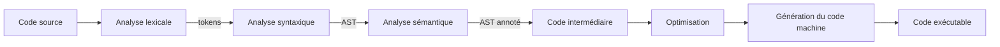

À chaque étape, le compilateur peut détecter des erreurs et arrêter la compilation : caractère illégal au lexer, structure incorrecte au parser, type incompatible au vérificateur sémantique, et ainsi de suite.

### Les sept phases canoniques (Aho et al.)

> **Que veut dire « Aho et al. » et « phase canonique » ?** « Aho et al. » désigne les auteurs du livre de référence sur les compilateurs (Alfred Aho et ses coauteurs ; « et al. » est l'abréviation latine d'*et alii*, « et les autres »). « Canonique » veut dire « qui fait autorité, considéré comme la version officielle ». Les sept phases ci-dessous sont donc le découpage standard que tout le monde reconnaît, comme une recette de cuisine classique que chaque cuisinier respecte.

La frontière entre les deux familles (front-end qui comprend, back-end qui fabrique) et le rôle pivot de l'IR se visualisent ainsi :

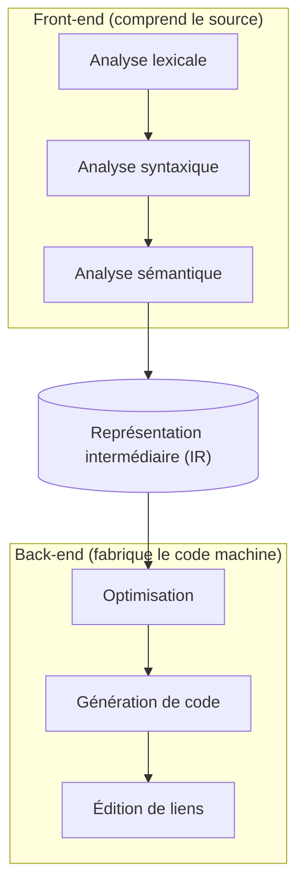

| # | Phase | Entrée | Sortie | Erreurs typiques |
|---|-------|--------|--------|------------------|
| 1 | Analyse lexicale | flux de caractères | flux de tokens | caractère interdit, littéral mal formé |
| 2 | Analyse syntaxique | tokens | arbre syntaxique (concret puis AST) | parenthèse non fermée, mot-clé manquant |
| 3 | Analyse sémantique | AST | AST annoté + table des symboles | type incompatible, variable non déclarée |
| 4 | Génération d'IR | AST annoté | IR (TAC, SSA, LLVM IR…) | rare ; plutôt des invariants à respecter |
| 5 | Optimisation | IR | IR transformée | aucune (sinon le passe est buggé) |
| 6 | Génération de code | IR | assembleur / fichier objet | contraintes de cible (registre, alignement) |
| 7 | Édition de liens | objets `.o` | exécutable / bibliothèque | symbole non résolu, ABI incompatible |

[Retour en haut de page](#table-des-matières)

## Analyse lexicale

L'analyse lexicale (*lexing* ou *scanning* en anglais) découpe le flux de caractères du code source en une suite de **tokens** (des lexèmes classés par type). Chaque token est une paire `(type, valeur)` : `(IDENT, "ma_variable")`, `(NOMBRE, 42)`, `(MOT_CLE, "if")`, `(SYMBOLE, "+")`.

> **Que veut dire « analyse lexicale » et « lexer » ?** Le lexer est l'étape qui découpe le texte du programme en petits morceaux qui ont un sens, exactement comme vous découpez une phrase en mots avant de la comprendre. Devant `int x = 42;`, l'ordinateur ne voit au départ qu'une suite de lettres et de symboles collés ; le lexer y reconnaît les mots `int`, `x`, `=`, `42`, `;`. « Lexical » vient du grec *lexis*, le mot.

> **Que veut dire « token » et « lexème » ?** Le **lexème** est le morceau de texte tel qu'il apparaît dans le source (les caractères `4` et `2` mis bout à bout). Le **token** est ce morceau une fois étiqueté : « ceci est un NOMBRE qui vaut 42 ». Comparaison : dans une bibliothèque, le lexème est le livre physique, le token est la fiche du catalogue qui dit « roman, par tel auteur ». Le lexer fabrique les fiches à partir des livres.

> **Que veut dire « flux de caractères » ?** Un « flux » est simplement une suite de choses qui défilent une à une, dans l'ordre, comme l'eau qui passe dans un tuyau. Un flux de caractères, c'est le texte du programme lu lettre après lettre, du début à la fin.

> **Définition opérationnelle.** Le lexer **produit** les tokens, le parser les **consomme**. Cette frontière est un contrat unidirectionnel : le lexer ne sait rien de la grammaire du langage (au-delà du *maximal munch* et de la table des mots-clés), le parser ne sait rien des caractères d'origine (au-delà éventuellement des positions, conservées pour les diagnostics). Confondre les deux niveaux est l'erreur la plus fréquente des cours d'introduction : *analyser la syntaxe* signifie reconnaître la structure d'un programme à partir de tokens, pas à partir de caractères.

### Vocabulaire

- **Lexème** : la sous-chaîne effective trouvée dans le source (`"42"`).
- **Token** : la classe attribuée au lexème (`NOMBRE`) plus son attribut (la valeur entière `42`).
- **Mot-clé** : lexème dont la chaîne est réservée par le langage (`if`, `while`, `return`).

### Exemple lexical

Pour l'expression source `int x = 42;`, le lexer produit :

```text
(KEYWORD, "int")  (IDENT, "x")  (OP, "=")  (NUMBER, 42)  (PUNCT, ";")
```

### Étapes du lexer

1. **Lecture caractère par caractère** du flux source.
2. **Reconnaissance des lexèmes** à l'aide d'expressions régulières ou d'un automate fini.
3. **Classification** : à chaque lexème reconnu, on associe un type de token.
4. **Émission** : le lexer renvoie une séquence de tokens au parser, généralement à la demande (interface itérateur).

Les outils classiques (`lex`, `flex`, `re2c`) génèrent ce code à partir d'une grammaire régulière.

### De la regex au DFA : Thompson + construction par sous-ensembles

> **Que veut dire « regex » ?** Abréviation de *regular expression*, expression régulière. C'est une petite formule qui décrit une famille de textes possibles. Par exemple, « un chiffre, suivi d'autres chiffres » décrit tous les nombres entiers. C'est l'équivalent d'un gabarit de couture : un seul patron permet de reconnaître (ou de fabriquer) une infinité de pièces qui suivent la même forme.

> **Que veut dire « automate fini » (NFA, DFA) ?** Un automate fini est une petite machine imaginaire à cases (les « états ») reliées par des flèches. On lit le texte caractère par caractère ; à chaque caractère, on suit la flèche correspondante vers la case suivante. Si l'on termine sur une case « acceptante », le texte est reconnu. C'est comme un plateau de jeu de l'oie où chaque lettre lue vous fait avancer d'une case. Le **DFA** (*Deterministic Finite Automaton*, automate déterministe) n'a qu'une seule flèche possible par caractère : aucune hésitation. Le **NFA** (*Nondeterministic Finite Automaton*, automate non déterministe) peut avoir plusieurs flèches pour le même caractère, voire des flèches « gratuites » (notées ε, la lettre grecque epsilon) que l'on emprunte sans rien lire. Le NFA est plus facile à construire, le DFA plus rapide à exécuter ; on convertit donc l'un en l'autre.

La construction d'un lexer suit deux étapes algorithmiques fondamentales, décrites en détail par Aho, Lam, Sethi & Ullman.

**1. Construction de Thompson (regex → NFA).** Chaque opérateur régulier se traduit par un patron d'automate avec ε-transitions (des flèches gratuites qui ne consomment aucun caractère) :

- `a` : un état initial → état final via `a`.
- `r1 r2` (concaténation) : on relie l'état final de `r1` à l'état initial de `r2` par ε.
- `r1 | r2` (alternative) : un nouvel état initial part par ε vers `r1` et `r2` ; un nouvel état final reçoit par ε.
- `r*` (étoile de Kleene) : ε vers `r` et ε de retour, plus un raccourci ε.

> **Que veut dire « étoile de Kleene » ?** Le symbole `*` placé après un motif signifie « zéro, une ou plusieurs répétitions de ce motif ». `a*` reconnaît donc le vide, `a`, `aa`, `aaa`, et ainsi de suite. Nommée d'après le mathématicien Stephen Kleene. C'est le « etc. » des expressions régulières.

**2. Construction par sous-ensembles (NFA → DFA).** Chaque état du DFA est un *ensemble* d'états du NFA atteignables. La fermeture ε (l'ensemble des états joignables par les flèches gratuites) et la fonction de transition sont calculées de proche en proche jusqu'à ce que plus rien ne change (saturation).

### Exemple concret : un littéral entier décimal

Regex : `0 | [1-9][0-9]*`

DFA correspondant (états : `S` start, `Z` zero, `D` digit) :

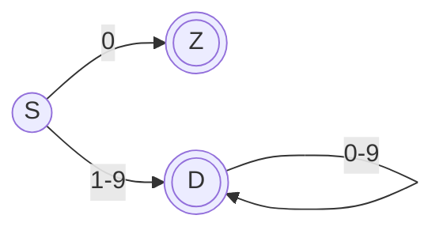

`Z` et `D` sont des états acceptants (double cercle), c'est-à-dire des cases où l'on a le droit de s'arrêter avec un nombre valide reconnu. Le lexer adopte la **règle du plus long préfixe** (*maximal munch*, littéralement « la plus grosse bouchée ») : il continue de lire tant qu'une flèche existe, retient la dernière case acceptante traversée, et y revient si la lecture suivante mène à une impasse. Justification : sans cette règle, devant `123` le lexer pourrait s'arrêter au premier `1` ; on veut au contraire le nombre entier le plus long. La règle de **priorité** départage les cas où deux catégories conviennent (`if` est reconnu comme mot-clé plutôt que comme nom de variable, car les mots-clés passent avant).

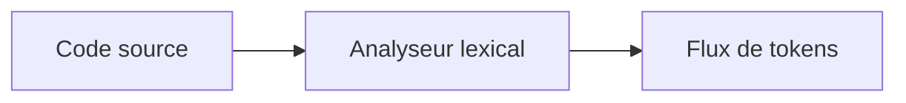

### Pour creuser

- *Dragon Book*, ch. 3 « Lexical Analysis ».
- *Crafting Interpreters*, ch. 4 « Scanning ».

[Retour en haut de page](#table-des-matières)

## Analyse syntaxique

L'analyse syntaxique (*parsing* en anglais) consomme le flux de tokens et construit un **arbre syntaxique abstrait** (AST) qui représente la structure du programme selon la grammaire du langage. Si la séquence de tokens ne respecte pas la grammaire, le parser émet une erreur de syntaxe.

> **Que veut dire « analyse syntaxique » et « parser » ?** Si le lexer découpe la phrase en mots, le parser, lui, comprend comment ces mots s'organisent : quel mot est le verbe, quel groupe est le sujet, quel morceau est entre parenthèses. Devant `2 + 3 * 4`, le parser comprend que la multiplication doit se faire avant l'addition. Il ne se contente pas de la liste des mots, il en reconstruit la grammaire, comme l'analyse de phrase apprise à l'école.

> **Que veut dire « grammaire » (d'un langage de programmation) ?** Ce sont les règles qui disent quelles suites de tokens forment un programme correct, exactement comme la grammaire du français dit qu'une phrase a besoin d'un sujet et d'un verbe. « Une expression est deux expressions séparées par un `+` » est une règle de grammaire.

> **Que veut dire « arbre syntaxique abstrait » (AST, de l'anglais *Abstract Syntax Tree*) ?** C'est une représentation en forme d'arbre de la structure du programme. Au lieu de garder le texte à plat, on le range comme un arbre généalogique : l'addition est au sommet, ses deux opérandes sont ses enfants. « Abstrait » parce qu'on jette les détails inutiles (parenthèses, espaces) pour ne garder que le sens. L'AST a sa propre section plus bas, où il est détaillé.

> **Note terminologique.** « LL(1) » n'est *pas* « le parser » : c'est une **classe** de parsers, c'est-à-dire un sous-ensemble de grammaires reconnaissables par un certain algorithme. Une même grammaire peut être LL(1), LL(*k*), LALR(1), LR(1), GLR ou PEG selon les outils utilisés. Choisir une famille, c'est arbitrer entre puissance grammaticale, qualité des diagnostics, vitesse de compilation et facilité d'implémentation.

### Grammaires hors contexte (CFG)

> **Que veut dire « grammaire hors contexte » (CFG, de l'anglais *Context-Free Grammar*) ?** « Hors contexte » signifie qu'une règle s'applique toujours de la même façon, peu importe ce qu'il y a autour : une expression reste une expression qu'elle soit au début ou au milieu du programme, comme le mot « chat » reste un nom quel que soit le reste de la phrase. Cette régularité rend l'analyse réalisable par une machine. Attention : le sigle CFG désigne aussi, plus loin, le « graphe de flot de contrôle », une notion sans rapport ; le contexte précisera lequel.

Une CFG est un quadruplet `(N, T, P, S)`, c'est-à-dire quatre ingrédients :

- `N` : symboles **non terminaux** (les catégories de grammaire, comme « expression » ou « instruction », écrites en majuscule par convention) ;
- `T` : symboles **terminaux** (les tokens, les briques de base que l'on ne décompose plus) ;
- `P` : règles de production `A → α`, à lire « un `A` peut prendre la forme `α` », où `α` est une suite de symboles ;
- `S` : symbole de départ (la catégorie de plus haut niveau, en général « programme »).

> **Que veut dire « terminal » et « non terminal » ?** Un terminal est un mot final que l'on ne remplace plus, comme le token `+` ou un nombre : c'est un point d'arrivée. Un non terminal est une catégorie que l'on doit encore développer en appliquant des règles, comme « expression » qui n'existe pas telle quelle dans le texte mais se déploie en morceaux plus petits. Comparaison : « terminal » = une vraie brique de Lego ; « non terminal » = le nom d'un sous-ensemble (« le toit ») qu'il faut encore assembler à partir de vraies briques.

### Top-down vs bottom-up

> **Que veut dire « top-down » et « bottom-up » ?** Ce sont deux façons opposées de reconstruire l'arbre du programme. *Top-down* (« du haut vers le bas ») part de l'idée générale (« je cherche un programme ») et la précise au fur et à mesure, comme un plan de maison que l'on détaille pièce par pièce. *Bottom-up* (« du bas vers le haut ») part des petits morceaux concrets (les tokens) et les regroupe peu à peu en structures plus grandes, comme un puzzle que l'on assemble par bouts avant de voir l'image entière.

| Approche | Idée | Difficulté | Outils |
|----------|------|-----------|--------|
| **Top-down** | Part de `S` et essaie de dériver le flux de tokens. | Échoue sur la récursivité gauche, sensible à l'ambiguïté. | Récursif descendant, LL(*k*), PEG, packrat. |
| **Bottom-up** | Part des tokens et tente de les réduire vers `S`. | Plus puissant mais plus opaque. | LR(*k*), LALR(1), GLR. |

### Exemple : grammaire arithmétique LL(1) factorisée

Une grammaire naïve :

```text
E → E + T | T
T → T * F | F
F → ( E ) | nombre
```

est **récursive à gauche** : un parser LL(1) bouclerait indéfiniment. On la transforme par **élimination de la récursivité gauche** :

> **Que veut dire « récursive à gauche » ?** Une règle est récursive à gauche quand elle se rappelle elle-même tout au début, sans avoir consommé le moindre token entre-temps. La règle `E → E + T` commence par `E` : pour reconnaître un `E`, il faudrait d'abord reconnaître un `E`, qui demande d'abord un `E`, etc. C'est comme un dictionnaire qui définirait un mot par lui-même : on tourne en rond sans jamais avancer. On réécrit donc la règle pour qu'elle progresse à chaque tour.

```text
E  → T E'
E' → + T E' | ε
T  → F T'
T' → * F T' | ε
F  → ( E ) | nombre
```

### Recursive descent en pseudo-code

```text
fonction parseE():
    n = parseT()
    tant que peek() == '+':
        consume('+')
        droit = parseT()
        n = Plus(n, droit)
    retourner n

fonction parseT():
    n = parseF()
    tant que peek() == '*':
        consume('*')
        droit = parseF()
        n = Mul(n, droit)
    retourner n

fonction parseF():
    si peek() == '(' :
        consume('(') ; n = parseE() ; consume(')') ; retourner n
    sinon :
        retourner Num(consume_number())
```

Ce parser est **LL(1)** : une seule lecture en avant suffit à choisir la production.

> **Que veut dire « LL(1) » ?** Le premier `L` veut dire que l'on lit la source de gauche à droite (*Left-to-right*). Le second `L` veut dire que l'on construit l'arbre en développant toujours d'abord le symbole le plus à gauche (*Leftmost*). Le `(1)` veut dire que l'on a le droit de regarder **un** seul token en avance pour décider quoi faire, comme un joueur d'échecs qui n'anticipe qu'un coup. Plus le chiffre est grand, plus on regarde loin, mais une seule lecture suffit pour les grammaires bien rangées.

### Pour `2 + 3 * 4`, l'AST respecte les priorités

```text
       (+)
      /   \
    (2)    (*)
          /   \
        (3)   (4)
```

### LR(1) et LALR(1) : l'intuition

> **Que veut dire « LR », « handle », « réduire » et « empiler » ?** Un parser **LR** lit de gauche à droite (`L`) et reconstruit l'arbre par la droite, à l'envers (`R`, *Rightmost in reverse*). Concrètement, il pose les tokens lus sur une **pile** (un tas où l'on ajoute et retire toujours par le dessus, comme une pile d'assiettes). Dès qu'il reconnaît au sommet de la pile un groupe qui correspond exactement au côté droit d'une règle (ce groupe s'appelle un *handle*, une « poignée »), il le **réduit** : il remplace ce groupe par le non terminal correspondant. Empiler les tokens et réduire dès qu'on reconnaît un morceau, c'est exactement assembler un puzzle pièce par pièce.

Là où un LL(1) décide *à l'avance* quelle règle appliquer, un LR(*k*) lit les tokens, les empile, et reconnaît un *handle* au sommet de la pile pour le réduire. L'analyse est pilotée par une table d'états, calculée à partir des **items LR(0)** étendus par un *lookahead* (le ou les tokens regardés en avance).

- **LR(1)** : tables potentiellement énormes (un état par contexte de lookahead).
- **LALR(1)** : *Look-Ahead LR(1)*. Cette variante fusionne les états LR(1) qui ne diffèrent que par le lookahead. Tables beaucoup plus petites, légère perte d'expressivité, suffisant pour la quasi-totalité des langages réels. C'est l'algorithme de `yacc`, `bison`, `menhir`.
- **GLR** (*Generalized LR*, LR généralisé) : conserve plusieurs piles d'analyse en parallèle pour explorer les ambiguïtés. Justification : quand le texte peut se comprendre de deux façons, on suit les deux pistes à la fois plutôt que de parier sur une seule. Utilisé par Bison `%glr-parser`, Elkhound (le parser C++ de Mozilla en son temps), Tree-sitter (pour les éditeurs de code).

#### LL vs LR : compromis pratiques

| Critère | LL(1) / récursif descendant | LR(1) | LALR(1) | PEG / Pratt |
|---------|-----------------------------|-------|---------|-------------|
| Implémentation à la main | facile | hostile | hostile | facile |
| Puissance grammaticale | la moins étendue | la plus étendue | proche de LR(1) | différente (ordonnée) |
| Récursivité gauche | interdite (à factoriser) | gérée nativement | gérée nativement | interdite (à factoriser) |
| Diagnostics d'erreur | excellents (contrôle total) | moyens (table opaque) | moyens | bons |
| Vitesse de génération | n/a (codé à la main) | longue | rapide | n/a (mémoïsation packrat) |
| Exemples industriels | gcc, clang, rustc, Roslyn, V8 | rare en l'état | yacc/bison historique, OCaml/menhir | Python ≥ 3.9, Lua, Pest |

Conclusion pragmatique : **commencez en récursif descendant + Pratt**. Passez à un générateur (menhir, lalrpop) si la grammaire devient ingérable à la main, ou à un GLR si elle est franchement ambiguë.

### Récursif descendant + *precedence climbing* : l'approche industrielle

> **Que veut dire « récursif descendant » et « précédence d'opérateurs » ?** « Récursif descendant » décrit un parser écrit comme un jeu de fonctions qui s'appellent les unes les autres en suivant la grammaire : une fonction `analyser_expression` appelle `analyser_terme` qui appelle `analyser_facteur`, en descendant du général vers le détail (et « récursif » car ces fonctions peuvent se rappeler elles-mêmes). La « précédence d'opérateurs » est l'ordre des priorités de calcul : le `*` est prioritaire sur le `+`, comme dans la règle scolaire « multiplications avant additions ».

C'est la voie effectivement empruntée par `gcc`, `clang`, le front-end de Roslyn (C#) et `rustc` (avant `chumsky`). On écrit un parser récursif descendant à la main et on délègue les expressions à un sous-parser à **escalade de précédence** (*precedence climbing*) ou Pratt. Avantages décisifs :

- **diagnostics sur mesure** : à chaque appel récursif, on contrôle exactement le contexte ;
- **récupération d'erreurs** : on peut écrire `recover_until(SEMICOLON)` et continuer ;
- **code lisible** : le parser ressemble à la grammaire ;
- **pas d'outil externe** : pas de génération, pas de débogage à travers une table d'états opaque.

Inconvénient : les langages très ambigus (C++ avec son *most vexing parse*, Fortran sans mots réservés) deviennent inconfortables à parser à la main et peuvent tirer parti d'un GLR.

### Précédence d'opérateurs et Pratt parsing

Pour les langages à expressions riches (Python, JavaScript, Swift), un **Pratt parser** (Vaughan Pratt, 1973) combine récursif descendant et précédence d'opérateurs : chaque token porte une *binding power* (une « force de liaison »). L'algorithme est concis, élégant, et naturellement extensible aux opérateurs préfixes, postfixes et mixfix.

> **Que veut dire « binding power » ?** C'est la force avec laquelle un opérateur attire ses voisins, comme un aimant plus ou moins puissant. Dans `1 + 2 * 3`, le `*` a une force de liaison plus grande que le `+` : il « capture » le `2` et le `3` plus fermement, donc la multiplication se fait d'abord. Donner à chaque opérateur une force chiffrée suffit à respecter automatiquement toutes les priorités.

> **Que veut dire « préfixe », « infixe », « postfixe », « mixfix » ?** Cela désigne la position de l'opérateur par rapport à ses opérandes. **Préfixe** : devant, comme le moins d'un nombre négatif `-x`. **Infixe** : au milieu, comme `a + b`. **Postfixe** : après, comme l'incrément `i++` en C. **Mixfix** : mélangé en plusieurs morceaux autour des opérandes, comme `condition ? valeur_si_vrai : valeur_si_faux`.

#### Exemple Pratt sur `1 + 2 * 3`

Table de précédence (binding power) :

| Token | LBP (left binding power) |
|-------|---:|
| `+` | 10 |
| `*` | 20 |
| nombre, fin | 0 |

Pseudo-code minimal :

```text
fonction expr(rbp = 0):
    g = nud(consume())                     # null-denotation : feuille
    tant que lbp(peek()) > rbp:
        op = consume()
        g = led(op, g, expr(lbp(op)))      # left-denotation : binaire
    retourner g

nud(NOMBRE n) -> Num(n)
led(+ , g, d) -> Plus(g, d)
led(* , g, d) -> Mul(g, d)
```

Trace pour `1 + 2 * 3` (rbp initial = 0) :

1. `expr(0)` : `nud(1)` donne `Num(1)`. `peek() = +`, `lbp(+) = 10 > 0` : on entre dans la boucle.
2. On consomme `+` et appelle `expr(10)` pour le membre droit.
3. `expr(10)` : `nud(2)` donne `Num(2)`. `peek() = *`, `lbp(*) = 20 > 10` : on entre.
4. On consomme `*` et appelle `expr(20)`. `nud(3)` donne `Num(3)`. `peek()` = fin, `lbp = 0 ≤ 20` : on sort, retour `Num(3)`.
5. `led(*, Num(2), Num(3))` = `Mul(Num(2), Num(3))`. `peek()` = fin, on sort, retour `Mul(2,3)`.
6. `led(+, Num(1), Mul(2,3))` = `Plus(Num(1), Mul(Num(2), Num(3)))`. Fin, retour.

Arbre obtenu, avec `*` lié plus fort que `+` :

```text
       (+)
      /   \
   Num(1) (*)
          /  \
       Num(2) Num(3)
```

> **Que veut dire « associativité » ?** Quand deux opérateurs de même priorité se suivent, l'associativité dit lequel se calcule en premier. `8 - 3 - 2` est **gauche-associatif** : on calcule de gauche à droite, `(8 - 3) - 2 = 3`. L'élévation à la puissance `2 ^ 3 ^ 2` est **droite-associative** : on calcule de droite à gauche, `2 ^ (3 ^ 2)`. C'est la même idée que l'ordre dans lequel on enchaîne des gestes identiques.

L'**associativité** se code par une nuance de 1 sur la précédence droite : un opérateur **droit-associatif** (par exemple `^`) appelle `expr(lbp(op) - 1)` pour autoriser un opérateur de même précédence à se rebrancher à droite ; un opérateur **gauche-associatif** appelle `expr(lbp(op))`.

### PEG et packrat parsing

> **Que veut dire « PEG » ?** *Parsing Expression Grammar*, grammaire d'expressions d'analyse. C'est une autre façon de décrire la grammaire dans laquelle le choix entre plusieurs possibilités est **ordonné** : on essaie la première, et si elle marche on s'arrête, sans jamais revenir tester les suivantes. Comme une liste de priorités où le premier candidat acceptable l'emporte définitivement.

Une **PEG** (Bryan Ford, 2004) ressemble à une CFG, mais le choix `|` est ordonné : la première alternative qui réussit gagne, sans retour arrière. Conséquence : pas d'ambiguïté grammaticale par construction, mais aussi des langages reconnus parfois contre-intuitifs (`a | ab` ne reconnaît jamais `ab`, car `a` étant essayé en premier et réussissant, on ne tente jamais `ab`).

> **Que veut dire « mémoïser » et « packrat » ?** *Mémoïser* veut dire garder en mémoire le résultat d'un calcul déjà fait pour ne pas le refaire, comme noter une réponse trouvée pour ne pas la rechercher plus tard. Le **packrat parsing** (de l'anglais *pack rat*, le rat qui amasse tout) applique cette idée : il retient le résultat de chaque tentative à chaque position du texte. On gagne en vitesse, on dépense de la mémoire.

Le packrat parsing mémoïse chaque tentative `(règle, position)` : la complexité tombe à *O(n)* (le temps de calcul croît proportionnellement à la longueur du texte, ce qui est le mieux possible) au prix d'une consommation mémoire proportionnelle à `|grammaire| × |entrée|`. Lua et CPython depuis la 3.9 utilisent un parser PEG, écrit à la main pour Python (Guido van Rossum, *PEP 617*), généré par `pegen`.

### Familles d'analyseurs

| Famille | Caractéristique |
|---------|-----------------|
| LL(*k*), récursif descendant | Lecture de gauche à droite, dérivation gauche, *k* tokens d'anticipation. Simple à écrire à la main. |
| LR(*k*), LALR(1) | Plus puissants, générés par des outils (`yacc`, `bison`, `menhir`). |
| PEG | *Parsing Expression Grammars* ; pas d'ambiguïté grammaticale par construction. |
| GLR | *Generalized LR* : explore les ambiguïtés en parallèle (utilisé par Elkhound, Bison `%glr-parser`). |
| Pratt parser | Combine récursif descendant et précédence d'opérateurs ; populaire dans les langages dynamiques. |

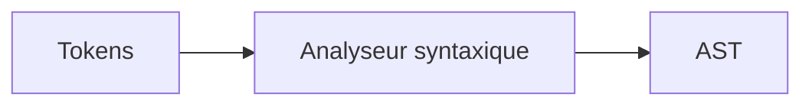

### Pour creuser

- *Dragon Book*, ch. 4 « Syntax Analysis ».
- *Modern Compiler Implementation in ML* (Appel), ch. 3 « Parsing ».

[Retour en haut de page](#table-des-matières)

## Arbre syntaxique abstrait (AST)

L'**AST** est la représentation arborescente du programme dans laquelle on a oublié les détails purement syntaxiques (parenthèses redondantes, points-virgules, espaces). Il s'oppose à l'**arbre syntaxique concret** (CST ou *parse tree*) qui matérialise toutes les règles de grammaire utilisées.

> **Que veut dire « arbre » (en informatique) ?** Un arbre est une structure en branches, comme un arbre généalogique ou un organigramme : un sommet (la racine), qui possède des descendants, lesquels possèdent à leur tour des descendants. Chaque point s'appelle un nœud, et un nœud sans descendant s'appelle une feuille. Pour `2 + 3`, la racine est le `+`, ses deux feuilles sont `2` et `3`.

> **Que veut dire « CST » (arbre syntaxique concret) ?** *Concrete Syntax Tree*. C'est l'arbre complet qui garde absolument toutes les étapes de la grammaire, y compris les parenthèses et les détours inutiles. L'AST en est la version dégraissée. Image : le CST est le brouillon avec ratures et flèches, l'AST est la version au propre qui ne garde que l'essentiel.

### CST vs AST

Pour `(2 + 3)`, le CST porte un nœud par règle traversée (`E → ( E )`, `E → E + T`, etc.). L'AST se réduit à `Plus(Num(2), Num(3))` : la parenthèse a déjà rempli son rôle (regrouper), elle disparaît.

### Pourquoi un AST plutôt qu'un CST ?

- La taille du CST est dominée par les règles structurelles ; l'AST ne garde que la structure logique.
- Toutes les passes ultérieures (sémantique, IR) ne s'intéressent qu'à cette structure logique.
- L'AST se prête naturellement au **patron Visiteur**.

### Le patron Visiteur

> **Que veut dire « patron Visiteur » ?** Un « patron » (en anglais *design pattern*) est une recette de conception éprouvée pour organiser du code, comme un patron de couture réutilisable. Le **Visiteur** est l'un de ces patrons : au lieu de mettre tous les traitements à l'intérieur de chaque type de nœud, on écrit un objet « visiteur » à part qui sait quoi faire pour chaque type de nœud rencontré. Image : un contrôleur qui passe de maison en maison ; chaque maison le laisse entrer (`accept`) et lui, applique son traitement selon le type de maison. Pour ajouter un nouveau traitement, on crée un nouveau contrôleur sans toucher aux maisons.

Chaque nœud expose une méthode `accept(v)`. Le visiteur `v` implémente `visit_Plus`, `visit_Num`, `visit_If`, etc. Ajouter une nouvelle passe revient à écrire un nouveau visiteur, sans toucher aux types de nœuds. C'est le mode opératoire de la quasi-totalité des compilateurs orientés objet (`javac`, `roslyn`, `tsc`).

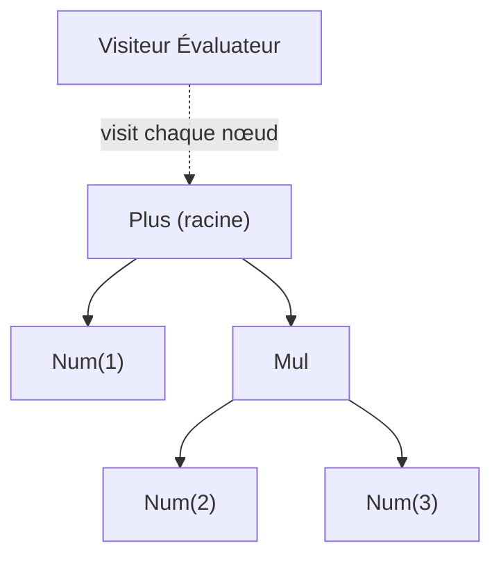

```text
classe Visiteur:
    fonction visit(noeud):
        appeler la méthode visit_<TypeDuNoeud> correspondante

classe Évaluateur hérite de Visiteur:
    visit_Num(n)  : retourner n.valeur
    visit_Plus(p) : retourner visit(p.gauche) + visit(p.droite)
    visit_Mul(m)  : retourner visit(m.gauche) * visit(m.droite)
```

[Retour en haut de page](#table-des-matières)

## Analyse sémantique

L'analyse sémantique vérifie ce que la grammaire ne peut exprimer : portée des identifiants, compatibilité des types, déclarations préalables, signatures de fonctions, contrôle d'accès. Elle consomme l'AST et produit un **AST annoté** (chaque nœud porte son type, sa portée, ses références résolues).

> **Que veut dire « sémantique » ?** La grammaire vérifie la **forme** d'une phrase, la sémantique vérifie son **sens**. « La pierre mange le ciel » est grammaticalement correcte mais n'a aucun sens : la grammaire la laisse passer, la sémantique la rejette. De même, `x = 1 + "bonjour"` peut être bien écrit syntaxiquement, mais additionner un nombre et un texte n'a pas de sens : c'est l'analyse sémantique qui s'en aperçoit.

> **Que veut dire « portée » (d'un identifiant) ?** La portée (en anglais *scope*) est la zone du programme où un nom est connu et utilisable. Une variable déclarée dans une fonction n'existe que dans cette fonction, comme une règle interne à une pièce de la maison qui ne s'applique pas dans les autres pièces. En dehors de sa portée, le nom n'existe pas.

> **Que veut dire « type » et « AST annoté » ?** Le **type** d'une valeur dit à quelle catégorie elle appartient (un entier, un texte, un booléen vrai/faux) et donc ce qu'on a le droit d'en faire. L'**AST annoté** est l'arbre du programme sur lequel on a ajouté ces informations à chaque nœud, comme un texte que l'on aurait surligné et commenté dans la marge : « ici, un entier ; là, cette variable renvoie à telle déclaration ».

### Vérifications typiques

- chaque identifiant utilisé est-il déclaré dans une portée visible ?
- l'expression `x + y` est-elle bien définie pour les types de `x` et `y` ?
- la fonction appelée existe-t-elle ? avec la bonne arité (le bon nombre d'arguments) et les bons types ?
- les contrôles d'accès (`private`, `protected`) sont-ils respectés ?

### Table des symboles

> **Que veut dire « table des symboles » ?** C'est un carnet d'adresses du programme : pour chaque nom (chaque « symbole ») utilisé dans le code, il note tout ce qu'on sait de lui (son type, l'endroit où il a été déclaré, s'il a le droit de changer de valeur, qui peut le voir). Quand le compilateur rencontre un nom, il consulte ce carnet pour savoir de quoi il s'agit.

L'analyseur sémantique s'appuie sur une table des symboles structurée par portée (souvent une pile de tables, une par bloc). Elle associe à chaque identifiant ses métadonnées : type, position de déclaration, mutabilité (le droit ou non de changer de valeur), visibilité.

À l'entrée d'un bloc, on empile une table fille ; à la sortie, on la dépile. La résolution d'un identifiant remonte la pile jusqu'à la première occurrence trouvée : c'est la **résolution lexicale** (*lexical scoping*).

### Vérification de types

Un *type checker* parcourt l'AST et calcule pour chaque expression un type, qu'il confronte au type attendu par le contexte. Pour `if (cond) ... else ...`, on vérifie que `cond` est `bool` ; pour `f(x)`, que le type de `x` correspond au paramètre formel de `f`.

### Inférence de types : intuition Hindley-Milner

> **Que veut dire « inférence de types » ?** *Inférer* veut dire deviner par déduction. L'inférence de types, c'est le compilateur qui devine tout seul le type de vos variables sans que vous ayez à l'écrire, en s'appuyant sur la façon dont elles sont utilisées. Si vous écrivez `x = 3 + 4`, il en déduit que `x` est un entier. Comme un enquêteur qui reconstitue un fait à partir d'indices.

ML, OCaml, Haskell, Rust et Swift exploitent une variante du système **Hindley-Milner** (HM), du nom de ses inventeurs Roger Hindley et Robin Milner. L'idée :

1. À chaque sous-expression, on attribue une **variable de type** fraîche (`α`, `β`…).
2. La structure de l'expression engendre des **équations de types** (par exemple `α → α → α` pour `+` sur `int`).
3. On résout ces équations par **unification** de Robinson : on tente de rendre deux types identiques en remplaçant les variables par ce qu'il faut.
4. Le type le plus général (le **type principal**) est attribué.

> **Que veut dire « unification » ?** Unifier deux descriptions, c'est trouver le remplacement qui les rend identiques. Si une équation dit « ce truc est un `α` » et une autre « ce même truc est un entier », on en déduit `α` = entier et on propage partout. C'est résoudre un système d'équations, mais sur des types plutôt que sur des nombres.

> **Que veut dire « polymorphe » et « let-polymorphe » ?** *Polymorphe* signifie « qui prend plusieurs formes ». Une fonction polymorphe marche pour plusieurs types : la fonction identité `fun x -> x` renvoie ce qu'on lui donne, qu'il s'agisse d'un entier ou d'un texte, donc son type contient une variable libre `α`. « let-polymorphe » désigne le cas, géré automatiquement par Hindley-Milner, où une définition introduite par `let` peut être réutilisée à plusieurs types différents.

```text
let id = fun x -> x        # id : ∀α. α → α
let succ = fun n -> n + 1  # succ : int → int
```

L'inférence HM est **complète et décidable** sans annotations dans le fragment let-polymorphe, ce qui explique son succès.

> **Que veut dire « décidable » ?** Un problème est décidable s'il existe une méthode garantie de toujours donner la bonne réponse en un temps fini, sans risque de tourner pour l'éternité. Dire que l'inférence HM est décidable, c'est promettre que le compilateur trouvera toujours les types tout seul et s'arrêtera, sans jamais rester bloqué. C'est une garantie rassurante, pas évidente pour des systèmes de types plus ambitieux.

Les extensions (sous-typage, types dépendants, GADT) sortent de HM et imposent souvent des annotations écrites à la main.

### Au-delà de Hindley-Milner

Les langages industriels modernes mêlent plusieurs disciplines de typage.

#### Typage bidirectionnel

Le **typage bidirectionnel** (Pierce & Turner, 2000) sépare deux jugements :

- **synthèse** (*infer*) `Γ ⊢ e ⇒ τ` : l'expression `e` produit un type `τ` calculé ;
- **vérification** (*check*) `Γ ⊢ e ⇐ τ` : on vérifie que `e` a bien le type `τ` attendu par le contexte.

Cette dualité explique pourquoi un littéral entier peut être un `i32` ou un `i64` (un entier sur 32 ou 64 bits) selon le contexte qui le reçoit, sans annotation explicite. Rust, Swift, TypeScript et Idris en font un usage intensif. C'est la technique qui permet d'introduire le sous-typage, les *generics* et les *higher-rank types* sans casser la décidabilité.

> **Que veut dire « sous-typage » et « generics » ?** Le **sous-typage** est l'idée qu'un type peut être un cas particulier d'un autre : un `Chat` est un sous-type d'`Animal`, donc partout où un animal est attendu, un chat convient (comme un sous-ensemble qui rentre dans l'ensemble). Les **generics** (types génériques) sont des types « à trous » que l'on remplit ensuite : une `Liste<T>` est une liste de n'importe quoi, et l'on précise après si c'est une `Liste<entier>` ou une `Liste<texte>`. Cela évite de réécrire le même code pour chaque type.

#### Typage graduel

Le **typage graduel** (Siek & Taha, 2006) introduit un type joker `?` (ou `Dynamic`) compatible avec tout autre type. Le compilateur insère des **casts** dynamiques aux frontières entre la partie typée et la partie non typée du programme.

> **Que veut dire « typage graduel » et « cast » ?** « Graduel » veut dire qu'on peut typer le programme petit à petit : certaines parties sont vérifiées strictement, d'autres restent libres, et les deux cohabitent. C'est utile pour ajouter de la rigueur à un vieux code sans tout réécrire d'un coup. Un **cast** (« conversion ») est l'opération qui force une valeur à être vue comme d'un certain type ; ici, à la frontière entre zone libre et zone typée, le compilateur ajoute une vérification à l'exécution pour s'assurer que la valeur a bien la forme promise, comme un contrôle de douane entre deux pays. C'est la stratégie de TypeScript (`any`), Python (annotations PEP 484 + `mypy`), Hack, Dart, Typed Racket et Reticulated Python. Le coût d'exécution des casts a été l'une des raisons de l'abandon du *strict gradual typing* dans plusieurs implémentations au profit d'un typage **optionnel** sans vérification à l'exécution.

#### Vérification de propriétés

Au-delà des types « valeur a la forme attendue », certains compilateurs vérifient des propriétés plus riches :

- *borrow checker* de Rust (alias et durées de vie) ;

> **Que veut dire « borrow checker » et « alias » ?** Le *borrow checker* (« vérificateur d'emprunts ») est la partie de Rust qui contrôle qui a le droit de lire ou de modifier une donnée et pendant combien de temps, pour éviter qu'on s'emmêle. Un **alias** désigne le cas où deux noms différents pointent vers la même donnée (comme deux personnes qui ont la clé du même casier) : si l'une modifie pendant que l'autre lit, c'est la pagaille. Rust interdit ces situations dangereuses dès la compilation.
- *effect systems* (Koka, OCaml 5) ;
- *refinement types* (Liquid Haskell, F\*) où `{ x : int | x > 0 }` est un type valide.

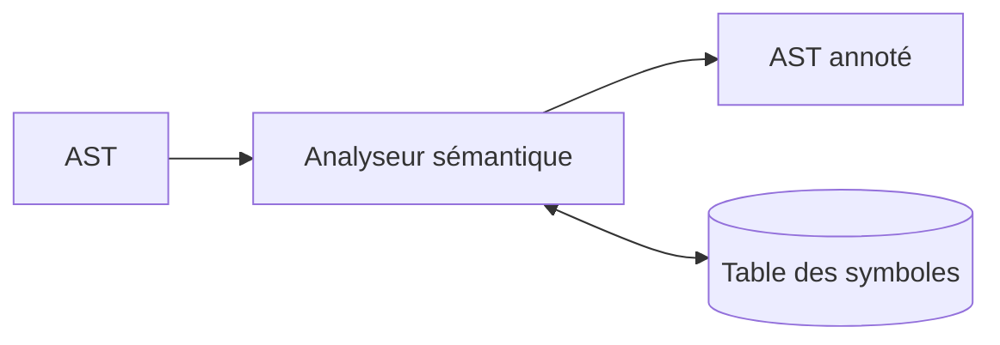

### Pour creuser

- *Tiger Book* (Appel), ch. 5 « Semantic Analysis » et ch. 16 sur l'inférence.
- Pierce, *Types and Programming Languages*, pour une présentation rigoureuse.

[Retour en haut de page](#table-des-matières)

## Génération de code intermédiaire

L'AST annoté est traduit en une **représentation intermédiaire** (IR) plus simple, indépendante du langage source et de la machine cible. Les IR usuelles :

- **Three-Address Code** (TAC, code à trois adresses) : `t1 = a + b; t2 = t1 * c;`
- **Static Single Assignment** (SSA) : chaque variable n'est affectée qu'une seule fois ; les fusions de chemins utilisent des fonctions φ. Forme privilégiée pour l'optimisation.
- **LLVM IR**, **bytecode JVM**, **WebAssembly** : IR portables, parfois publiées comme cibles à part entière.

> **Que veut dire « LLVM IR » et « bytecode JVM » ?** **LLVM** est une grande boîte à outils libre pour construire des compilateurs ; son IR (le « LLVM IR ») est le format pivot que partagent de nombreux langages (C, Rust, Swift). Le **bytecode JVM** est l'IR de l'univers Java : le code Java est d'abord traduit en ce bytecode, que la machine virtuelle Java (JVM) exécute ensuite sur n'importe quel système. Dans les deux cas, c'est une langue pivot stable au milieu du parcours.

> **Que veulent dire « HIR », « MIR », « LIR » ?** Plutôt qu'une seule IR, les gros compilateurs en enchaînent plusieurs, de la plus proche du langage à la plus proche de la machine : **HIR** (*High-level IR*, IR de haut niveau) garde encore la saveur du langage source, **MIR** (*Mid-level IR*, niveau moyen) est plus dépouillée, **LIR** (*Low-level IR*, bas niveau) frôle l'assembleur. On descend ainsi par paliers, comme un escalier qui mène doucement du langage humain au langage machine, chaque marche simplifiant un peu plus.

### Code à 3 adresses (TAC)

> **Que veut dire « code à trois adresses » ?** C'est une façon d'écrire le programme où chaque ligne ne fait qu'une seule opération simple, avec au plus trois cases mentionnées : deux d'où viennent les données, une où va le résultat. Au lieu de `t2 = (a + b) * c`, on écrit deux lignes : `t1 = a + b` puis `t2 = t1 * c`. C'est volontairement décortiqué, comme une recette qui détaille « casser l'œuf », puis « battre l'œuf », plutôt que « préparer l'omelette » : plus facile à analyser et à transformer ensuite.

Le code à 3 adresses limite chaque instruction à au plus trois opérandes (deux sources, une destination) :

```text
op  dest, src1, src2     # ex : add t1, a, b
mov dest, src            # ex : mov t2, t1
br  cond, label_vrai, label_faux
```

Avantage pédagogique : c'est l'IR la plus lisible, très proche du jeu d'instructions abstrait des manuels.

### Pourquoi une IR ?

- découplage front-end / back-end (*N* langages × *M* cibles demandent *N + M* implémentations au lieu de *N × M*) ;

> **Pourquoi *N + M* est tellement mieux que *N × M* ?** Sans IR commune, pour relier 5 langages à 5 machines il faudrait écrire un traducteur direct pour chaque paire, soit 5 × 5 = 25 traducteurs. Avec une IR au milieu, chaque langage écrit un seul traducteur vers l'IR (5) et chaque machine un seul traducteur depuis l'IR (5), soit 5 + 5 = 10. L'écart se creuse vite : 10 langages et 10 machines donneraient 100 contre 20. C'est le même principe qu'un aéroport qui sert de hub central plutôt que de relier chaque ville à toutes les autres.
- abstraction propice aux optimisations (analyse de flot de données, propagation de constantes) ;
- portabilité.

### Blocs de base et graphe de flot de contrôle

> **Que veut dire « bloc de base » ?** C'est un morceau de code qui se déroule toujours en entier, d'une traite, sans saut au milieu : on entre par la première instruction et l'on ressort par la dernière, jamais autrement. Comme un couloir sans porte intermédiaire : une fois engagé, on va forcément jusqu'au bout. Découper le programme en tels blocs simplifie énormément l'analyse.

> **Que veut dire « graphe de flot de contrôle » (CFG, de l'anglais *Control-Flow Graph*) ?** Un graphe est un ensemble de points reliés par des flèches. Ici, les points sont les blocs de base et les flèches indiquent quels enchaînements sont possibles à l'exécution (« après ce bloc, on peut aller à celui-ci ou à celui-là selon le test »). C'est le plan des routes du programme. Attention : ce sigle CFG est l'homonyme de la grammaire hors contexte vue plus haut, mais n'a rien à voir.

Une IR linéaire se découpe en blocs de base : suites maximales d'instructions sans branchement entrant ailleurs qu'en tête, ni sortant ailleurs qu'en queue. Les arêtes de transfert de contrôle entre blocs forment le graphe de flot de contrôle (CFG). La quasi-totalité des analyses (vivacité des variables, dominateurs, atteignabilité) opèrent sur le CFG.

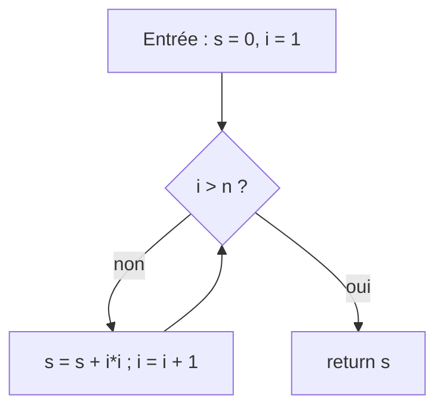

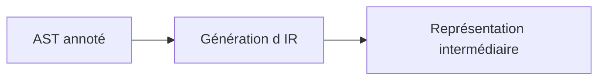

[Retour en haut de page](#table-des-matières)

## Forme SSA

La forme **SSA** (*Static Single Assignment*) est une variante d'IR dans laquelle **chaque variable est affectée exactement une fois**. Adoptée par GCC, LLVM, V8, HotSpot, .NET RyuJIT, GraalVM et tous les compilateurs sérieux depuis le début des années 2000.

> **Que veut dire « SSA » (affectation unique statique) ?** En français : *Static Single Assignment*, « affectation statique unique ». La règle est simple : chaque variable ne reçoit une valeur qu'une seule fois dans tout le texte du programme. Si le code réécrit `x` trois fois, on crée à la place `x1`, `x2`, `x3`. Avantage : en voyant `x2`, on sait immédiatement et sans ambiguïté d'où vient sa valeur, puisqu'elle n'a qu'une seule origine. C'est comme donner un numéro de série unique à chaque version d'un document plutôt que d'écraser le même fichier : on retrouve toujours d'où sort chaque valeur.

### Avant / après SSA

Code TAC ordinaire :

```text
x = 1
x = x + 2
y = x * 3
```

En SSA, chaque réécriture donne lieu à une nouvelle « version » de la variable :

```text
x1 = 1
x2 = x1 + 2
y1 = x2 * 3
```

### Les fonctions φ

> **Que veut dire « fonction φ » (phi) ?** φ est une lettre grecque (« phi »). La règle SSA pose un problème quand deux chemins se rejoignent : selon le chemin emprunté, la valeur vient de `x1` ou de `x2`, mais il faut un seul nom pour la suite. La fonction φ règle cela : `x3 = φ(x1, x2)` veut dire « `x3` vaut `x1` si l'on arrive par le premier chemin, `x2` si l'on arrive par le second ». Ce n'est pas une vraie opération de calcul, juste une note qui dit « ici, plusieurs versions se rejoignent ». Comparaison : un carrefour où deux routes fusionnent et où un panneau indique quelle file devient la voie unique.

Quand deux chemins se rejoignent, plusieurs versions d'une même variable arrivent au point de jonction. On les fusionne avec une fonction φ :

```text
si cond:
    x1 = 10
sinon:
    x2 = 20
x3 = φ(x1, x2)        # x3 vaut x1 si l'on vient de la branche vraie, x2 sinon
```

### Construction de SSA

> **Que veut dire « dominateur » et « frontière de dominance » ?** Dans le plan des routes du programme (le CFG), un bloc `D` **domine** un bloc `N` si l'on est obligé de passer par `D` pour atteindre `N`, quel que soit le chemin : `D` est un passage obligé. La **frontière de dominance** d'un bloc, c'est l'endroit précis où son influence s'arrête, juste là où d'autres chemins rejoignent le flot. C'est exactement aux frontières de dominance que les versions de variables se croisent et qu'il faut donc placer une fonction φ. Image : un pont obligatoire (le dominateur) ; la frontière, c'est le premier carrefour après le pont où arrivent aussi des routes qui ne l'ont pas emprunté.

L'algorithme de Cytron, Ferrante, Rosen, Wegman & Zadeck (1991) place les fonctions φ aux frontières de dominance : un bloc `B` reçoit un φ pour `v` si `v` est définie dans plusieurs prédécesseurs et si `B` est en frontière de dominance de l'une de ces définitions.

### Pourquoi SSA ?

- les chaînes use-def deviennent triviales : chaque variable a **une seule** définition ;
- la propagation de constantes, l'élimination de code mort, le *value numbering* deviennent linéaires ;

> **Que veut dire « chaîne use-def » et « value numbering » ?** Une chaîne *use-def* (« usage-définition ») relie chaque endroit où une variable est **utilisée** à l'endroit où sa valeur a été **définie**. En SSA, comme chaque variable n'a qu'une définition, retrouver l'origine d'une valeur est immédiat. Le *value numbering* (« numérotation des valeurs ») donne un même numéro à deux calculs qui produisent forcément le même résultat, pour ne les faire qu'une fois ; c'est repérer les doublons pour ne pas refaire deux fois le même travail.
- l'allocation de registres globale (Briggs, Chaitin) s'appuie sur SSA.

### Pour creuser

- Cytron et al., « Efficiently computing static single assignment form and the control dependence graph », ACM TOPLAS 1991.
- Documentation LLVM, *LangRef* : tout LLVM IR est en SSA hors mémoire (`alloca`/`load`/`store`).

[Retour en haut de page](#table-des-matières)

## Optimisation du code

L'optimisation transforme l'IR pour réduire le temps d'exécution, l'empreinte mémoire ou la taille du binaire, **sans changer le comportement observable** du programme.

> **Que veut dire « optimisation » et « comportement observable » ?** Optimiser, c'est rendre le programme plus rapide ou plus léger sans toucher à ce qu'il fait. Le « comportement observable » est tout ce qu'un utilisateur ou un autre programme peut constater de l'extérieur : les résultats affichés, les fichiers écrits, les valeurs renvoyées. L'optimiseur a le droit de tout réorganiser à l'intérieur, à une seule condition : que le résultat visible soit exactement le même. C'est comme réorganiser une cuisine pour cuisiner plus vite : le plat servi doit rester identique.

> **Que veut dire « binaire » ?** Le « binaire » est le fichier exécutable final, celui que l'on lance, rempli de code machine (des 0 et des 1, d'où le nom). Réduire sa taille, c'est obtenir un fichier plus petit à stocker et à charger.

### Optimisations courantes

| Optimisation | Effet |
|--------------|-------|
| Propagation de constantes | Remplace `x = 2; y = x + 3;` par `y = 5`. |
| *Constant folding* | Évalue les expressions purement constantes au moment de la compilation. |
| Élimination de code mort (DCE) | Supprime les calculs dont le résultat n'est pas utilisé. |
| Élimination de sous-expressions communes (CSE) | Calcule `a + b` une seule fois si la valeur ne change pas. |
| *Global Value Numbering* (GVN) | Variante de CSE qui identifie les valeurs équivalentes globalement. |
| *Strength reduction* | Remplace une opération coûteuse par une moins coûteuse (`x*2` → `x<<1`). |
| Inlining | Remplace l'appel par le corps de la fonction (voir plus bas). |
| Déroulage de boucle | Réduit le coût des tests de boucle au prix d'une taille de code accrue. |
| Vectorisation (SIMD) | Effectue plusieurs opérations scalaires en une seule instruction. |
| **LICM** (*Loop-Invariant Code Motion*) | Sort les calculs invariants du corps de la boucle. |
| Allocation de registres | Affecte les variables vivantes à des registres physiques. |
| *Tail-call optimization* | Transforme un appel terminal en saut, économise une *stack frame*. |
| *Peephole optimization* | Réécriture locale sur 2-3 instructions consécutives (ex : `mov eax,0` → `xor eax,eax`). |

> **Que veulent dire les sigles d'optimisation (DCE, CSE, GVN, LICM, SIMD) ?** Ce sont des noms abrégés de transformations, tous résumés dans le tableau. **DCE** (*Dead Code Elimination*) supprime le code mort, c'est-à-dire les calculs dont personne ne se sert (jeter les ingrédients qu'on ne mettra jamais dans le plat). **CSE** (*Common Subexpression Elimination*) calcule une seule fois une expression qui revient à l'identique. **GVN** (*Global Value Numbering*) est une version plus maligne de CSE qui repère les égalités dans tout le programme. **LICM** (*Loop-Invariant Code Motion*) sort d'une boucle les calculs qui donnent toujours le même résultat à chaque tour (inutile de recalculer à chaque fois ce qui ne change pas). **SIMD** (*Single Instruction, Multiple Data*) applique une même opération à plusieurs données d'un coup.

> **Que veut dire « strength reduction » et « inlining » ?** *Strength reduction* (« réduction de force ») remplace une opération coûteuse par une moins chère qui donne le même résultat, par exemple multiplier par 2 en décalant les bits d'un cran. *Inlining* (« mise en ligne ») recopie le corps d'une petite fonction directement à l'endroit où elle est appelée, pour éviter le coût d'un aller-retour ; cette technique a sa propre section plus bas.

Une optimisation est **valide** si elle préserve la sémantique du langage. Les optimisations agressives reposent sur les propriétés du langage source (par exemple : pas d'aliasing en Rust, *strict aliasing* en C).

> **Que veut dire « aliasing » ?** Il y a *aliasing* quand deux noms ou deux pointeurs désignent en réalité la même zone mémoire (« alias » = autre nom de la même chose). C'est gênant pour l'optimiseur : s'il modifie l'un, il doit deviner si l'autre change aussi. Quand le langage garantit l'absence d'aliasing (comme Rust), l'optimiseur peut se permettre des transformations plus audacieuses en toute sécurité.

### L'ordre des passes : une question de productivité

Les passes d'optimisation ne sont **pas commutatives**. Une mauvaise ordonnance laisse sur la table une grande partie des gains. Quelques règles éprouvées :

1. **Inlining d'abord, ou très tôt.** L'inlining ouvre les frontières d'appel : tout ce qui en dépend (propagation de constantes inter-procédurale, dévirtualisation, élimination de gardes) ne peut commencer qu'après. LLVM exécute son `InlinerPass` au début du pipeline, puis ré-itère.
2. **Constant folding avant DCE.** Le repli de constantes (`y = 2 * 3` → `y = 6`) crée souvent du code mort (`if (false) { ... }` après propagation). Lancer DCE *avant* le folding nettoie peu ; le lancer *après* nettoie tout.
3. **SSA avant les optimisations à base de flot.** GVN, LICM, propagation de copies sont triviales en SSA, pénibles sans. La construction SSA est donc une passe précoce.
4. **CSE / GVN avant *strength reduction*.** Identifier `a*b` dupliqué est plus facile avant qu'il ne soit transformé en série de décalages et additions.
5. **Boucles : LICM avant déroulage.** Sortir le code invariant *avant* de dérouler évite de dupliquer le travail invariant.
6. **Allocation de registres en dernier.** Toute optimisation qui change la durée de vie des variables invalide l'analyse de vivacité et devrait précéder l'allocateur.
7. **Fixed-point.** LLVM, GCC et HotSpot bouclent leur pipeline d'optimisation : chaque passe peut créer du travail pour les précédentes. La boucle s'arrête quand un point fixe est atteint (pas de modification durant un tour) ou quand un budget est épuisé.

> **Que veut dire « passe » et « point fixe » (fixed-point) ?** Une « passe » est un parcours complet du code par une optimisation donnée, comme un coup de balai dans toute la maison. Un « point fixe » est l'état où un nouveau passage ne change plus rien : on balaie une dernière fois, on ne ramasse plus aucune poussière, donc c'est terminé. Les compilateurs répètent leurs passes jusqu'à ce point fixe parce qu'une optimisation en débloque souvent une autre.

```text
SSA build → SCCP (sparse conditional const prop) → InstCombine
   → Inliner → SCCP → DCE → SROA → GVN → LICM → IndVarSimplify
   → LoopUnroll → SLP/Loop Vectorize → InstCombine → DCE
   → CodeGenPrepare → ISel → RegAlloc → Scheduling → Emit
```

Cette structure « petite passe locale × itération » est appelée **pipeline canonique LLVM**.

### Exemple détaillé : LICM

```text
pour i de 0 à n-1:
    x = a * b           # invariant : a et b ne changent pas dans la boucle
    t[i] = x + i
```

LICM hisse `x = a * b` avant la boucle :

```text
x = a * b
pour i de 0 à n-1:
    t[i] = x + i
```

Pour prouver l'invariance, l'optimiseur s'appuie sur la **dominance** : `a*b` peut être hissé si ses opérandes sont définis hors de la boucle ou par des instructions elles-mêmes hissables.

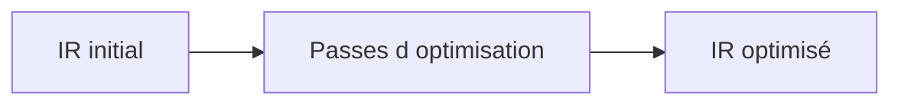

[Retour en haut de page](#table-des-matières)

## Allocation de registres

Les processeurs modernes disposent d'un nombre fini de **registres** physiques (16 entiers généraux sur x86-64, 31 sur ARM64). Il faut donc choisir, à chaque instant, quelles variables y résident, et lesquelles sont **spillées** (déversées) en pile.

> **Que veut dire « registre », « pile » et « spiller » ?** Un **registre** est une minuscule case de mémoire ultra-rapide située dans le processeur lui-même ; c'est là que les calculs ont lieu. Il y en a très peu (une poignée), comme le plan de travail d'une cuisine : tout petit, mais immédiatement accessible. La **pile** (en anglais *stack*) est une zone de mémoire principale plus grande mais plus lente, comme le placard au fond de la cuisine. **Spiller** une variable (« déverser »), c'est la sortir d'un registre faute de place pour la ranger dans la pile, quitte à aller la rechercher plus tard. On spille à contrecœur, car c'est plus lent.

### Vivacité (*liveness*)

> **Que veut dire « vivacité » (liveness) et « variable vivante » ?** Une variable est « vivante » à un endroit donné si sa valeur actuelle servira encore plus loin avant d'être remplacée. Si plus personne ne la lira, elle est « morte » et son registre peut être réutilisé. C'est comme un plat sur le plan de travail : tant qu'on en aura besoin, on le garde ; dès qu'il ne sert plus, on libère la place. Savoir qui est vivant à chaque instant indique combien de registres il faut réellement.

Une variable est vivante en un point du programme si sa valeur peut être utilisée plus tard sans être réécrite entre-temps. L'analyse de vivacité se calcule en arrière sur le CFG (de la fin vers le début, car on a besoin de savoir si une valeur servira plus tard) :

```text
in[B]  = use[B] ∪ (out[B] − def[B])
out[B] = ⋃_{S successeur de B} in[S]
```

### Graphe d'interférence

> **Que veut dire « graphe d'interférence » et « colorier un graphe » ?** Deux variables « interfèrent » si elles sont vivantes en même temps : elles ne peuvent donc pas partager le même registre, sinon l'une écraserait l'autre. On dessine un point par variable et on relie par un trait celles qui interfèrent. Allouer les registres revient alors à un coloriage : donner une couleur (un registre) à chaque point de sorte que deux points reliés n'aient jamais la même couleur. C'est exactement le problème de colorier une carte sans que deux pays voisins partagent la couleur. Si l'on n'a pas assez de couleurs (de registres), il faut en spiller certaines en pile.

On construit un graphe d'interférence : les sommets sont les variables, une arête relie deux variables vivantes simultanément. Allouer `k` registres revient alors à colorier ce graphe avec `k` couleurs telles que deux sommets adjacents reçoivent des couleurs différentes.

### Algorithme de Chaitin–Briggs (graph coloring)

1. Construire le graphe d'interférence.
2. Tant qu'il existe un sommet de degré `< k` : l'empiler, le retirer du graphe.
3. Si tous les sommets restants ont un degré `≥ k`, choisir un candidat à *spiller* (heuristique de coût) ; le retirer aussi.
4. Dépiler : à chaque sommet, lui assigner une couleur libre parmi ses voisins déjà coloriés. Si aucune n'est libre, le marquer pour *spill*.
5. Recompiler la fonction avec les *spills* matérialisés ; itérer.

### *Linear scan* (Poletto–Sarkar 1999)

Algorithme plus simple, utilisé dans les JIT (HotSpot client, V8 anciennes versions) : on parcourt les intervalles de vie linéairement et on alloue les registres dans l'ordre. Compromis qualité / vitesse de compilation favorable au JIT.

### Conventions d'appel et registres dédiés

> **Que veut dire « convention d'appel » et « ABI » ?** Quand une fonction en appelle une autre, les deux doivent se mettre d'accord : où sont rangés les arguments, où sera rangé le résultat, qui a le droit d'abîmer quels registres. Ce contrat s'appelle la **convention d'appel**. L'**ABI** (*Application Binary Interface*, interface binaire applicative) est l'ensemble plus large de ces règles d'entente au niveau des octets, qui permet à des morceaux de programme compilés séparément de fonctionner ensemble. C'est comme un protocole entre deux services d'une entreprise : sans règles communes, ils ne pourraient pas se passer le travail.

> **Que veut dire « callee-saved » et « caller-saved » ?** *Caller* = l'appelant, *callee* = l'appelé. Un registre **callee-saved** (« préservé par l'appelé ») est promis intact : la fonction appelée doit le remettre comme elle l'a trouvé si elle s'en sert. Un registre **caller-saved** (« préservé par l'appelant ») n'offre aucune garantie : si l'appelant y tient, c'est à lui de le sauvegarder avant l'appel. Image : une chambre d'hôtel (callee-saved, on doit la rendre en état) face à un brouillon partagé (caller-saved, n'importe qui peut écrire dessus).

Une fraction des registres est réservée par l'ABI : pointeur de pile (`rsp`), pointeur de cadre (`rbp`), registres préservés (*callee-saved*) face aux sacrifiables (*caller-saved*). L'allocateur doit connaître ce contrat pour insérer les sauvegardes / restaurations aux entrées / sorties de fonction.

### Pour creuser

- Chaitin et al., « Register allocation via coloring », *Computer Languages* 1981.
- Briggs, *Register Allocation via Graph Coloring*, thèse Rice 1992.

[Retour en haut de page](#table-des-matières)

## Génération du code machine

Le back-end traduit l'IR optimisée en instructions de la cible (x86-64, ARM, RISC-V, WebAssembly, etc.).

> **Que veut dire « cible » et « jeu d'instructions » (x86-64, ARM, RISC-V) ?** La « cible » est la sorte de processeur pour laquelle on fabrique le code. Chaque famille de processeurs comprend son propre vocabulaire d'ordres élémentaires, son « jeu d'instructions » : x86-64 équipe la plupart des PC et serveurs, ARM la plupart des téléphones et les Mac récents, RISC-V est une famille libre et ouverte. Une instruction écrite pour l'un ne veut rien dire pour l'autre, comme deux langues distinctes ; le back-end doit donc savoir dans laquelle traduire.

### Étapes du back-end

1. **Sélection d'instructions** : à chaque opération de l'IR, choisir l'instruction machine qui la réalise.
2. **Allocation de registres** : décider quelles variables vivent en registre, lesquelles sont *spillées* en pile (voir la section précédente).
3. **Ordonnancement** : ordonner les instructions pour exploiter le pipeline du processeur et masquer les latences mémoire.
4. **Émission** : produire un fichier objet (`.o`), puis l'éditeur de liens (*linker*) résout les symboles externes pour produire l'exécutable.

> **Que veut dire « pipeline du processeur » et « latence » ?** Un processeur moderne ne traite pas une instruction de A à Z avant de commencer la suivante : il les fait avancer à la chaîne, plusieurs en même temps à des stades différents, comme une chaîne de montage où chaque poste travaille sur une voiture différente. C'est le « pipeline » du processeur. La « latence » est le délai d'attente d'une opération lente (par exemple lire en mémoire principale). Bien ranger les instructions permet de remplir ces temps morts avec du travail utile au lieu d'attendre les bras croisés.

### Sélection d'instructions

Deux grandes familles :

- **Macro-expansion** : à chaque opération IR, on substitue un patron d'assembleur. Rapide, peu optimal.
- **Tree pattern matching** (Aho–Ganapathi–Tjiang) : la sélection est posée comme un **filtrage d'arbre** avec coûts. Le sélecteur cherche la couverture optimale. C'est l'approche de LLVM (*SelectionDAG* puis *GlobalISel*).

### Ordonnancement d'instructions

> **Que veut dire « out-of-order » et « bulle de pipeline » ?** Un processeur *out-of-order* (« dans le désordre ») se permet d'exécuter les instructions dans un ordre différent de celui écrit, dès qu'une est prête, pour ne pas perdre de temps. Une « bulle » est un trou dans la chaîne de montage : un poste reste inactif parce que la pièce attendue n'est pas encore arrivée. Moins il y a de bulles, plus le processeur travaille à plein régime.

Les processeurs *out-of-order* réordonnent à l'exécution, mais un ordre de départ favorable réduit les bulles de pipeline et améliore l'usage des unités de calcul. L'ordonnancement utilise un **graphe de dépendances** (qui dit quelle instruction doit attendre le résultat de quelle autre) entre données et ressources.

### Conventions d'appel et ABI

L'**ABI** fige :

- l'ordre des arguments (registres puis pile, ou tout en pile) ;
- les registres préservés par l'appelé vs l'appelant ;
- le passage des structures, des arguments variadiques (`stdarg`), du `this` C++ ;
- l'alignement de la pile aux frontières d'appel ;
- le format de la *stack frame* (prologue / épilogue).

> **Que veut dire « stack frame », « prologue » et « épilogue » ?** Une *stack frame* (« cadre de pile ») est l'espace de travail privé qu'une fonction se réserve sur la pile le temps de son exécution : ses variables locales, l'adresse de retour, etc. Le **prologue** est le petit code de début qui met ce cadre en place (comme installer son bureau en arrivant) ; l'**épilogue** est le code de fin qui le range avant de rendre la main (ranger son bureau en partant). Chaque appel de fonction empile son propre cadre, ce qui permet aux fonctions de s'appeler sans se marcher dessus.

Exemples courants : System V AMD64 (Linux/macOS), Microsoft x64 (Windows), AAPCS (ARM), RISC-V Calling Convention. Une ABI mal respectée fait planter le programme à la première frontière de fonction.

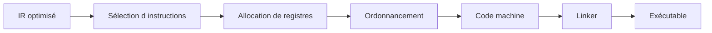

[Retour en haut de page](#table-des-matières)

## Éditeur de liens et chargement

L'**éditeur de liens** (*linker*) combine plusieurs **fichiers objets** (`.o`, `.obj`) et bibliothèques pour produire un exécutable ou une bibliothèque. Il résout les références croisées entre unités de compilation.

> **Que veut dire « éditeur de liens » (linker) et « fichier objet » ?** On compile souvent chaque fichier source séparément, ce qui donne un **fichier objet** : du code machine presque complet, mais avec des trous là où il appelle des fonctions définies ailleurs (par exemple `printf`). L'**éditeur de liens** est le programme qui rassemble tous ces fichiers objets, bouche les trous en reliant chaque appel à sa vraie définition, et produit l'exécutable final. C'est comme assembler les chapitres d'un livre écrits par plusieurs auteurs et remplacer chaque « voir le chapitre X » par le bon numéro de page.

> **Que veut dire « symbole » et « unité de compilation » ?** Un **symbole** est un nom qui désigne une fonction ou une variable dans le code machine (par exemple `main`, `printf`). Une **unité de compilation** est un fichier source compilé d'un seul tenant. Les symboles sont l'annuaire qui permet à une unité de retrouver ce que les autres ont défini.

### Liaison statique

Tout le code nécessaire est copié dans le binaire final. Avantages : pas de dépendance externe, lancement rapide. Inconvénients : binaire volumineux, pas de mise à jour partagée.

```text
hello.o + libc.a + crt0.o  →  hello (statique)
```

### Liaison dynamique

> **Que veut dire « liaison statique » et « liaison dynamique » ?** En liaison **statique**, on recopie tout le code nécessaire dans l'exécutable final : il se suffit à lui-même, mais il est gros et chaque programme embarque sa propre copie. En liaison **dynamique**, l'exécutable garde seulement une référence vers des bibliothèques partagées installées sur la machine, chargées au lancement. Comparaison : la version statique est une trousse à outils complète emportée partout ; la version dynamique est un atelier commun où tous les programmes empruntent les mêmes outils.

Les bibliothèques partagées (`.so` Linux, `.dll` Windows, `.dylib` macOS) sont chargées à l'exécution par le **loader** (le « chargeur », le programme qui installe l'exécutable en mémoire au lancement). Le binaire ne contient qu'une référence symbolique. Avantages : économie de mémoire, mises à jour de sécurité partagées. Inconvénients : le « DLL hell » (conflits de versions entre bibliothèques partagées), un léger surcoût au démarrage.

### Formats objets

| Format | Plateforme |
|--------|-----------|
| **ELF** (*Executable and Linkable Format*) | Linux, BSD, illumos |
| **PE / COFF** | Windows |
| **Mach-O** | macOS, iOS |

Tous décrivent les mêmes objets : segments / sections (`.text`, `.data`, `.bss`, `.rodata`), table de symboles, table de **relocations**.

### Relocations

> **Que veut dire « relocation » et « section » (`.text`, `.data`) ?** Une **relocation** (« réadressage ») est une note laissée dans le fichier objet qui dit : « ici, l'adresse exacte de tel symbole n'est pas encore connue, à compléter dès qu'elle le sera ». Le linker (ou le loader) honore ces notes. Les **sections** sont les rayons rangés d'un fichier objet : `.text` contient le code, `.data` les données qui changent, `.rodata` les données en lecture seule, `.bss` les données initialisées à zéro. C'est l'équivalent des rayons d'un entrepôt, chacun pour un type de marchandise.

Une relocation est une demande adressée au linker : « à cette adresse, insère l'adresse réelle du symbole `printf` ». Tant que les modules sont indépendants, leurs adresses absolues sont inconnues ; les relocations sont résolues au moment du lien.

### PLT et GOT

> **Que veut dire « ELF » ?** *Executable and Linkable Format*, le format de fichier exécutable utilisé sous Linux et la plupart des systèmes Unix. C'est le moule standard qui décrit comment un exécutable est rangé sur le disque (ses sections, ses symboles, ses relocations). Windows utilise PE/COFF, macOS utilise Mach-O ; même rôle, formats différents.

Sur ELF, la liaison dynamique différée s'appuie sur deux tables :

- **GOT** (*Global Offset Table*, table des décalages globaux) : une case par donnée externe, remplie par le loader avec la vraie adresse.
- **PLT** (*Procedure Linkage Table*, table de liaison des procédures) : un petit aiguillage par fonction externe. Au premier appel, il passe par le résolveur dynamique qui trouve l'adresse et remplit la GOT ; les appels suivants vont droit au but.

> **Que veut dire « trampoline » (ici) ?** Un trampoline est un tout petit bout de code qui ne fait que rebondir vers un autre endroit. Dans la PLT, c'est un intermédiaire : le premier appel rebondit vers le code qui cherche l'adresse réelle, puis les appels suivants rebondissent directement au bon endroit. Comme un standard téléphonique qui, la première fois, cherche le bon poste, puis met ensuite en relation directe.

C'est ce mécanisme qui permet le **lazy binding** (`LD_BIND_NOW=1` pour le forcer eager) et qui rend possible la précharge de bibliothèques (`LD_PRELOAD`), surface d'attaque historique des injections.

> **Que veut dire « lazy binding » et « eager » ?** *Lazy* signifie « paresseux » : on ne fait le travail (ici, trouver l'adresse réelle d'une fonction de bibliothèque) qu'au tout dernier moment, au premier appel, pas avant. *Eager* signifie « empressé » : on fait tout le travail d'avance, au démarrage. Le paresseux démarre plus vite mais paie un petit coût au premier usage ; l'empressé démarre plus lentement mais ne paie plus rien ensuite.

### Loader et chargement

Au lancement, le **loader** (`ld-linux.so` sur Linux, `dyld` sur macOS, `ntdll` sur Windows) :

1. Mappe le binaire en mémoire (sections rangées en pages).
2. Charge en cascade les bibliothèques requises.
3. Applique les relocations restantes.
4. Initialise la TLS et exécute les constructeurs (`.init_array`).
5. Saute au point d'entrée (`_start`, qui appelle `main`).

> **Que veut dire « mapper en mémoire », « page », « TLS » et « point d'entrée » ?** « Mapper » un fichier, c'est le rendre accessible en mémoire sans forcément tout recopier d'un coup, comme poser un calque sur la mémoire. Une « page » est l'unité de découpage de la mémoire (souvent 4 kibioctets), comme les pages d'un cahier. La **TLS** (*Thread-Local Storage*, stockage local au fil d'exécution) est une zone mémoire propre à chaque fil d'exécution, pour que deux tâches parallèles ne se mélangent pas leurs variables. Le **point d'entrée** (`_start`, qui finit par appeler `main`) est la toute première instruction exécutée au lancement, la porte d'entrée du programme.

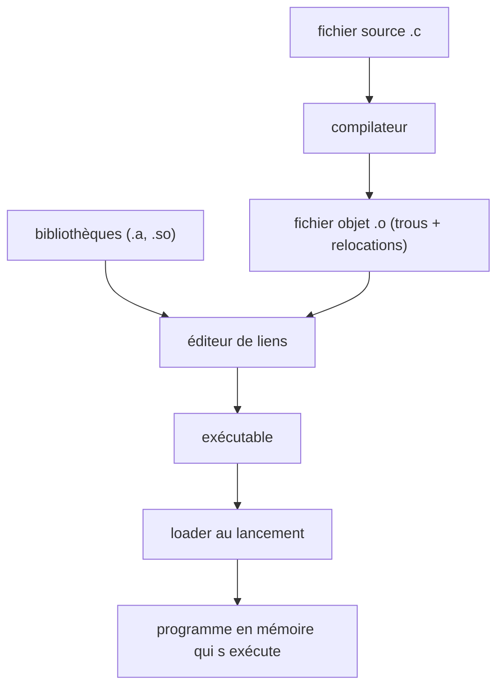

[Retour en haut de page](#table-des-matières)

## Les compilateurs modernes

Les compilateurs actuels exploitent ce pipeline en y ajoutant des techniques avancées.

### Inlining

L'*inlining* remplace un appel de fonction par le corps de la fonction appelée. On évite le coût de l'appel (sauvegarde de registres, saut, retour) et on ouvre la voie à d'autres optimisations (propagation de constantes au-delà des frontières d'appel).

```c
// Avant inlining
static inline int carre(int x) { return x * x; }
int hypothenuse_carree(int a, int b) { return carre(a) + carre(b); }

// Après inlining (équivalent vu par l'optimiseur)
int hypothenuse_carree(int a, int b) { return a * a + b * b; }
```

L'inlining excessif gonfle la taille du binaire ; les compilateurs appliquent des heuristiques (taille, fréquence d'appel, profil d'exécution).

### Vectorisation

La vectorisation utilise des instructions **SIMD** (*Single Instruction, Multiple Data* : SSE, AVX, NEON) pour appliquer la même opération à plusieurs éléments en parallèle.

> **Que veut dire « SIMD » et « vectorisation » ?** SIMD signifie « une seule instruction, plusieurs données ». Au lieu d'additionner les nombres un par un, le processeur en additionne quatre ou huit d'un seul coup, comme un tampon encreur qui imprime toute une rangée d'un geste au lieu de timbrer chaque case séparément. La « vectorisation » est la transformation par laquelle le compilateur repère une boucle qui fait la même chose sur chaque élément et la remplace par ces instructions groupées. SSE, AVX et NEON sont les noms de ces jeux d'instructions selon les processeurs.

```c
// Boucle scalaire
for (int i = 0; i < n; i++) a[i] = b[i] + c[i];

// Vectorisée par le compilateur (SIMD AVX, 4 floats par instruction)
//   *((__m128*)(a+i)) = _mm_add_ps(*(__m128*)(b+i), *(__m128*)(c+i));
```

À ne pas confondre avec le *déroulage de boucle* (loop unrolling), qui duplique le corps de boucle sans utiliser d'instruction vectorielle.

### Parallélisation et compilation distribuée

La parallélisation au sens du compilateur reste limitée : les vrais gains de parallélisme sont souvent à la charge du programmeur ou d'extensions comme [OpenMP](https://www.openmp.org/). En revanche, la compilation **distribuée** (le code source est compilé en parallèle sur plusieurs machines) accélère les gros projets ([icecc](https://github.com/icecc/icecream), [distcc](https://www.distcc.org/)).

### Profile-Guided Optimization (PGO)

> **Que veut dire « PGO » (optimisation guidée par le profil) ?** *Profile-Guided Optimization*. Un profil, c'est l'enregistrement de ce qui se passe vraiment quand le programme tourne : quelles fonctions sont appelées souvent, quelles branches `if` sont prises le plus. La PGO consiste à faire d'abord tourner le programme pour récolter ce profil, puis à recompiler en se servant de ces statistiques pour soigner en priorité les parties chaudes. C'est comme réaménager un magasin après avoir observé les rayons où les clients vont le plus.

Une compilation classique ne connaît pas les fréquences d'exécution réelles. La PGO exécute d'abord un binaire instrumenté (truffé de compteurs) sur des données représentatives, collecte un profil, puis recompile en exploitant ce profil pour orienter l'inlining, l'ordre des branches et l'agencement du code.

### Link-Time Optimization (LTO)

> **Que veut dire « LTO » (optimisation au moment de l'édition de liens) ?** *Link-Time Optimization*. D'habitude, chaque fichier est optimisé seul, dans son coin : l'optimiseur ne voit jamais le programme entier d'un coup. La LTO repousse une partie des optimisations jusqu'au lien, quand tous les morceaux sont enfin réunis, ce qui permet par exemple d'intégrer une fonction d'un fichier dans un autre. C'est comme corriger un livre une fois tous les chapitres rassemblés plutôt que chaque chapitre isolément : on voit les répétitions d'un bout à l'autre.

La LTO repousse l'optimisation au moment de l'édition de liens : chaque `.o` contient en réalité de l'IR (LLVM bitcode, GIMPLE pour GCC), et l'optimiseur voit l'ensemble du programme. Elle débloque l'inlining entre modules, le DCE entre modules, et la dévirtualisation C++ (le remplacement d'un appel indirect, choisi à l'exécution, par un appel direct quand le compilateur prouve quelle fonction est réellement visée).

### Multi-cibles

Des projets comme [LLVM](https://llvm.org/) ou [GraalVM](https://www.graalvm.org/) factorisent les optimisations au niveau de l'IR et déclinent un même front-end vers plusieurs cibles (x86-64, ARM64, WebAssembly, GPU).

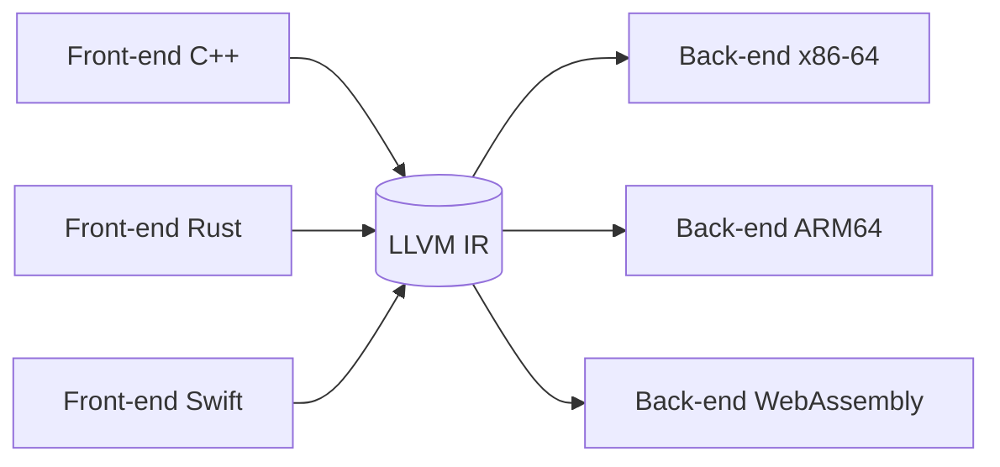

[Retour en haut de page](#table-des-matières)

## JIT, AOT et compilation adaptative

### AOT (*Ahead-Of-Time*)

> **Que veut dire « AOT » et « JIT » ?** Ce sont deux moments différents pour compiler. **AOT** (*Ahead-Of-Time*, « en avance ») traduit tout le programme en code machine bien avant qu'on le lance : c'est le modèle de C ou de Rust. **JIT** (*Just-In-Time*, « juste à temps ») attend l'exécution et traduit les parties au moment où elles servent vraiment. Comparaison : l'AOT, c'est cuisiner tout le repas la veille ; le JIT, c'est cuisiner chaque plat à la commande, en s'adaptant à ce que le client demande réellement.

Compilation classique : tout le programme est traduit en code machine **avant** exécution. Modèle de C, C++, Rust, Go, Swift, OCaml. Avantages : démarrage immédiat, optimisations coûteuses possibles. Inconvénient : pas d'accès au profil réel.

### JIT (*Just-In-Time*)

Le code est compilé **pendant** l'exécution, à mesure que des sections deviennent « chaudes ». Avantage majeur : le compilateur connaît les types vus, les valeurs typiques, les chemins fréquentés. Modèle de la JVM HotSpot, V8, .NET CLR, PyPy, GraalVM, LuaJIT.

### Compilation adaptative et OSR

> **Que veut dire « VM », « interpréter », « tiered compilation » et « hot path » ?** Une **VM** (*Virtual Machine*, machine virtuelle) est un programme qui imite un processeur pour exécuter du bytecode. **Interpréter** veut dire exécuter le code instruction par instruction, à la volée, sans le compiler d'abord (lent à démarrer mais immédiat). La *tiered compilation* (« compilation par paliers ») combine plusieurs niveaux : on commence par interpréter, puis on compile vite et grossièrement les parties qui reviennent souvent, puis on les recompile à fond si elles sont vraiment cruciales. Un *hot path* (« chemin chaud ») est justement une partie du code exécutée très fréquemment, qui mérite qu'on investisse dans son optimisation.

Les VM à *tiered compilation* (HotSpot, V8) commencent par interpréter le bytecode, puis compilent à un niveau peu optimisé (C1, *Ignition*+*Sparkplug*), enfin à un niveau agressif (C2, TurboFan, Maglev) après détection d'un *hot path*. Le **On-Stack Replacement** (OSR) permet de remplacer un cadre interprété par un cadre compilé sans attendre le retour de la fonction.

> **Que veut dire « On-Stack Replacement » (OSR) ?** Littéralement « remplacement sur la pile ». Imaginez une boucle qui tourne déjà depuis longtemps en mode interprété (lent) : on aimerait passer à la version compilée (rapide) sans attendre la fin de la boucle. L'OSR fait exactement cela : il échange, en plein milieu, le cadre d'exécution lent contre le cadre rapide, comme remplacer le moteur d'un train sans l'arrêter en gare.

### Spéculation et désoptimisation

> **Que veut dire « spéculer » et « désoptimiser » ?** Un JIT **spécule** quand il parie sur un fait observé pour produire du code plus rapide, par exemple « cette variable est toujours un nombre entier ». Le code optimisé n'est correct que tant que le pari tient. Si un jour le fait devient faux, la VM **désoptimise** : elle jette en catastrophe le code optimisé et revient à une version prudente. C'est comme prendre un raccourci tant que la route est dégagée, et faire demi-tour vers l'itinéraire sûr dès qu'on tombe sur un barrage.

Un JIT spécule : « cet appel vise toujours `Cat.meow` ». Il compile une version *inline* (le corps recopié sur place). Si l'hypothèse est violée, la VM désoptimise : elle revient à l'interprète, recompile une version plus prudente. Cette boucle hypothèse / vérification / désoptimisation est le cœur de V8 et HotSpot.

> **Que veut dire « appel polymorphe » ?** Un appel est polymorphe quand le même bout de code peut appeler des fonctions différentes selon le type réel de l'objet du moment : `animal.crier()` déclenche le miaulement pour un chat, l'aboiement pour un chien. Le processeur ne sait pas d'avance lequel ; le JIT parie sur le cas le plus fréquent.

### LLVM JIT (ORC, MCJIT)

LLVM expose une infrastructure de JIT générique (ORC v2). Julia, le shell PostgreSQL JIT, le moteur de requêtes ClickHouse, et Mojo l'utilisent. Le pipeline complet (IR → optim → codegen) est exécuté dans le processus, et le code émis est lié dynamiquement à l'image en cours.

[Retour en haut de page](#table-des-matières)

## Étude de cas : C → AST → 3-adresses → assembleur

Suivons une fonction C minimale à travers tout le pipeline.

### Source C

```c
int somme_carres(int n) {
    int s = 0;
    for (int i = 1; i <= n; i++) {
        s = s + i * i;
    }
    return s;
}
```

### AST (vue simplifiée)

```text
FunDecl somme_carres : (int n) -> int
└── Block
    ├── VarDecl s = Num(0)
    ├── For
    │   ├── init : VarDecl i = Num(1)
    │   ├── cond : LessEq(Var(i), Var(n))
    │   ├── step : Assign(i, Plus(Var(i), Num(1)))
    │   └── body : Assign(s, Plus(Var(s), Mul(Var(i), Var(i))))
    └── Return Var(s)
```

### Code à 3 adresses (TAC)

```text
somme_carres(n):
        s   = 0
        i   = 1
.L1:    if i > n goto .L2
        t1  = i * i
        s   = s + t1
        i   = i + 1
        goto .L1
.L2:    return s
```

### Forme SSA

```text
somme_carres(n):
        s0 = 0
        i0 = 1
.L1:    s1 = φ(s0, s2)
        i1 = φ(i0, i2)
        if i1 > n goto .L2
        t1 = i1 * i1
        s2 = s1 + t1
        i2 = i1 + 1
        goto .L1
.L2:    return s1
```

### Assembleur x86-64 (System V AMD64, sans optimisation puis avec)

Sans optimisation, `gcc -O0` produit un code mécanique fidèle au TAC, avec accès mémoire à chaque variable. Avec `-O2`, `s` et `i` vivent en registres et la boucle se réduit à :

```asm
somme_carres:
        test    edi, edi          ; n <= 0 ?
        jle     .Lzero
        mov     eax, 0            ; s = 0
        mov     ecx, 1            ; i = 1
.Lloop: mov     edx, ecx
        imul    edx, ecx          ; t1 = i * i
        add     eax, edx          ; s += t1
        add     ecx, 1            ; i++
        cmp     ecx, edi
        jle     .Lloop
        ret
.Lzero: xor     eax, eax
        ret
```

On voit le résultat de plusieurs passes : *constant folding* sur la borne, allocation de registres (`s`→`eax`, `i`→`ecx`), peephole (`mov eax,0` initial est conservé ici car `eax` est ensuite incrémenté ; `xor eax,eax` apparaît dans la branche zéro), choix d'instruction (`imul` plutôt qu'une séquence shift/add), respect de l'ABI (`edi` reçoit le premier argument, `eax` rend la valeur).

[Retour en haut de page](#table-des-matières)

## Gestion de la mémoire et runtime

> **Que veut dire « mémoire », « allocation », « runtime » et « modèle mémoire » ?** Pour fonctionner, un programme range ses données dans la mémoire de l'ordinateur. **Allouer** de la mémoire, c'est réserver une zone pour y mettre une donnée ; la **désallouer** (ou libérer), c'est rendre cette zone quand on n'en a plus besoin, afin qu'elle resserve. Le **runtime** est le petit programme de soutien embarqué avec votre code, qui assure ces tâches en coulisse pendant l'exécution. Le **modèle mémoire** décrit qui, du programmeur, du compilateur ou du runtime, a la charge d'allouer et de libérer. Image : la mémoire est un parking ; allouer = se garer, libérer = repartir, et le modèle dit qui surveille les places.

> **Que veut dire « write barrier » et « drop » ?** Une *write barrier* (« barrière d'écriture ») est un petit code ajouté automatiquement à chaque modification d'un objet pour prévenir le ramasse-miettes que quelque chose a changé, afin qu'il garde sa carte de la mémoire à jour. Un bloc `drop` est le code que des langages comme Rust insèrent à la sortie d'une portée pour libérer proprement ce qui ne sert plus, sans intervention du programmeur.

> **Que veut dire « modèle mémoire » selon les langages ?** Chaque langage choisit qui libère la mémoire et quand. Le choix conditionne le code émis par le back-end : barrières d'écriture pour le ramasse-miettes, blocs `drop` insérés à la sortie de portée, comptage de références implicite.

### Trois grandes familles

| Modèle | Qui libère ? | Surcoût d'exécution | Exemples |
|--------|--------------|---------------------|----------|
| **Manuel** | le programmeur (`malloc`/`free`, `new`/`delete`) | nul (mais bugs : *use-after-free*, *double-free*, fuites) | C, C++ historique, Zig |
| **RAII / *ownership*** | le compilateur, automatiquement à la sortie de portée | nul ou quasi | C++ moderne (RAII), Rust (*ownership*+*borrow*) |
| **ARC** (*Automatic Reference Counting*) | runtime, à la dernière référence | incrémenter/décrémenter à chaque copie ; cycles fuient | Swift, Objective-C ARC, Python (CPython) |
| **GC tracing** | runtime, périodique | pauses GC, *write barriers*, surcoût mémoire | Java, Go, C#, Haskell, OCaml, JavaScript |

> **Que veulent dire ces familles (manuel, RAII / ownership, ARC, GC) ?** En gestion **manuelle**, le programmeur réserve et rend la mémoire à la main : maximum de contrôle, maximum d'erreurs possibles (oublier de libérer, ou utiliser une zone déjà rendue). **RAII / ownership** (« acquisition de ressource = initialisation » et « propriété ») confie au compilateur la libération automatique dès qu'une donnée sort de sa portée, comme une lumière à détecteur qui s'éteint quand vous quittez la pièce. **ARC** (*Automatic Reference Counting*, « comptage automatique de références ») compte combien de personnes utilisent une donnée et la libère quand le compteur tombe à zéro, comme une salle qu'on ferme quand le dernier occupant sort. Le **GC** (*Garbage Collector*, « ramasse-miettes ») est un programme qui passe régulièrement repérer et jeter ce dont plus personne ne se sert, comme un service de nettoyage qui fait sa ronde.

### Algorithmes de garbage collection

Le compilateur d'un langage à GC émet du code coopératif avec le collecteur (carte mémoire, *safepoints*, *write barriers*). Les principales familles d'algorithmes :

> **Que veut dire « atteignable », « racines » et « fragmentation » ?** Les **racines** sont les points de départ connus (les variables en cours d'usage). Une donnée est **atteignable** si l'on peut y arriver en suivant les références depuis ces racines, comme tout ce qu'on peut joindre en suivant les liens d'un carnet d'adresses. Ce qui n'est plus atteignable est du déchet : personne ne pourra plus jamais y accéder, on peut le jeter. La **fragmentation** est l'état où la mémoire libre est éparpillée en petits trous entre des données encore utilisées, si bien qu'on ne trouve plus de grand espace continu, comme un parking plein de places isolées où un autocar ne peut pas se garer.

- **Mark-and-sweep** : marque tout ce qui est atteignable depuis les racines, puis libère le reste. Simple mais fragmente la mémoire.
- **Mark-compact** : après marquage, compacte les vivants en bord de tas. Élimine la fragmentation au prix d'une passe supplémentaire.
- **Copying / semi-spaces** (Cheney) : on partage le tas en deux moitiés, on copie les vivants d'une moitié à l'autre, on échange les rôles. Allocation triviale (bump pointer), mais on n'utilise que la moitié du tas.
- **Generational** : la plupart des objets meurent jeunes (*hypothèse générationnelle*). On alloue en *young generation*, on copie les survivants en *old generation*. La young est collectée fréquemment et vite.
- **Concurrent / incremental** : le GC tourne en parallèle du *mutator* (le programme), avec des *write barriers* pour suivre les modifications. Exemples : ZGC (Java), Shenandoah, Go (concurrent mark + sweep), V8 Orinoco.
- **Region-based** (MLton, Cyclone) : statique, le compilateur prouve qu'une région entière est libérable d'un bloc.

### Compile time vs run time

La frontière intéresse directement le compilateur :

- **Allocation au tas** : généralement runtime (`malloc`, `mmap`, GC bump pointer) ; le compilateur insère l'appel.
- ***Escape analysis*** : passe d'optimisation qui prouve qu'un objet ne s'échappe pas du cadre courant et peut donc être alloué en pile (HotSpot, Go, GraalVM).

> **Que veut dire « escape analysis » (analyse d'échappement) ?** C'est le compilateur qui se demande : « cet objet va-t-il survivre à la fonction qui le crée, ou bien rester confiné à l'intérieur ? ». S'il ne « s'échappe » pas (personne d'extérieur n'en gardera de référence), on peut le ranger dans la pile, libérée gratuitement à la sortie de la fonction, plutôt que dans le tas surveillé par le ramasse-miettes. C'est comme distinguer un brouillon jetable, qu'on déchire en quittant la pièce, d'un document à archiver.
- ***Stack maps*** : tables émises à la compilation décrivant, à chaque *safepoint*, l'emplacement des pointeurs vivants ; consommées par le GC à l'exécution.
- ***Drop glue*** : Rust émet à la compilation le code qui appellera les destructeurs à la sortie de portée. Pas de runtime requis.

[Retour en haut de page](#table-des-matières)

## Diagnostics et messages d'erreur

> **Que veut dire « diagnostic » ?** En médecine, un diagnostic explique ce qui ne va pas. Ici, c'est pareil : un diagnostic est un message du compilateur sur votre code, qu'il s'agisse d'une erreur bloquante, d'un simple avertissement, d'une note ou d'une suggestion de correction. Un bon diagnostic ne dit pas juste « non », il explique pourquoi et comment réparer.

La qualité des diagnostics est un sujet d'ingénierie à part entière, longtemps négligé puis remis au centre par Rust, Elm et Swift.

### Anatomie d'un bon message

1. **Localisation précise** : fichier, ligne, colonne, étendue (*span*) sur la portion fautive.

> **Que veut dire « span » (étendue) ?** Un *span* est la portion exacte de texte concernée par le message, du premier au dernier caractère fautif. Au lieu de dire vaguement « erreur ligne 10 », le compilateur peut souligner précisément les caractères en cause, comme un correcteur qui surligne le mot mal orthographié plutôt que la phrase entière.
2. **Cause primaire** : ce que le compilateur a vu de problématique, en termes du langage source.
3. **Contexte** : la ou les définitions concernées (où le type a été déclaré, où la variable a été *moved*).
4. **Explication** : pourquoi c'est une erreur (la règle violée).
5. **Suggestion** correctrice quand elle est mécanique : « ajoutez `&` », « importez `std::collections::HashMap` », « renommez en `foo` (typo possible) ».
6. **Exemple positif** : code qui *aurait* fonctionné, idéalement avec un *diff* applicable.

### Le standard Rust

`rustc` rend la barre haute : étendues colorées, codes d'erreur stables (`E0382`), explications longues accessibles via `--explain`, suggestions structurées que `cargo fix` peut appliquer mécaniquement, *teach mode* pour les débutants. Le secret est en grande partie une **structure de données riche** dans le compilateur : un diagnostic Rust n'est pas une chaîne, c'est un arbre annoté que l'IDE (rust-analyzer) consomme aussi.

### Récupération d'erreurs

Un parser robuste **ne s'arrête pas** à la première erreur. Stratégies classiques :

- **synchronisation** sur des tokens « stables » (point-virgule, accolade fermante) ;
- **erreurs de panic mode** : on jette les tokens jusqu'à un point de synchronisation ;
- **réparation** : on insère ou supprime un token plausible et on continue (Merr, *minimum-edit error recovery*) ;
- **îlots résilients** : Tree-sitter parse en présence d'erreurs et conserve un AST partiel, précieux pour les éditeurs.

### Avertissements et lints

> **Que veut dire « lint » ?** Un *lint* est une remarque de style ou de prudence sur du code pourtant parfaitement légal : « cette variable ne sert jamais », « cette comparaison est toujours vraie ». Le mot vient des peluches (*lint*) qu'on retire d'un vêtement : ce sont les petits défauts qu'on enlève pour faire propre, même si le vêtement est portable tel quel. Les lints sont configurables, on choisit lesquels activer.

Au-delà des erreurs, le compilateur émet des avertissements (code suspect mais légal) et des lints (règles configurables : style, motifs déconseillés, complexité). `clippy` (Rust), `clang-tidy` (C/C++), ESLint (JavaScript) sont des couches de lints construites sur l'AST ou l'IR du compilateur.

[Retour en haut de page](#table-des-matières)

## Bootstrapping et confiance

> **Que veut dire « bootstrapping » et « stage » ?** Le mot vient de l'expression anglaise « se hisser par ses propres lacets » (*bootstraps*). Pour un compilateur, c'est le fait d'écrire le compilateur du langage `L` dans le langage `L` lui-même, et de le compiler. Cela ressemble à un paradoxe de la poule et de l'œuf : comment compiler un compilateur en `L` s'il n'existe pas encore de compilateur `L` ? On s'en sort par étapes appelées **stages** : `stage0` est un compilateur de référence qui existe déjà (parfois écrit dans un autre langage) ; il compile `stage1` (le nouveau compilateur) ; puis `stage1` se recompile lui-même pour produire `stage2`. À partir de là, le langage se compile tout seul.

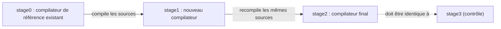

### Pourquoi bootstrapper ?

- **Auto-validation** : si le langage est expressif et le compilateur correct, écrire le compilateur dans son propre langage est la meilleure démonstration.
- **Dogfooding** : les concepteurs subissent leur langage en premier ; les imperfections remontent vite.

> **Que veut dire « dogfooding » ?** De l'expression anglaise « manger sa propre nourriture pour chien » : utiliser soi-même le produit qu'on fabrique. En écrivant le compilateur de leur langage dans ce langage, ses créateurs en deviennent les premiers utilisateurs et repèrent vite ce qui est pénible, exactement comme un restaurateur qui goûte ses propres plats.
- **Indépendance** : à terme, le projet ne dépend plus que de son binaire de référence, distribué pour amorcer l'auto-compilation.

### Cas historiques

- Niklaus **Wirth** réimplémenta Pascal en Pascal ; le compilateur P4 a servi de gabarit pédagogique pendant deux décennies.
- **GCC** est écrit en C++ (autrefois C) et se compile lui-même via les fameux *stages* `stage1`/`stage2`/`stage3`. La comparaison binaire entre `stage2` et `stage3` est un test d'intégrité majeur : ils doivent être identiques.
- **Rustc** est écrit en Rust et se compile via un compilateur précédent fourni par `rustup` ; le projet maintient une chaîne d'amorçage manuelle (`mrustc`) qui repart d'un sous-ensemble traduit en C++.
- **OCaml** : `ocamlc` (bytecode) bootstrap `ocamlopt` (natif) qui se recompile lui-même.

### *Reflections on Trusting Trust* (Ken Thompson, 1984)

L'**attaque de Thompson** (« Reflections on Trusting Trust », ACM Turing Award lecture) est l'argument de sécurité le plus cité dans l'histoire des compilateurs. Idée :

1. On modifie le compilateur `C` pour qu'il insère, à la compilation de `login`, une porte dérobée.
2. On modifie en plus `C` pour qu'à la compilation de **lui-même** il réinsère **les deux modifications**.
3. On recompile `C` une fois, puis on retire les sources malveillantes : le binaire `C` reste infecté et propage l'infection à toutes ses descendances, sans laisser de trace dans les sources.

Conséquence : la confiance dans un binaire ne peut pas se dériver uniquement de la lecture de ses sources, ni de celles de son compilateur, ni de celles du compilateur de son compilateur. C'est une régression infinie (un problème qui se repousse sans fin, comme deux miroirs face à face). La parade pratique est la **compilation reproductible** (*reproducible builds*) et le **bootstrapping diversifié** (*Diverse Double-Compiling* de David A. Wheeler) : compiler `C` avec deux compilateurs indépendants `A` et `B`, puis comparer les binaires obtenus en `stage2`.

> **Que veut dire « compilation reproductible » ?** C'est la garantie que recompiler les mêmes sources donne exactement le même fichier binaire, octet pour octet, sur n'importe quelle machine. Cela permet de vérifier qu'un exécutable distribué correspond bien à ses sources et n'a pas été trafiqué : si deux personnes obtiennent le même résultat, c'est qu'aucune porte dérobée ne s'est glissée. C'est l'équivalent d'une recette si précise que deux cuisiniers obtiennent un gâteau strictement identique.

[Retour en haut de page](#table-des-matières)

## WebAssembly et générateurs de code alternatifs

### WebAssembly comme cible de compilation

> **Que veut dire « WebAssembly » et « machine à pile » ?** WebAssembly (abrégé Wasm) est un format de bytecode portable, conçu d'abord pour faire tourner du code rapide dans le navigateur web, et devenu depuis une cible générale. Une « machine à pile » est une machine virtuelle qui calcule en empilant et dépilant des valeurs sur une pile (« mets 2, mets 3, additionne » laisse 5 au sommet), plutôt qu'en utilisant des registres nommés. C'est simple à décrire et à vérifier, donc pratique comme cible commune.

**WebAssembly** (Wasm) est un format binaire de bytecode pour une machine à pile virtuelle, standardisé par le W3C (l'organisme qui normalise les technologies du web). Conçu initialement pour le navigateur, il est devenu une cible générale (Wasmtime, Wasmer, WasmEdge, conteneurs « micro-VM »). Caractéristiques pertinentes pour un compilateur :

- **typé statiquement** : 4 types numériques (`i32`, `i64`, `f32`, `f64`) plus références ;
- **structuré** : pas de `goto` libre, mais des blocs (`block`, `loop`, `if`) à branches étiquetées ;
- **sandboxé** : la mémoire linéaire est un tableau d'octets borné, pas d'accès direct au système d'exploitation ;
- **ABI** définie par WASI (*WebAssembly System Interface*) pour les appels au système.

> **Que veut dire « sandboxé » et « mémoire linéaire » ?** Un code « sandboxé » (« mis en bac à sable ») tourne dans un espace clos d'où il ne peut pas toucher au reste de la machine : il ne lit pas vos fichiers, n'accède pas au réseau sans permission, exactement comme un enfant qui joue dans un bac à sable sans pouvoir en sortir. La « mémoire linéaire » est l'unique grand tableau d'octets dont dispose ce code, de taille bornée et surveillée, ce qui rend toute fuite hors limites impossible.

> **Que veut dire « CFG réductible » ?** Un graphe de flot de contrôle est « réductible » quand toutes ses boucles sont bien structurées, avec une seule porte d'entrée chacune, sans sauts sauvages qui entrent au milieu d'une boucle. WebAssembly n'accepte que ce type de structure ordonnée (pas de `goto` libre). Le compilateur doit donc remettre le flot du programme dans cette forme propre avant de produire du Wasm.

Côté compilateur, viser Wasm impose une forme réductible du CFG (toutes les boucles ont un en-tête unique). LLVM y parvient via une passe de *relooper* dérivée des travaux d'Emscripten ; `wasm-ld` joue le rôle du linker.

Cas industriels : `clang --target=wasm32-wasi`, `rustc --target=wasm32-unknown-unknown`, Go (depuis 1.21), Swift, .NET (Blazor), AssemblyScript.

### Cranelift : un back-end alternatif à LLVM

**Cranelift** est un générateur de code écrit en Rust, hébergé par Bytecode Alliance. Conçu d'abord pour Wasmtime (JIT WebAssembly), il sert aussi de back-end alternatif à `rustc` (`-Zcodegen-backend=cranelift`) pour les *debug builds* rapides.

| Critère | LLVM | Cranelift |
|---------|------|-----------|
| Qualité du code optimisé | très haute (>30 ans d'optims) | moyenne |
| Vitesse de compilation | lente | très rapide (objectif principal) |
| Surface (taille binaire, dépendances) | énorme (\~15 millions de lignes C++) | modérée (Rust pur) |
| Cibles | x86, ARM, RISC-V, GPU, Wasm, MIPS… | x86-64, ARM64, s390x, RISC-V |
| IR | LLVM IR (textuel + bitcode) | CLIF (Cranelift IR) |
| Modèle d'usage | AOT et JIT (ORC) | JIT prioritaire, AOT possible |

Le compromis est explicite : Cranelift sacrifie une partie des optimisations agressives de LLVM pour offrir des temps de compilation comparables à un interprète, ce qui est précieux pour un JIT Wasm ou une boucle d'itération `cargo check`. D'autres alternatives existent : QBE (minimaliste, pédagogique), Go SSA backend (interne au compilateur Go), .NET RyuJIT.

### Front-end / back-end : quelle réutilisabilité ?

L'argument *N + M ≪ N × M* de l'IR commune n'est pas gratuit. En pratique :

- **Front-ends partageant LLVM IR** : Clang (C/C++/Obj-C), Rust, Swift, Julia, Crystal, Zig (en transition), Pony, Pyston. Chaque front-end maintient malgré tout son **HIR/MIR** spécifique pour les vérifications langagières (emprunt Rust, ARC Swift, types dépendants Julia) avant d'abaisser vers LLVM IR.
- **Back-ends partagés** : un même back-end LLVM accepte des dizaines d'IR sources en passant par LLVM IR. La réutilisation est réelle pour la phase de codegen (sélection d'instructions, allocation de registres, ordonnancement, formats objet).
- **Limites** : LLVM IR est typé mais sans notion de *traits* Rust, de classes Swift, de *generics* Java ; toute information sémantique perdue dans l'abaissement n'est pas récupérable. D'où la tendance moderne à **conserver une MIR de haut niveau** spécifique au langage (MIR Rust, SIL Swift, GIMPLE GCC) avant l'abaissement vers l'IR partagée.

[Retour en haut de page](#table-des-matières)

## Pour aller plus loin

Lectures recommandées, par ordre approximatif de difficulté :

- *Crafting Interpreters*, Robert Nystrom ([disponible en ligne](https://craftinginterpreters.com/)). Construit deux interpréteurs complets pour le langage Lox. Excellente porte d'entrée.
- *Modern Compiler Implementation in Java/ML/C* (« Tiger Book »), Andrew W. Appel. Construction guidée d'un compilateur Tiger, du lexer à la génération de code.
- *Engineering a Compiler*, Keith D. Cooper, Linda Torczon. Très bon équilibre théorie / pratique, accent sur l'optimisation et SSA.
- *Compilers: Principles, Techniques, and Tools* (« Dragon Book »), Aho, Lam, Sethi, Ullman. La référence pour la théorie des langages, le lexing et le parsing.
- *Advanced Compiler Design and Implementation*, Steven Muchnick. Le complément back-end / optimisations du Dragon.
- *Static Single Assignment Book*, Rastello & Bouchez Tichadou (libre, [pfalcon.github.io/ssabook](http://ssabook.gforge.inria.fr/latest/book.pdf)). Tout sur SSA et ses transformations.
- *Linkers and Loaders*, John R. Levine. Sur la liaison statique et dynamique, ELF/PE/Mach-O.
- *Types and Programming Languages*, Benjamin Pierce. Pour le typage, l'inférence, la sémantique.

Documentations et cours :

- [LLVM Project](https://llvm.org/) : l'infrastructure de compilation moderne (LLVM IR, *passes*, ORC JIT).
- [GCC Internals manual](https://gcc.gnu.org/onlinedocs/gccint/) : architecture interne de GCC, GIMPLE, RTL.
- [Stanford CS143 Compilers](https://web.stanford.edu/class/cs143/) : cours en ligne complet, projet COOL.
- [Cornell CS 6120 Advanced Compilers](https://www.cs.cornell.edu/courses/cs6120/) : cours moderne centré sur SSA et l'optimisation.
- [V8 blog](https://v8.dev/blog) et [HotSpot Wiki](https://wiki.openjdk.org/display/HotSpot) : articles d'ingénieurs sur les JIT en production.

## Licence

Distribué sous licence [MIT](LICENSE).

## Auteur

**Tansoftware - Tanguy Chénier** · [LinkedIn](https://www.linkedin.com/in/tanguy-chenier) · [Tan-Software](https://github.com/Tan-Software) · [Compte personnel (derniers outils)](https://github.com/tanguychenier) · [tansoftware.com](https://www.tansoftware.com)
