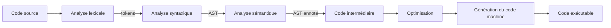
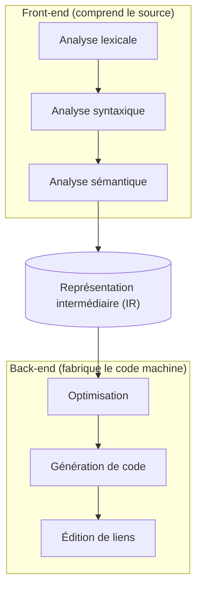

[↑ Sommaire](../README.md#table-des-matières) · [Le front-end : de la source a l'arbre →](02-le-front-end-de-la-source-a-larbre.md)

# 1. Fondations et vue d'ensemble

## Introduction

Un compilateur est un programme qui traduit un texte écrit dans un *langage source* (un langage de programmation, comme le C ou le Rust) vers un *langage cible*, le plus souvent du code machine exécutable. Le langage cible peut aussi être un autre langage de programmation (on parle alors de transpilation), du *bytecode* (voir l'encadré ci-dessous), ou une forme intermédiaire.

> **Que veut dire « transpilation » ?** C'est traduire d'un langage de programmation vers un autre langage de programmation de niveau comparable, par exemple du TypeScript vers du JavaScript. À la différence de la compilation classique qui descend vers le code machine, la transpilation reste « à la même altitude », comme traduire un roman du français vers l'espagnol plutôt que vers le braille.

> **Que veut dire « compilateur » ?** Imaginez un traducteur qui prend un livre écrit en français et le réécrit entièrement en chinois avant de vous le remettre. Vous lisez ensuite la version chinoise sans plus jamais revenir au français. Le compilateur fait pareil : il traduit une fois pour toutes le texte que le programmeur écrit (lisible par un humain) en instructions que le processeur sait exécuter directement (illisibles pour un humain). Cela diffère d'un interprète, qui lui traduirait phrase par phrase pendant que vous lisez, à chaque lecture.

> **Que veut dire « code machine » ?** C'est la liste des ordres élémentaires qu'un processeur comprend vraiment : « additionne ces deux nombres », « range ce résultat ici », « saute à cet endroit du programme ». Ces ordres sont des suites de nombres, pas du texte. Le processeur ne sait rien faire d'autre que dérouler cette liste très vite.

> **Que veut dire « bytecode » ?** C'est un code intermédiaire, à mi-chemin entre le langage du programmeur et le code machine du processeur. Il n'est pas exécuté par le processeur en personne, mais par un autre programme appelé machine virtuelle (par exemple la machine virtuelle Java). Avantage : le même bytecode tourne sur n'importe quelle machine où la machine virtuelle est installée.

Le parcours classique d'un compilateur suit une succession d'étapes que l'on regroupe en deux familles :

- le **front-end** (la partie « avant ») comprend le code source : il le lit et vérifie qu'il a du sens (analyses lexicale, syntaxique, sémantique, expliquées plus loin) ;
- le **back-end** (la partie « arrière ») produit du code optimisé pour une machine cible donnée.

> **Que veut dire « front-end » et « back-end » ?** Pensez à un restaurant. Le front-end, c'est la salle et le serveur qui prennent votre commande et la comprennent. Le back-end, c'est la cuisine qui prépare réellement le plat. Le serveur ne cuisine pas, la cuisine ne parle pas au client : chacun son métier. Dans un compilateur, le front-end comprend, le back-end fabrique.

Entre les deux, une *représentation intermédiaire* (IR) sert d'intermédiaire neutre qui sépare proprement les deux familles. Cette séparation est utile : un même front-end peut viser plusieurs machines cibles, et un même back-end peut accepter plusieurs langages source. C'est l'architecture de [LLVM](https://llvm.org/) et de [GCC](https://gcc.gnu.org/).

> **Que veut dire « représentation intermédiaire » (IR, de l'anglais *Intermediate Representation*) ?** Reprenons le traducteur. Plutôt que de traduire directement du français vers le chinois, le japonais et l'arabe (trois traductions à écrire à chaque fois), il traduit d'abord vers une langue pivot universelle, puis de cette langue pivot vers chaque langue voulue. La langue pivot, c'est l'IR : un format unique placé au milieu du parcours qui évite de tout refaire pour chaque combinaison langage / machine.

[Retour en haut de page](#table-des-matières)

## Glossaire express

Un compilateur manipule un vocabulaire technique dense. Voici les définitions courtes de référence. Chaque terme est repris et développé, avec une analogie, dans la section où il apparaît pour la première fois ; cette table sert d'aide-mémoire à consulter en cas de doute.

| Terme | Définition courte |
|-------|-------------------|
| **Lexème** | Sous-chaîne du source qui forme une unité atomique (`while`, `42`, `==`, `foo`). |
| **Token** | Lexème classé par catégorie : paire `(type, valeur)`, par exemple `(MOT_CLE, "while")`. |
| **Expression régulière (regex)** | Description compacte d'un langage régulier ; sert à spécifier les tokens. |
| **NFA** | *Nondeterministic Finite Automaton*. Automate fini où, depuis un état, plusieurs transitions peuvent porter le même symbole (ou des transitions vides ε). |
| **DFA** | *Deterministic Finite Automaton*. Automate fini déterministe : un seul état suivant possible par symbole. Forme exécutable d'un lexer. |
| **Grammaire hors contexte (CFG)** | *Context-Free Grammar*, ensemble de règles `A → α` qui définit la syntaxe du langage. **Attention : même acronyme que le graphe de flot de contrôle.** Le contexte lève l'ambiguïté : *grammaire CFG* (syntaxe) vs *graphe CFG* (flot). |
| **PEG** | *Parsing Expression Grammar* : grammaire ordonnée à choix prioritaire, sans ambiguïté par construction. |
| **Pratt parser** | Parser top-down piloté par des *binding powers* gauche/droite ; gère élégamment les opérateurs préfixes, infixes, postfixes et mixfix. |
| **LL(1)** | Parser top-down qui lit la source de gauche à droite (*Left-to-right*) et produit une dérivation gauche (*Leftmost*) avec **1** token d'anticipation. |
| **LR(1)** | Parser bottom-up *Left-to-right* + dérivation droite inverse (*Rightmost in reverse*) avec 1 token d'anticipation. |
| **LALR(1)** | *Look-Ahead LR(1)*. Variante compacte de LR(1) utilisée par `yacc`/`bison`. |
| **AST** | *Abstract Syntax Tree* : arbre représentant la structure logique du programme, débarrassé du sucre syntaxique. |
| **IR** | *Intermediate Representation* : forme intermédiaire entre source et code machine. |
| **SSA** | *Static Single Assignment* : forme d'IR dans laquelle chaque variable est affectée exactement une fois. |
| **Bloc de base** | Suite maximale d'instructions sans branchement entrant ailleurs qu'au début, ni branchement sortant ailleurs qu'à la fin. |
| **Graphe de flot de contrôle (CFG)** | *Control-Flow Graph* : graphe orienté dont les sommets sont les blocs de base et les arêtes les transferts de contrôle. **Homonyme acronymique** de la grammaire hors contexte ; dans la suite, on écrira *grammaire CFG* ou *graphe CFG* lorsque le risque de confusion existe. |
| **MIR / HIR / LIR** | Représentations intermédiaires de niveau respectivement moyen, haut et bas. Pipeline canonique : AST → HIR → MIR → LIR → assembleur. |
| **Bootstrapping** | Auto-compilation : un compilateur écrit dans son propre langage (le compilateur Rust est écrit en Rust, GCC en C/C++, ocamlopt en OCaml). |
| **Dominateur** | Dans un CFG, le nœud `D` *domine* `N` si tout chemin du point d'entrée à `N` passe par `D`. |
| **Allocation de registres** | Affectation des variables vivantes à un nombre fini de registres physiques. |
| **Peephole optimization** | Optimisation locale sur une fenêtre de quelques instructions consécutives. |
| **Convention d'appel** | Contrat sur la façon de passer arguments et résultats (registres, pile, ordre, alignement). |
| **ABI** | *Application Binary Interface* : ensemble des règles d'interopérabilité binaire (convention d'appel + format de structures + symboles). |
| **Linker** | *Éditeur de liens* : combine plusieurs fichiers objets et résout les symboles externes. |
| **Liaison dynamique** | Résolution différée à l'exécution via une bibliothèque partagée (`.so`, `.dll`, `.dylib`). |

[Retour en haut de page](#table-des-matières)

## Vue d'ensemble du pipeline

> **Que veut dire « pipeline » ?** En anglais, un *pipeline* est un pipeline, une canalisation. En informatique, c'est une chaîne de traitement : le résultat de chaque étape devient l'entrée de la suivante, comme sur une chaîne de montage en usine où la voiture passe d'un poste à l'autre. Le code source entre d'un côté, l'exécutable sort de l'autre, et entre les deux il traverse une série de postes spécialisés.

À chaque étape, le compilateur peut détecter des erreurs et arrêter la compilation : caractère illégal au lexer, structure incorrecte au parser, type incompatible au vérificateur sémantique, et ainsi de suite.

### Les sept phases canoniques (Aho et al.)

> **Que veut dire « Aho et al. » et « phase canonique » ?** « Aho et al. » désigne les auteurs du livre de référence sur les compilateurs (Alfred Aho et ses coauteurs ; « et al. » est l'abréviation latine d'*et alii*, « et les autres »). « Canonique » veut dire « qui fait autorité, considéré comme la version officielle ». Les sept phases ci-dessous sont donc le découpage standard que tout le monde reconnaît, comme une recette de cuisine classique que chaque cuisinier respecte.

La frontière entre les deux familles (front-end qui comprend, back-end qui fabrique) et le rôle pivot de l'IR se visualisent ainsi :

| # | Phase | Entrée | Sortie | Erreurs typiques |
|---|-------|--------|--------|------------------|
| 1 | Analyse lexicale | flux de caractères | flux de tokens | caractère interdit, littéral mal formé |
| 2 | Analyse syntaxique | tokens | arbre syntaxique (concret puis AST) | parenthèse non fermée, mot-clé manquant |
| 3 | Analyse sémantique | AST | AST annoté + table des symboles | type incompatible, variable non déclarée |
| 4 | Génération d'IR | AST annoté | IR (TAC, SSA, LLVM IR…) | rare ; plutôt des invariants à respecter |
| 5 | Optimisation | IR | IR transformée | aucune (sinon le passe est buggé) |
| 6 | Génération de code | IR | assembleur / fichier objet | contraintes de cible (registre, alignement) |
| 7 | Édition de liens | objets `.o` | exécutable / bibliothèque | symbole non résolu, ABI incompatible |

[Retour en haut de page](#table-des-matières)

---

[↑ Sommaire](../README.md#table-des-matières) · [Le front-end : de la source a l'arbre →](02-le-front-end-de-la-source-a-larbre.md)
