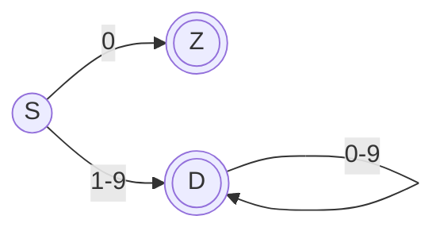
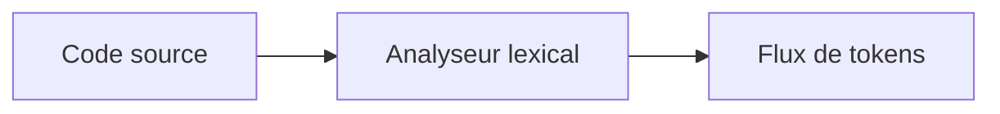
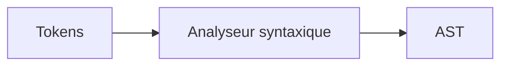
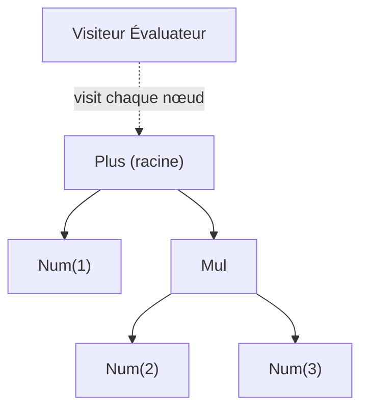
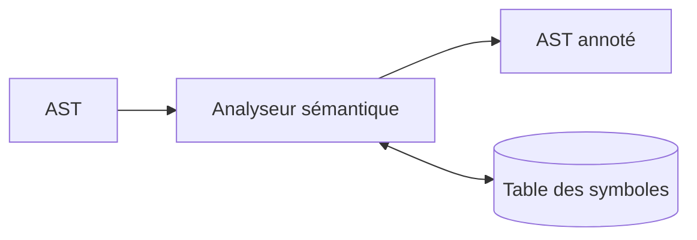

[← Fondations et vue d'ensemble](01-fondations-et-vue-densemble.md) · [↑ Sommaire](../README.md#table-des-matières) · [Representation intermediaire et optimisation →](03-representation-intermediaire-et-optimisation.md)

# 2. Le front-end : de la source a l'arbre

## Analyse lexicale

L'analyse lexicale (*lexing* ou *scanning* en anglais) découpe le flux de caractères du code source en une suite de **tokens** (des lexèmes classés par type). Chaque token est une paire `(type, valeur)` : `(IDENT, "ma_variable")`, `(NOMBRE, 42)`, `(MOT_CLE, "if")`, `(SYMBOLE, "+")`.

> **Que veut dire « analyse lexicale » et « lexer » ?** Le lexer est l'étape qui découpe le texte du programme en petits morceaux qui ont un sens, exactement comme vous découpez une phrase en mots avant de la comprendre. Devant `int x = 42;`, l'ordinateur ne voit au départ qu'une suite de lettres et de symboles collés ; le lexer y reconnaît les mots `int`, `x`, `=`, `42`, `;`. « Lexical » vient du grec *lexis*, le mot.

> **Que veut dire « token » et « lexème » ?** Le **lexème** est le morceau de texte tel qu'il apparaît dans le source (les caractères `4` et `2` mis bout à bout). Le **token** est ce morceau une fois étiqueté : « ceci est un NOMBRE qui vaut 42 ». Comparaison : dans une bibliothèque, le lexème est le livre physique, le token est la fiche du catalogue qui dit « roman, par tel auteur ». Le lexer fabrique les fiches à partir des livres.

> **Que veut dire « flux de caractères » ?** Un « flux » est simplement une suite de choses qui défilent une à une, dans l'ordre, comme l'eau qui passe dans un tuyau. Un flux de caractères, c'est le texte du programme lu lettre après lettre, du début à la fin.

> **Définition opérationnelle.** Le lexer **produit** les tokens, le parser les **consomme**. Cette frontière est un contrat unidirectionnel : le lexer ne sait rien de la grammaire du langage (au-delà du *maximal munch* et de la table des mots-clés), le parser ne sait rien des caractères d'origine (au-delà éventuellement des positions, conservées pour les diagnostics). Confondre les deux niveaux est l'erreur la plus fréquente des cours d'introduction : *analyser la syntaxe* signifie reconnaître la structure d'un programme à partir de tokens, pas à partir de caractères.

### Vocabulaire

- **Lexème** : la sous-chaîne effective trouvée dans le source (`"42"`).
- **Token** : la classe attribuée au lexème (`NOMBRE`) plus son attribut (la valeur entière `42`).
- **Mot-clé** : lexème dont la chaîne est réservée par le langage (`if`, `while`, `return`).

### Exemple lexical

Pour l'expression source `int x = 42;`, le lexer produit :

```text
(KEYWORD, "int")  (IDENT, "x")  (OP, "=")  (NUMBER, 42)  (PUNCT, ";")
```

### Étapes du lexer

1. **Lecture caractère par caractère** du flux source.
2. **Reconnaissance des lexèmes** à l'aide d'expressions régulières ou d'un automate fini.
3. **Classification** : à chaque lexème reconnu, on associe un type de token.
4. **Émission** : le lexer renvoie une séquence de tokens au parser, généralement à la demande (interface itérateur).

Les outils classiques (`lex`, `flex`, `re2c`) génèrent ce code à partir d'une grammaire régulière.

### De la regex au DFA : Thompson + construction par sous-ensembles

> **Que veut dire « regex » ?** Abréviation de *regular expression*, expression régulière. C'est une petite formule qui décrit une famille de textes possibles. Par exemple, « un chiffre, suivi d'autres chiffres » décrit tous les nombres entiers. C'est l'équivalent d'un gabarit de couture : un seul patron permet de reconnaître (ou de fabriquer) une infinité de pièces qui suivent la même forme.

> **Que veut dire « automate fini » (NFA, DFA) ?** Un automate fini est une petite machine imaginaire à cases (les « états ») reliées par des flèches. On lit le texte caractère par caractère ; à chaque caractère, on suit la flèche correspondante vers la case suivante. Si l'on termine sur une case « acceptante », le texte est reconnu. C'est comme un plateau de jeu de l'oie où chaque lettre lue vous fait avancer d'une case. Le **DFA** (*Deterministic Finite Automaton*, automate déterministe) n'a qu'une seule flèche possible par caractère : aucune hésitation. Le **NFA** (*Nondeterministic Finite Automaton*, automate non déterministe) peut avoir plusieurs flèches pour le même caractère, voire des flèches « gratuites » (notées ε, la lettre grecque epsilon) que l'on emprunte sans rien lire. Le NFA est plus facile à construire, le DFA plus rapide à exécuter ; on convertit donc l'un en l'autre.

La construction d'un lexer suit deux étapes algorithmiques fondamentales, décrites en détail par Aho, Lam, Sethi & Ullman.

**1. Construction de Thompson (regex → NFA).** Chaque opérateur régulier se traduit par un patron d'automate avec ε-transitions (des flèches gratuites qui ne consomment aucun caractère) :

- `a` : un état initial → état final via `a`.
- `r1 r2` (concaténation) : on relie l'état final de `r1` à l'état initial de `r2` par ε.
- `r1 | r2` (alternative) : un nouvel état initial part par ε vers `r1` et `r2` ; un nouvel état final reçoit par ε.
- `r*` (étoile de Kleene) : ε vers `r` et ε de retour, plus un raccourci ε.

> **Que veut dire « étoile de Kleene » ?** Le symbole `*` placé après un motif signifie « zéro, une ou plusieurs répétitions de ce motif ». `a*` reconnaît donc le vide, `a`, `aa`, `aaa`, et ainsi de suite. Nommée d'après le mathématicien Stephen Kleene. C'est le « etc. » des expressions régulières.

**2. Construction par sous-ensembles (NFA → DFA).** Chaque état du DFA est un *ensemble* d'états du NFA atteignables. La fermeture ε (l'ensemble des états joignables par les flèches gratuites) et la fonction de transition sont calculées de proche en proche jusqu'à ce que plus rien ne change (saturation).

### Exemple concret : un littéral entier décimal

Regex : `0 | [1-9][0-9]*`

DFA correspondant (états : `S` start, `Z` zero, `D` digit) :



`Z` et `D` sont des états acceptants (double cercle), c'est-à-dire des cases où l'on a le droit de s'arrêter avec un nombre valide reconnu. Le lexer adopte la **règle du plus long préfixe** (*maximal munch*, littéralement « la plus grosse bouchée ») : il continue de lire tant qu'une flèche existe, retient la dernière case acceptante traversée, et y revient si la lecture suivante mène à une impasse. Justification : sans cette règle, devant `123` le lexer pourrait s'arrêter au premier `1` ; on veut au contraire le nombre entier le plus long. La règle de **priorité** départage les cas où deux catégories conviennent (`if` est reconnu comme mot-clé plutôt que comme nom de variable, car les mots-clés passent avant).



### Pour creuser

- *Dragon Book*, ch. 3 « Lexical Analysis ».
- *Crafting Interpreters*, ch. 4 « Scanning ».

[Retour en haut de page](#table-des-matières)

## Analyse syntaxique

L'analyse syntaxique (*parsing* en anglais) consomme le flux de tokens et construit un **arbre syntaxique abstrait** (AST) qui représente la structure du programme selon la grammaire du langage. Si la séquence de tokens ne respecte pas la grammaire, le parser émet une erreur de syntaxe.

> **Que veut dire « analyse syntaxique » et « parser » ?** Si le lexer découpe la phrase en mots, le parser, lui, comprend comment ces mots s'organisent : quel mot est le verbe, quel groupe est le sujet, quel morceau est entre parenthèses. Devant `2 + 3 * 4`, le parser comprend que la multiplication doit se faire avant l'addition. Il ne se contente pas de la liste des mots, il en reconstruit la grammaire, comme l'analyse de phrase apprise à l'école.

> **Que veut dire « grammaire » (d'un langage de programmation) ?** Ce sont les règles qui disent quelles suites de tokens forment un programme correct, exactement comme la grammaire du français dit qu'une phrase a besoin d'un sujet et d'un verbe. « Une expression est deux expressions séparées par un `+` » est une règle de grammaire.

> **Que veut dire « arbre syntaxique abstrait » (AST, de l'anglais *Abstract Syntax Tree*) ?** C'est une représentation en forme d'arbre de la structure du programme. Au lieu de garder le texte à plat, on le range comme un arbre généalogique : l'addition est au sommet, ses deux opérandes sont ses enfants. « Abstrait » parce qu'on jette les détails inutiles (parenthèses, espaces) pour ne garder que le sens. L'AST a sa propre section plus bas, où il est détaillé.

> **Note terminologique.** « LL(1) » n'est *pas* « le parser » : c'est une **classe** de parsers, c'est-à-dire un sous-ensemble de grammaires reconnaissables par un certain algorithme. Une même grammaire peut être LL(1), LL(*k*), LALR(1), LR(1), GLR ou PEG selon les outils utilisés. Choisir une famille, c'est arbitrer entre puissance grammaticale, qualité des diagnostics, vitesse de compilation et facilité d'implémentation.

### Grammaires hors contexte (CFG)

> **Que veut dire « grammaire hors contexte » (CFG, de l'anglais *Context-Free Grammar*) ?** « Hors contexte » signifie qu'une règle s'applique toujours de la même façon, peu importe ce qu'il y a autour : une expression reste une expression qu'elle soit au début ou au milieu du programme, comme le mot « chat » reste un nom quel que soit le reste de la phrase. Cette régularité rend l'analyse réalisable par une machine. Attention : le sigle CFG désigne aussi, plus loin, le « graphe de flot de contrôle », une notion sans rapport ; le contexte précisera lequel.

Une CFG est un quadruplet `(N, T, P, S)`, c'est-à-dire quatre ingrédients :

- `N` : symboles **non terminaux** (les catégories de grammaire, comme « expression » ou « instruction », écrites en majuscule par convention) ;
- `T` : symboles **terminaux** (les tokens, les briques de base que l'on ne décompose plus) ;
- `P` : règles de production `A → α`, à lire « un `A` peut prendre la forme `α` », où `α` est une suite de symboles ;
- `S` : symbole de départ (la catégorie de plus haut niveau, en général « programme »).

> **Que veut dire « terminal » et « non terminal » ?** Un terminal est un mot final que l'on ne remplace plus, comme le token `+` ou un nombre : c'est un point d'arrivée. Un non terminal est une catégorie que l'on doit encore développer en appliquant des règles, comme « expression » qui n'existe pas telle quelle dans le texte mais se déploie en morceaux plus petits. Comparaison : « terminal » = une vraie brique de Lego ; « non terminal » = le nom d'un sous-ensemble (« le toit ») qu'il faut encore assembler à partir de vraies briques.

### Top-down vs bottom-up

> **Que veut dire « top-down » et « bottom-up » ?** Ce sont deux façons opposées de reconstruire l'arbre du programme. *Top-down* (« du haut vers le bas ») part de l'idée générale (« je cherche un programme ») et la précise au fur et à mesure, comme un plan de maison que l'on détaille pièce par pièce. *Bottom-up* (« du bas vers le haut ») part des petits morceaux concrets (les tokens) et les regroupe peu à peu en structures plus grandes, comme un puzzle que l'on assemble par bouts avant de voir l'image entière.

| Approche | Idée | Difficulté | Outils |
|----------|------|-----------|--------|
| **Top-down** | Part de `S` et essaie de dériver le flux de tokens. | Échoue sur la récursivité gauche, sensible à l'ambiguïté. | Récursif descendant, LL(*k*), PEG, packrat. |
| **Bottom-up** | Part des tokens et tente de les réduire vers `S`. | Plus puissant mais plus opaque. | LR(*k*), LALR(1), GLR. |

### Exemple : grammaire arithmétique LL(1) factorisée

Une grammaire naïve :

```text
E → E + T | T
T → T * F | F
F → ( E ) | nombre
```

est **récursive à gauche** : un parser LL(1) bouclerait indéfiniment. On la transforme par **élimination de la récursivité gauche** :

> **Que veut dire « récursive à gauche » ?** Une règle est récursive à gauche quand elle se rappelle elle-même tout au début, sans avoir consommé le moindre token entre-temps. La règle `E → E + T` commence par `E` : pour reconnaître un `E`, il faudrait d'abord reconnaître un `E`, qui demande d'abord un `E`, etc. C'est comme un dictionnaire qui définirait un mot par lui-même : on tourne en rond sans jamais avancer. On réécrit donc la règle pour qu'elle progresse à chaque tour.

```text
E  → T E'
E' → + T E' | ε
T  → F T'
T' → * F T' | ε
F  → ( E ) | nombre
```

### Recursive descent en pseudo-code

```text
fonction parseE():
    n = parseT()
    tant que peek() == '+':
        consume('+')
        droit = parseT()
        n = Plus(n, droit)
    retourner n

fonction parseT():
    n = parseF()
    tant que peek() == '*':
        consume('*')
        droit = parseF()
        n = Mul(n, droit)
    retourner n

fonction parseF():
    si peek() == '(' :
        consume('(') ; n = parseE() ; consume(')') ; retourner n
    sinon :
        retourner Num(consume_number())
```

Ce parser est **LL(1)** : une seule lecture en avant suffit à choisir la production.

> **Que veut dire « LL(1) » ?** Le premier `L` veut dire que l'on lit la source de gauche à droite (*Left-to-right*). Le second `L` veut dire que l'on construit l'arbre en développant toujours d'abord le symbole le plus à gauche (*Leftmost*). Le `(1)` veut dire que l'on a le droit de regarder **un** seul token en avance pour décider quoi faire, comme un joueur d'échecs qui n'anticipe qu'un coup. Plus le chiffre est grand, plus on regarde loin, mais une seule lecture suffit pour les grammaires bien rangées.

### Pour `2 + 3 * 4`, l'AST respecte les priorités

```text
       (+)
      /   \
    (2)    (*)
          /   \
        (3)   (4)
```

### LR(1) et LALR(1) : l'intuition

> **Que veut dire « LR », « handle », « réduire » et « empiler » ?** Un parser **LR** lit de gauche à droite (`L`) et reconstruit l'arbre par la droite, à l'envers (`R`, *Rightmost in reverse*). Concrètement, il pose les tokens lus sur une **pile** (un tas où l'on ajoute et retire toujours par le dessus, comme une pile d'assiettes). Dès qu'il reconnaît au sommet de la pile un groupe qui correspond exactement au côté droit d'une règle (ce groupe s'appelle un *handle*, une « poignée »), il le **réduit** : il remplace ce groupe par le non terminal correspondant. Empiler les tokens et réduire dès qu'on reconnaît un morceau, c'est exactement assembler un puzzle pièce par pièce.

Là où un LL(1) décide *à l'avance* quelle règle appliquer, un LR(*k*) lit les tokens, les empile, et reconnaît un *handle* au sommet de la pile pour le réduire. L'analyse est pilotée par une table d'états, calculée à partir des **items LR(0)** étendus par un *lookahead* (le ou les tokens regardés en avance).

- **LR(1)** : tables potentiellement énormes (un état par contexte de lookahead).
- **LALR(1)** : *Look-Ahead LR(1)*. Cette variante fusionne les états LR(1) qui ne diffèrent que par le lookahead. Tables beaucoup plus petites, légère perte d'expressivité, suffisant pour la quasi-totalité des langages réels. C'est l'algorithme de `yacc`, `bison`, `menhir`.
- **GLR** (*Generalized LR*, LR généralisé) : conserve plusieurs piles d'analyse en parallèle pour explorer les ambiguïtés. Justification : quand le texte peut se comprendre de deux façons, on suit les deux pistes à la fois plutôt que de parier sur une seule. Utilisé par Bison `%glr-parser`, Elkhound (le parser C++ de Mozilla en son temps), Tree-sitter (pour les éditeurs de code).

#### LL vs LR : compromis pratiques

| Critère | LL(1) / récursif descendant | LR(1) | LALR(1) | PEG / Pratt |
|---------|-----------------------------|-------|---------|-------------|
| Implémentation à la main | facile | hostile | hostile | facile |
| Puissance grammaticale | la moins étendue | la plus étendue | proche de LR(1) | différente (ordonnée) |
| Récursivité gauche | interdite (à factoriser) | gérée nativement | gérée nativement | interdite (à factoriser) |
| Diagnostics d'erreur | excellents (contrôle total) | moyens (table opaque) | moyens | bons |
| Vitesse de génération | n/a (codé à la main) | longue | rapide | n/a (mémoïsation packrat) |
| Exemples industriels | gcc, clang, rustc, Roslyn, V8 | rare en l'état | yacc/bison historique, OCaml/menhir | Python ≥ 3.9, Lua, Pest |

Conclusion pragmatique : **commencez en récursif descendant + Pratt**. Passez à un générateur (menhir, lalrpop) si la grammaire devient ingérable à la main, ou à un GLR si elle est franchement ambiguë.

### Récursif descendant + *precedence climbing* : l'approche industrielle

> **Que veut dire « récursif descendant » et « précédence d'opérateurs » ?** « Récursif descendant » décrit un parser écrit comme un jeu de fonctions qui s'appellent les unes les autres en suivant la grammaire : une fonction `analyser_expression` appelle `analyser_terme` qui appelle `analyser_facteur`, en descendant du général vers le détail (et « récursif » car ces fonctions peuvent se rappeler elles-mêmes). La « précédence d'opérateurs » est l'ordre des priorités de calcul : le `*` est prioritaire sur le `+`, comme dans la règle scolaire « multiplications avant additions ».

C'est la voie effectivement empruntée par `gcc`, `clang`, le front-end de Roslyn (C#) et `rustc` (avant `chumsky`). On écrit un parser récursif descendant à la main et on délègue les expressions à un sous-parser à **escalade de précédence** (*precedence climbing*) ou Pratt. Avantages décisifs :

- **diagnostics sur mesure** : à chaque appel récursif, on contrôle exactement le contexte ;
- **récupération d'erreurs** : on peut écrire `recover_until(SEMICOLON)` et continuer ;
- **code lisible** : le parser ressemble à la grammaire ;
- **pas d'outil externe** : pas de génération, pas de débogage à travers une table d'états opaque.

Inconvénient : les langages très ambigus (C++ avec son *most vexing parse*, Fortran sans mots réservés) deviennent inconfortables à parser à la main et peuvent tirer parti d'un GLR.

### Précédence d'opérateurs et Pratt parsing

Pour les langages à expressions riches (Python, JavaScript, Swift), un **Pratt parser** (Vaughan Pratt, 1973) combine récursif descendant et précédence d'opérateurs : chaque token porte une *binding power* (une « force de liaison »). L'algorithme est concis, élégant, et naturellement extensible aux opérateurs préfixes, postfixes et mixfix.

> **Que veut dire « binding power » ?** C'est la force avec laquelle un opérateur attire ses voisins, comme un aimant plus ou moins puissant. Dans `1 + 2 * 3`, le `*` a une force de liaison plus grande que le `+` : il « capture » le `2` et le `3` plus fermement, donc la multiplication se fait d'abord. Donner à chaque opérateur une force chiffrée suffit à respecter automatiquement toutes les priorités.

> **Que veut dire « préfixe », « infixe », « postfixe », « mixfix » ?** Cela désigne la position de l'opérateur par rapport à ses opérandes. **Préfixe** : devant, comme le moins d'un nombre négatif `-x`. **Infixe** : au milieu, comme `a + b`. **Postfixe** : après, comme l'incrément `i++` en C. **Mixfix** : mélangé en plusieurs morceaux autour des opérandes, comme `condition ? valeur_si_vrai : valeur_si_faux`.

#### Exemple Pratt sur `1 + 2 * 3`

Table de précédence (binding power) :

| Token | LBP (left binding power) |
|-------|---:|
| `+` | 10 |
| `*` | 20 |
| nombre, fin | 0 |

Pseudo-code minimal :

```text
fonction expr(rbp = 0):
    g = nud(consume())                     # null-denotation : feuille
    tant que lbp(peek()) > rbp:
        op = consume()
        g = led(op, g, expr(lbp(op)))      # left-denotation : binaire
    retourner g

nud(NOMBRE n) -> Num(n)
led(+ , g, d) -> Plus(g, d)
led(* , g, d) -> Mul(g, d)
```

Trace pour `1 + 2 * 3` (rbp initial = 0) :

1. `expr(0)` : `nud(1)` donne `Num(1)`. `peek() = +`, `lbp(+) = 10 > 0` : on entre dans la boucle.
2. On consomme `+` et appelle `expr(10)` pour le membre droit.
3. `expr(10)` : `nud(2)` donne `Num(2)`. `peek() = *`, `lbp(*) = 20 > 10` : on entre.
4. On consomme `*` et appelle `expr(20)`. `nud(3)` donne `Num(3)`. `peek()` = fin, `lbp = 0 ≤ 20` : on sort, retour `Num(3)`.
5. `led(*, Num(2), Num(3))` = `Mul(Num(2), Num(3))`. `peek()` = fin, on sort, retour `Mul(2,3)`.
6. `led(+, Num(1), Mul(2,3))` = `Plus(Num(1), Mul(Num(2), Num(3)))`. Fin, retour.

Arbre obtenu, avec `*` lié plus fort que `+` :

```text
       (+)
      /   \
   Num(1) (*)
          /  \
       Num(2) Num(3)
```

> **Que veut dire « associativité » ?** Quand deux opérateurs de même priorité se suivent, l'associativité dit lequel se calcule en premier. `8 - 3 - 2` est **gauche-associatif** : on calcule de gauche à droite, `(8 - 3) - 2 = 3`. L'élévation à la puissance `2 ^ 3 ^ 2` est **droite-associative** : on calcule de droite à gauche, `2 ^ (3 ^ 2)`. C'est la même idée que l'ordre dans lequel on enchaîne des gestes identiques.

L'**associativité** se code par une nuance de 1 sur la précédence droite : un opérateur **droit-associatif** (par exemple `^`) appelle `expr(lbp(op) - 1)` pour autoriser un opérateur de même précédence à se rebrancher à droite ; un opérateur **gauche-associatif** appelle `expr(lbp(op))`.

### PEG et packrat parsing

> **Que veut dire « PEG » ?** *Parsing Expression Grammar*, grammaire d'expressions d'analyse. C'est une autre façon de décrire la grammaire dans laquelle le choix entre plusieurs possibilités est **ordonné** : on essaie la première, et si elle marche on s'arrête, sans jamais revenir tester les suivantes. Comme une liste de priorités où le premier candidat acceptable l'emporte définitivement.

Une **PEG** (Bryan Ford, 2004) ressemble à une CFG, mais le choix `|` est ordonné : la première alternative qui réussit gagne, sans retour arrière. Conséquence : pas d'ambiguïté grammaticale par construction, mais aussi des langages reconnus parfois contre-intuitifs (`a | ab` ne reconnaît jamais `ab`, car `a` étant essayé en premier et réussissant, on ne tente jamais `ab`).

> **Que veut dire « mémoïser » et « packrat » ?** *Mémoïser* veut dire garder en mémoire le résultat d'un calcul déjà fait pour ne pas le refaire, comme noter une réponse trouvée pour ne pas la rechercher plus tard. Le **packrat parsing** (de l'anglais *pack rat*, le rat qui amasse tout) applique cette idée : il retient le résultat de chaque tentative à chaque position du texte. On gagne en vitesse, on dépense de la mémoire.

Le packrat parsing mémoïse chaque tentative `(règle, position)` : la complexité tombe à *O(n)* (le temps de calcul croît proportionnellement à la longueur du texte, ce qui est le mieux possible) au prix d'une consommation mémoire proportionnelle à `|grammaire| × |entrée|`. Lua et CPython depuis la 3.9 utilisent un parser PEG, écrit à la main pour Python (Guido van Rossum, *PEP 617*), généré par `pegen`.

### Familles d'analyseurs

| Famille | Caractéristique |
|---------|-----------------|
| LL(*k*), récursif descendant | Lecture de gauche à droite, dérivation gauche, *k* tokens d'anticipation. Simple à écrire à la main. |
| LR(*k*), LALR(1) | Plus puissants, générés par des outils (`yacc`, `bison`, `menhir`). |
| PEG | *Parsing Expression Grammars* ; pas d'ambiguïté grammaticale par construction. |
| GLR | *Generalized LR* : explore les ambiguïtés en parallèle (utilisé par Elkhound, Bison `%glr-parser`). |
| Pratt parser | Combine récursif descendant et précédence d'opérateurs ; populaire dans les langages dynamiques. |



### Pour creuser

- *Dragon Book*, ch. 4 « Syntax Analysis ».
- *Modern Compiler Implementation in ML* (Appel), ch. 3 « Parsing ».

[Retour en haut de page](#table-des-matières)

## Arbre syntaxique abstrait (AST)

L'**AST** est la représentation arborescente du programme dans laquelle on a oublié les détails purement syntaxiques (parenthèses redondantes, points-virgules, espaces). Il s'oppose à l'**arbre syntaxique concret** (CST ou *parse tree*) qui matérialise toutes les règles de grammaire utilisées.

> **Que veut dire « arbre » (en informatique) ?** Un arbre est une structure en branches, comme un arbre généalogique ou un organigramme : un sommet (la racine), qui possède des descendants, lesquels possèdent à leur tour des descendants. Chaque point s'appelle un nœud, et un nœud sans descendant s'appelle une feuille. Pour `2 + 3`, la racine est le `+`, ses deux feuilles sont `2` et `3`.

> **Que veut dire « CST » (arbre syntaxique concret) ?** *Concrete Syntax Tree*. C'est l'arbre complet qui garde absolument toutes les étapes de la grammaire, y compris les parenthèses et les détours inutiles. L'AST en est la version dégraissée. Image : le CST est le brouillon avec ratures et flèches, l'AST est la version au propre qui ne garde que l'essentiel.

### CST vs AST

Pour `(2 + 3)`, le CST porte un nœud par règle traversée (`E → ( E )`, `E → E + T`, etc.). L'AST se réduit à `Plus(Num(2), Num(3))` : la parenthèse a déjà rempli son rôle (regrouper), elle disparaît.

### Pourquoi un AST plutôt qu'un CST ?

- La taille du CST est dominée par les règles structurelles ; l'AST ne garde que la structure logique.
- Toutes les passes ultérieures (sémantique, IR) ne s'intéressent qu'à cette structure logique.
- L'AST se prête naturellement au **patron Visiteur**.

### Le patron Visiteur

> **Que veut dire « patron Visiteur » ?** Un « patron » (en anglais *design pattern*) est une recette de conception éprouvée pour organiser du code, comme un patron de couture réutilisable. Le **Visiteur** est l'un de ces patrons : au lieu de mettre tous les traitements à l'intérieur de chaque type de nœud, on écrit un objet « visiteur » à part qui sait quoi faire pour chaque type de nœud rencontré. Image : un contrôleur qui passe de maison en maison ; chaque maison le laisse entrer (`accept`) et lui, applique son traitement selon le type de maison. Pour ajouter un nouveau traitement, on crée un nouveau contrôleur sans toucher aux maisons.

Chaque nœud expose une méthode `accept(v)`. Le visiteur `v` implémente `visit_Plus`, `visit_Num`, `visit_If`, etc. Ajouter une nouvelle passe revient à écrire un nouveau visiteur, sans toucher aux types de nœuds. C'est le mode opératoire de la quasi-totalité des compilateurs orientés objet (`javac`, `roslyn`, `tsc`).



```text
classe Visiteur:
    fonction visit(noeud):
        appeler la méthode visit_<TypeDuNoeud> correspondante

classe Évaluateur hérite de Visiteur:
    visit_Num(n)  : retourner n.valeur
    visit_Plus(p) : retourner visit(p.gauche) + visit(p.droite)
    visit_Mul(m)  : retourner visit(m.gauche) * visit(m.droite)
```

[Retour en haut de page](#table-des-matières)

## Analyse sémantique

L'analyse sémantique vérifie ce que la grammaire ne peut exprimer : portée des identifiants, compatibilité des types, déclarations préalables, signatures de fonctions, contrôle d'accès. Elle consomme l'AST et produit un **AST annoté** (chaque nœud porte son type, sa portée, ses références résolues).

> **Que veut dire « sémantique » ?** La grammaire vérifie la **forme** d'une phrase, la sémantique vérifie son **sens**. « La pierre mange le ciel » est grammaticalement correcte mais n'a aucun sens : la grammaire la laisse passer, la sémantique la rejette. De même, `x = 1 + "bonjour"` peut être bien écrit syntaxiquement, mais additionner un nombre et un texte n'a pas de sens : c'est l'analyse sémantique qui s'en aperçoit.

> **Que veut dire « portée » (d'un identifiant) ?** La portée (en anglais *scope*) est la zone du programme où un nom est connu et utilisable. Une variable déclarée dans une fonction n'existe que dans cette fonction, comme une règle interne à une pièce de la maison qui ne s'applique pas dans les autres pièces. En dehors de sa portée, le nom n'existe pas.

> **Que veut dire « type » et « AST annoté » ?** Le **type** d'une valeur dit à quelle catégorie elle appartient (un entier, un texte, un booléen vrai/faux) et donc ce qu'on a le droit d'en faire. L'**AST annoté** est l'arbre du programme sur lequel on a ajouté ces informations à chaque nœud, comme un texte que l'on aurait surligné et commenté dans la marge : « ici, un entier ; là, cette variable renvoie à telle déclaration ».

### Vérifications typiques

- chaque identifiant utilisé est-il déclaré dans une portée visible ?
- l'expression `x + y` est-elle bien définie pour les types de `x` et `y` ?
- la fonction appelée existe-t-elle ? avec la bonne arité (le bon nombre d'arguments) et les bons types ?
- les contrôles d'accès (`private`, `protected`) sont-ils respectés ?

### Table des symboles

> **Que veut dire « table des symboles » ?** C'est un carnet d'adresses du programme : pour chaque nom (chaque « symbole ») utilisé dans le code, il note tout ce qu'on sait de lui (son type, l'endroit où il a été déclaré, s'il a le droit de changer de valeur, qui peut le voir). Quand le compilateur rencontre un nom, il consulte ce carnet pour savoir de quoi il s'agit.

L'analyseur sémantique s'appuie sur une table des symboles structurée par portée (souvent une pile de tables, une par bloc). Elle associe à chaque identifiant ses métadonnées : type, position de déclaration, mutabilité (le droit ou non de changer de valeur), visibilité.

À l'entrée d'un bloc, on empile une table fille ; à la sortie, on la dépile. La résolution d'un identifiant remonte la pile jusqu'à la première occurrence trouvée : c'est la **résolution lexicale** (*lexical scoping*).

### Vérification de types

Un *type checker* parcourt l'AST et calcule pour chaque expression un type, qu'il confronte au type attendu par le contexte. Pour `if (cond) ... else ...`, on vérifie que `cond` est `bool` ; pour `f(x)`, que le type de `x` correspond au paramètre formel de `f`.

### Inférence de types : intuition Hindley-Milner

> **Que veut dire « inférence de types » ?** *Inférer* veut dire deviner par déduction. L'inférence de types, c'est le compilateur qui devine tout seul le type de vos variables sans que vous ayez à l'écrire, en s'appuyant sur la façon dont elles sont utilisées. Si vous écrivez `x = 3 + 4`, il en déduit que `x` est un entier. Comme un enquêteur qui reconstitue un fait à partir d'indices.

ML, OCaml, Haskell, Rust et Swift exploitent une variante du système **Hindley-Milner** (HM), du nom de ses inventeurs Roger Hindley et Robin Milner. L'idée :

1. À chaque sous-expression, on attribue une **variable de type** fraîche (`α`, `β`…).
2. La structure de l'expression engendre des **équations de types** (par exemple `α → α → α` pour `+` sur `int`).
3. On résout ces équations par **unification** de Robinson : on tente de rendre deux types identiques en remplaçant les variables par ce qu'il faut.
4. Le type le plus général (le **type principal**) est attribué.

> **Que veut dire « unification » ?** Unifier deux descriptions, c'est trouver le remplacement qui les rend identiques. Si une équation dit « ce truc est un `α` » et une autre « ce même truc est un entier », on en déduit `α` = entier et on propage partout. C'est résoudre un système d'équations, mais sur des types plutôt que sur des nombres.

> **Que veut dire « polymorphe » et « let-polymorphe » ?** *Polymorphe* signifie « qui prend plusieurs formes ». Une fonction polymorphe marche pour plusieurs types : la fonction identité `fun x -> x` renvoie ce qu'on lui donne, qu'il s'agisse d'un entier ou d'un texte, donc son type contient une variable libre `α`. « let-polymorphe » désigne le cas, géré automatiquement par Hindley-Milner, où une définition introduite par `let` peut être réutilisée à plusieurs types différents.

```text
let id = fun x -> x        # id : ∀α. α → α
let succ = fun n -> n + 1  # succ : int → int
```

L'inférence HM est **complète et décidable** sans annotations dans le fragment let-polymorphe, ce qui explique son succès.

> **Que veut dire « décidable » ?** Un problème est décidable s'il existe une méthode garantie de toujours donner la bonne réponse en un temps fini, sans risque de tourner pour l'éternité. Dire que l'inférence HM est décidable, c'est promettre que le compilateur trouvera toujours les types tout seul et s'arrêtera, sans jamais rester bloqué. C'est une garantie rassurante, pas évidente pour des systèmes de types plus ambitieux.

Les extensions (sous-typage, types dépendants, GADT) sortent de HM et imposent souvent des annotations écrites à la main.

### Au-delà de Hindley-Milner

Les langages industriels modernes mêlent plusieurs disciplines de typage.

#### Typage bidirectionnel

Le **typage bidirectionnel** (Pierce & Turner, 2000) sépare deux jugements :

- **synthèse** (*infer*) `Γ ⊢ e ⇒ τ` : l'expression `e` produit un type `τ` calculé ;
- **vérification** (*check*) `Γ ⊢ e ⇐ τ` : on vérifie que `e` a bien le type `τ` attendu par le contexte.

Cette dualité explique pourquoi un littéral entier peut être un `i32` ou un `i64` (un entier sur 32 ou 64 bits) selon le contexte qui le reçoit, sans annotation explicite. Rust, Swift, TypeScript et Idris en font un usage intensif. C'est la technique qui permet d'introduire le sous-typage, les *generics* et les *higher-rank types* sans casser la décidabilité.

> **Que veut dire « sous-typage » et « generics » ?** Le **sous-typage** est l'idée qu'un type peut être un cas particulier d'un autre : un `Chat` est un sous-type d'`Animal`, donc partout où un animal est attendu, un chat convient (comme un sous-ensemble qui rentre dans l'ensemble). Les **generics** (types génériques) sont des types « à trous » que l'on remplit ensuite : une `Liste<T>` est une liste de n'importe quoi, et l'on précise après si c'est une `Liste<entier>` ou une `Liste<texte>`. Cela évite de réécrire le même code pour chaque type.

#### Typage graduel

Le **typage graduel** (Siek & Taha, 2006) introduit un type joker `?` (ou `Dynamic`) compatible avec tout autre type. Le compilateur insère des **casts** dynamiques aux frontières entre la partie typée et la partie non typée du programme.

> **Que veut dire « typage graduel » et « cast » ?** « Graduel » veut dire qu'on peut typer le programme petit à petit : certaines parties sont vérifiées strictement, d'autres restent libres, et les deux cohabitent. C'est utile pour ajouter de la rigueur à un vieux code sans tout réécrire d'un coup. Un **cast** (« conversion ») est l'opération qui force une valeur à être vue comme d'un certain type ; ici, à la frontière entre zone libre et zone typée, le compilateur ajoute une vérification à l'exécution pour s'assurer que la valeur a bien la forme promise, comme un contrôle de douane entre deux pays. C'est la stratégie de TypeScript (`any`), Python (annotations PEP 484 + `mypy`), Hack, Dart, Typed Racket et Reticulated Python. Le coût d'exécution des casts a été l'une des raisons de l'abandon du *strict gradual typing* dans plusieurs implémentations au profit d'un typage **optionnel** sans vérification à l'exécution.

#### Vérification de propriétés

Au-delà des types « valeur a la forme attendue », certains compilateurs vérifient des propriétés plus riches :

- *borrow checker* de Rust (alias et durées de vie) ;

> **Que veut dire « borrow checker » et « alias » ?** Le *borrow checker* (« vérificateur d'emprunts ») est la partie de Rust qui contrôle qui a le droit de lire ou de modifier une donnée et pendant combien de temps, pour éviter qu'on s'emmêle. Un **alias** désigne le cas où deux noms différents pointent vers la même donnée (comme deux personnes qui ont la clé du même casier) : si l'une modifie pendant que l'autre lit, c'est la pagaille. Rust interdit ces situations dangereuses dès la compilation.
- *effect systems* (Koka, OCaml 5) ;
- *refinement types* (Liquid Haskell, F\*) où `{ x : int | x > 0 }` est un type valide.



### Pour creuser

- *Tiger Book* (Appel), ch. 5 « Semantic Analysis » et ch. 16 sur l'inférence.
- Pierce, *Types and Programming Languages*, pour une présentation rigoureuse.

[Retour en haut de page](#table-des-matières)

---

[← Fondations et vue d'ensemble](01-fondations-et-vue-densemble.md) · [↑ Sommaire](../README.md#table-des-matières) · [Representation intermediaire et optimisation →](03-representation-intermediaire-et-optimisation.md)
