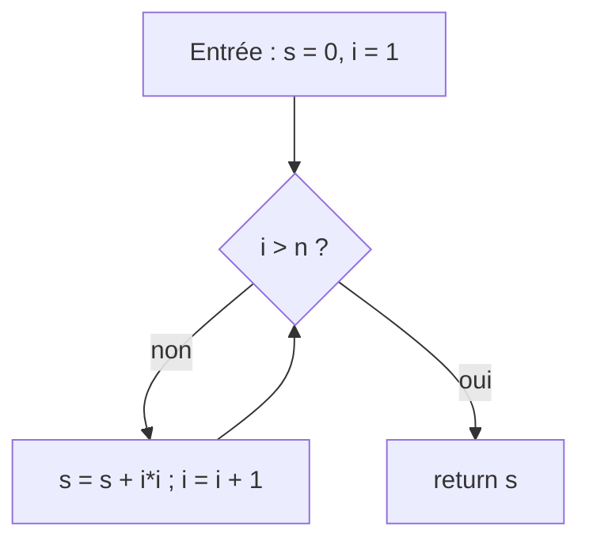
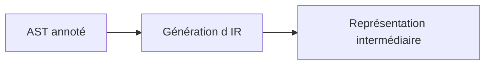
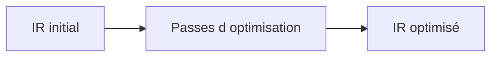

[← Le front-end : de la source a l'arbre](02-le-front-end-de-la-source-a-larbre.md) · [↑ Sommaire](../README.md#table-des-matières) · [Le back-end : du code machine a l'executable →](04-le-back-end-du-code-machine-a-lexecutable.md)

# 3. Representation intermediaire et optimisation

## Génération de code intermédiaire

L'AST annoté est traduit en une **représentation intermédiaire** (IR) plus simple, indépendante du langage source et de la machine cible. Les IR usuelles :

- **Three-Address Code** (TAC, code à trois adresses) : `t1 = a + b; t2 = t1 * c;`
- **Static Single Assignment** (SSA) : chaque variable n'est affectée qu'une seule fois ; les fusions de chemins utilisent des fonctions φ. Forme privilégiée pour l'optimisation.
- **LLVM IR**, **bytecode JVM**, **WebAssembly** : IR portables, parfois publiées comme cibles à part entière.

> **Que veut dire « LLVM IR » et « bytecode JVM » ?** **LLVM** est une grande boîte à outils libre pour construire des compilateurs ; son IR (le « LLVM IR ») est le format pivot que partagent de nombreux langages (C, Rust, Swift). Le **bytecode JVM** est l'IR de l'univers Java : le code Java est d'abord traduit en ce bytecode, que la machine virtuelle Java (JVM) exécute ensuite sur n'importe quel système. Dans les deux cas, c'est une langue pivot stable au milieu du parcours.

> **Que veulent dire « HIR », « MIR », « LIR » ?** Plutôt qu'une seule IR, les gros compilateurs en enchaînent plusieurs, de la plus proche du langage à la plus proche de la machine : **HIR** (*High-level IR*, IR de haut niveau) garde encore la saveur du langage source, **MIR** (*Mid-level IR*, niveau moyen) est plus dépouillée, **LIR** (*Low-level IR*, bas niveau) frôle l'assembleur. On descend ainsi par paliers, comme un escalier qui mène doucement du langage humain au langage machine, chaque marche simplifiant un peu plus.

### Code à 3 adresses (TAC)

> **Que veut dire « code à trois adresses » ?** C'est une façon d'écrire le programme où chaque ligne ne fait qu'une seule opération simple, avec au plus trois cases mentionnées : deux d'où viennent les données, une où va le résultat. Au lieu de `t2 = (a + b) * c`, on écrit deux lignes : `t1 = a + b` puis `t2 = t1 * c`. C'est volontairement décortiqué, comme une recette qui détaille « casser l'œuf », puis « battre l'œuf », plutôt que « préparer l'omelette » : plus facile à analyser et à transformer ensuite.

Le code à 3 adresses limite chaque instruction à au plus trois opérandes (deux sources, une destination) :

```text
op  dest, src1, src2     # ex : add t1, a, b
mov dest, src            # ex : mov t2, t1
br  cond, label_vrai, label_faux
```

Avantage pédagogique : c'est l'IR la plus lisible, très proche du jeu d'instructions abstrait des manuels.

### Pourquoi une IR ?

- découplage front-end / back-end (*N* langages × *M* cibles demandent *N + M* implémentations au lieu de *N × M*) ;

> **Pourquoi *N + M* est tellement mieux que *N × M* ?** Sans IR commune, pour relier 5 langages à 5 machines il faudrait écrire un traducteur direct pour chaque paire, soit 5 × 5 = 25 traducteurs. Avec une IR au milieu, chaque langage écrit un seul traducteur vers l'IR (5) et chaque machine un seul traducteur depuis l'IR (5), soit 5 + 5 = 10. L'écart se creuse vite : 10 langages et 10 machines donneraient 100 contre 20. C'est le même principe qu'un aéroport qui sert de hub central plutôt que de relier chaque ville à toutes les autres.
- abstraction propice aux optimisations (analyse de flot de données, propagation de constantes) ;
- portabilité.

### Blocs de base et graphe de flot de contrôle

> **Que veut dire « bloc de base » ?** C'est un morceau de code qui se déroule toujours en entier, d'une traite, sans saut au milieu : on entre par la première instruction et l'on ressort par la dernière, jamais autrement. Comme un couloir sans porte intermédiaire : une fois engagé, on va forcément jusqu'au bout. Découper le programme en tels blocs simplifie énormément l'analyse.

> **Que veut dire « graphe de flot de contrôle » (CFG, de l'anglais *Control-Flow Graph*) ?** Un graphe est un ensemble de points reliés par des flèches. Ici, les points sont les blocs de base et les flèches indiquent quels enchaînements sont possibles à l'exécution (« après ce bloc, on peut aller à celui-ci ou à celui-là selon le test »). C'est le plan des routes du programme. Attention : ce sigle CFG est l'homonyme de la grammaire hors contexte vue plus haut, mais n'a rien à voir.

Une IR linéaire se découpe en blocs de base : suites maximales d'instructions sans branchement entrant ailleurs qu'en tête, ni sortant ailleurs qu'en queue. Les arêtes de transfert de contrôle entre blocs forment le graphe de flot de contrôle (CFG). La quasi-totalité des analyses (vivacité des variables, dominateurs, atteignabilité) opèrent sur le CFG.





[Retour en haut de page](#table-des-matières)

## Forme SSA

La forme **SSA** (*Static Single Assignment*) est une variante d'IR dans laquelle **chaque variable est affectée exactement une fois**. Adoptée par GCC, LLVM, V8, HotSpot, .NET RyuJIT, GraalVM et tous les compilateurs sérieux depuis le début des années 2000.

> **Que veut dire « SSA » (affectation unique statique) ?** En français : *Static Single Assignment*, « affectation statique unique ». La règle est simple : chaque variable ne reçoit une valeur qu'une seule fois dans tout le texte du programme. Si le code réécrit `x` trois fois, on crée à la place `x1`, `x2`, `x3`. Avantage : en voyant `x2`, on sait immédiatement et sans ambiguïté d'où vient sa valeur, puisqu'elle n'a qu'une seule origine. C'est comme donner un numéro de série unique à chaque version d'un document plutôt que d'écraser le même fichier : on retrouve toujours d'où sort chaque valeur.

### Avant / après SSA

Code TAC ordinaire :

```text
x = 1
x = x + 2
y = x * 3
```

En SSA, chaque réécriture donne lieu à une nouvelle « version » de la variable :

```text
x1 = 1
x2 = x1 + 2
y1 = x2 * 3
```

### Les fonctions φ

> **Que veut dire « fonction φ » (phi) ?** φ est une lettre grecque (« phi »). La règle SSA pose un problème quand deux chemins se rejoignent : selon le chemin emprunté, la valeur vient de `x1` ou de `x2`, mais il faut un seul nom pour la suite. La fonction φ règle cela : `x3 = φ(x1, x2)` veut dire « `x3` vaut `x1` si l'on arrive par le premier chemin, `x2` si l'on arrive par le second ». Ce n'est pas une vraie opération de calcul, juste une note qui dit « ici, plusieurs versions se rejoignent ». Comparaison : un carrefour où deux routes fusionnent et où un panneau indique quelle file devient la voie unique.

Quand deux chemins se rejoignent, plusieurs versions d'une même variable arrivent au point de jonction. On les fusionne avec une fonction φ :

```text
si cond:
    x1 = 10
sinon:
    x2 = 20
x3 = φ(x1, x2)        # x3 vaut x1 si l'on vient de la branche vraie, x2 sinon
```

### Construction de SSA

> **Que veut dire « dominateur » et « frontière de dominance » ?** Dans le plan des routes du programme (le CFG), un bloc `D` **domine** un bloc `N` si l'on est obligé de passer par `D` pour atteindre `N`, quel que soit le chemin : `D` est un passage obligé. La **frontière de dominance** d'un bloc, c'est l'endroit précis où son influence s'arrête, juste là où d'autres chemins rejoignent le flot. C'est exactement aux frontières de dominance que les versions de variables se croisent et qu'il faut donc placer une fonction φ. Image : un pont obligatoire (le dominateur) ; la frontière, c'est le premier carrefour après le pont où arrivent aussi des routes qui ne l'ont pas emprunté.

L'algorithme de Cytron, Ferrante, Rosen, Wegman & Zadeck (1991) place les fonctions φ aux frontières de dominance : un bloc `B` reçoit un φ pour `v` si `v` est définie dans plusieurs prédécesseurs et si `B` est en frontière de dominance de l'une de ces définitions.

### Pourquoi SSA ?

- les chaînes use-def deviennent triviales : chaque variable a **une seule** définition ;
- la propagation de constantes, l'élimination de code mort, le *value numbering* deviennent linéaires ;

> **Que veut dire « chaîne use-def » et « value numbering » ?** Une chaîne *use-def* (« usage-définition ») relie chaque endroit où une variable est **utilisée** à l'endroit où sa valeur a été **définie**. En SSA, comme chaque variable n'a qu'une définition, retrouver l'origine d'une valeur est immédiat. Le *value numbering* (« numérotation des valeurs ») donne un même numéro à deux calculs qui produisent forcément le même résultat, pour ne les faire qu'une fois ; c'est repérer les doublons pour ne pas refaire deux fois le même travail.
- l'allocation de registres globale (Briggs, Chaitin) s'appuie sur SSA.

### Pour creuser

- Cytron et al., « Efficiently computing static single assignment form and the control dependence graph », ACM TOPLAS 1991.
- Documentation LLVM, *LangRef* : tout LLVM IR est en SSA hors mémoire (`alloca`/`load`/`store`).

[Retour en haut de page](#table-des-matières)

## Optimisation du code

L'optimisation transforme l'IR pour réduire le temps d'exécution, l'empreinte mémoire ou la taille du binaire, **sans changer le comportement observable** du programme.

> **Que veut dire « optimisation » et « comportement observable » ?** Optimiser, c'est rendre le programme plus rapide ou plus léger sans toucher à ce qu'il fait. Le « comportement observable » est tout ce qu'un utilisateur ou un autre programme peut constater de l'extérieur : les résultats affichés, les fichiers écrits, les valeurs renvoyées. L'optimiseur a le droit de tout réorganiser à l'intérieur, à une seule condition : que le résultat visible soit exactement le même. C'est comme réorganiser une cuisine pour cuisiner plus vite : le plat servi doit rester identique.

> **Que veut dire « binaire » ?** Le « binaire » est le fichier exécutable final, celui que l'on lance, rempli de code machine (des 0 et des 1, d'où le nom). Réduire sa taille, c'est obtenir un fichier plus petit à stocker et à charger.

### Optimisations courantes

| Optimisation | Effet |
|--------------|-------|
| Propagation de constantes | Remplace `x = 2; y = x + 3;` par `y = 5`. |
| *Constant folding* | Évalue les expressions purement constantes au moment de la compilation. |
| Élimination de code mort (DCE) | Supprime les calculs dont le résultat n'est pas utilisé. |
| Élimination de sous-expressions communes (CSE) | Calcule `a + b` une seule fois si la valeur ne change pas. |
| *Global Value Numbering* (GVN) | Variante de CSE qui identifie les valeurs équivalentes globalement. |
| *Strength reduction* | Remplace une opération coûteuse par une moins coûteuse (`x*2` → `x<<1`). |
| Inlining | Remplace l'appel par le corps de la fonction (voir plus bas). |
| Déroulage de boucle | Réduit le coût des tests de boucle au prix d'une taille de code accrue. |
| Vectorisation (SIMD) | Effectue plusieurs opérations scalaires en une seule instruction. |
| **LICM** (*Loop-Invariant Code Motion*) | Sort les calculs invariants du corps de la boucle. |
| Allocation de registres | Affecte les variables vivantes à des registres physiques. |
| *Tail-call optimization* | Transforme un appel terminal en saut, économise une *stack frame*. |
| *Peephole optimization* | Réécriture locale sur 2-3 instructions consécutives (ex : `mov eax,0` → `xor eax,eax`). |

> **Que veulent dire les sigles d'optimisation (DCE, CSE, GVN, LICM, SIMD) ?** Ce sont des noms abrégés de transformations, tous résumés dans le tableau. **DCE** (*Dead Code Elimination*) supprime le code mort, c'est-à-dire les calculs dont personne ne se sert (jeter les ingrédients qu'on ne mettra jamais dans le plat). **CSE** (*Common Subexpression Elimination*) calcule une seule fois une expression qui revient à l'identique. **GVN** (*Global Value Numbering*) est une version plus maligne de CSE qui repère les égalités dans tout le programme. **LICM** (*Loop-Invariant Code Motion*) sort d'une boucle les calculs qui donnent toujours le même résultat à chaque tour (inutile de recalculer à chaque fois ce qui ne change pas). **SIMD** (*Single Instruction, Multiple Data*) applique une même opération à plusieurs données d'un coup.

> **Que veut dire « strength reduction » et « inlining » ?** *Strength reduction* (« réduction de force ») remplace une opération coûteuse par une moins chère qui donne le même résultat, par exemple multiplier par 2 en décalant les bits d'un cran. *Inlining* (« mise en ligne ») recopie le corps d'une petite fonction directement à l'endroit où elle est appelée, pour éviter le coût d'un aller-retour ; cette technique a sa propre section plus bas.

Une optimisation est **valide** si elle préserve la sémantique du langage. Les optimisations agressives reposent sur les propriétés du langage source (par exemple : pas d'aliasing en Rust, *strict aliasing* en C).

> **Que veut dire « aliasing » ?** Il y a *aliasing* quand deux noms ou deux pointeurs désignent en réalité la même zone mémoire (« alias » = autre nom de la même chose). C'est gênant pour l'optimiseur : s'il modifie l'un, il doit deviner si l'autre change aussi. Quand le langage garantit l'absence d'aliasing (comme Rust), l'optimiseur peut se permettre des transformations plus audacieuses en toute sécurité.

### L'ordre des passes : une question de productivité

Les passes d'optimisation ne sont **pas commutatives**. Une mauvaise ordonnance laisse sur la table une grande partie des gains. Quelques règles éprouvées :

1. **Inlining d'abord, ou très tôt.** L'inlining ouvre les frontières d'appel : tout ce qui en dépend (propagation de constantes inter-procédurale, dévirtualisation, élimination de gardes) ne peut commencer qu'après. LLVM exécute son `InlinerPass` au début du pipeline, puis ré-itère.
2. **Constant folding avant DCE.** Le repli de constantes (`y = 2 * 3` → `y = 6`) crée souvent du code mort (`if (false) { ... }` après propagation). Lancer DCE *avant* le folding nettoie peu ; le lancer *après* nettoie tout.
3. **SSA avant les optimisations à base de flot.** GVN, LICM, propagation de copies sont triviales en SSA, pénibles sans. La construction SSA est donc une passe précoce.
4. **CSE / GVN avant *strength reduction*.** Identifier `a*b` dupliqué est plus facile avant qu'il ne soit transformé en série de décalages et additions.
5. **Boucles : LICM avant déroulage.** Sortir le code invariant *avant* de dérouler évite de dupliquer le travail invariant.
6. **Allocation de registres en dernier.** Toute optimisation qui change la durée de vie des variables invalide l'analyse de vivacité et devrait précéder l'allocateur.
7. **Fixed-point.** LLVM, GCC et HotSpot bouclent leur pipeline d'optimisation : chaque passe peut créer du travail pour les précédentes. La boucle s'arrête quand un point fixe est atteint (pas de modification durant un tour) ou quand un budget est épuisé.

> **Que veut dire « passe » et « point fixe » (fixed-point) ?** Une « passe » est un parcours complet du code par une optimisation donnée, comme un coup de balai dans toute la maison. Un « point fixe » est l'état où un nouveau passage ne change plus rien : on balaie une dernière fois, on ne ramasse plus aucune poussière, donc c'est terminé. Les compilateurs répètent leurs passes jusqu'à ce point fixe parce qu'une optimisation en débloque souvent une autre.

```text
SSA build → SCCP (sparse conditional const prop) → InstCombine
   → Inliner → SCCP → DCE → SROA → GVN → LICM → IndVarSimplify
   → LoopUnroll → SLP/Loop Vectorize → InstCombine → DCE
   → CodeGenPrepare → ISel → RegAlloc → Scheduling → Emit
```

Cette structure « petite passe locale × itération » est appelée **pipeline canonique LLVM**.

### Exemple détaillé : LICM

```text
pour i de 0 à n-1:
    x = a * b           # invariant : a et b ne changent pas dans la boucle
    t[i] = x + i
```

LICM hisse `x = a * b` avant la boucle :

```text
x = a * b
pour i de 0 à n-1:
    t[i] = x + i
```

Pour prouver l'invariance, l'optimiseur s'appuie sur la **dominance** : `a*b` peut être hissé si ses opérandes sont définis hors de la boucle ou par des instructions elles-mêmes hissables.



[Retour en haut de page](#table-des-matières)

---

[← Le front-end : de la source a l'arbre](02-le-front-end-de-la-source-a-larbre.md) · [↑ Sommaire](../README.md#table-des-matières) · [Le back-end : du code machine a l'executable →](04-le-back-end-du-code-machine-a-lexecutable.md)
