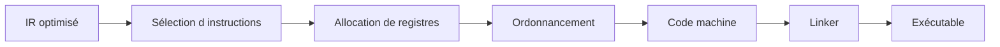
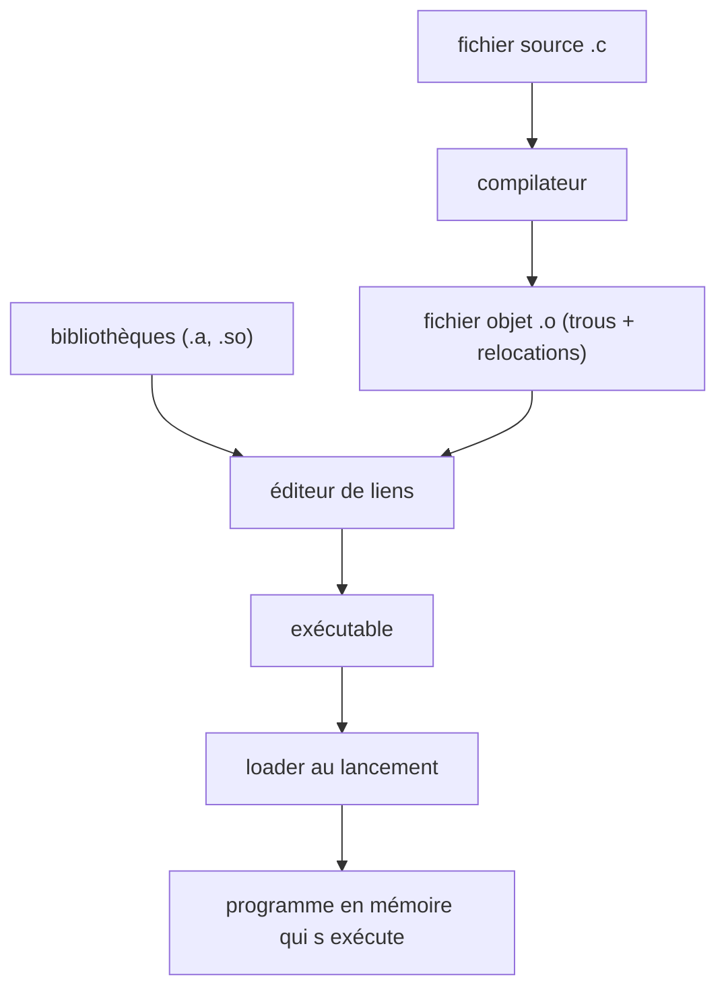

[← Representation intermediaire et optimisation](03-representation-intermediaire-et-optimisation.md) · [↑ Sommaire](../README.md#table-des-matières) · [Compilateurs modernes et execution →](05-compilateurs-modernes-et-execution.md)

# 4. Le back-end : du code machine a l'executable

## Allocation de registres

Les processeurs modernes disposent d'un nombre fini de **registres** physiques (16 entiers généraux sur x86-64, 31 sur ARM64). Il faut donc choisir, à chaque instant, quelles variables y résident, et lesquelles sont **spillées** (déversées) en pile.

> **Que veut dire « registre », « pile » et « spiller » ?** Un **registre** est une minuscule case de mémoire ultra-rapide située dans le processeur lui-même ; c'est là que les calculs ont lieu. Il y en a très peu (une poignée), comme le plan de travail d'une cuisine : tout petit, mais immédiatement accessible. La **pile** (en anglais *stack*) est une zone de mémoire principale plus grande mais plus lente, comme le placard au fond de la cuisine. **Spiller** une variable (« déverser »), c'est la sortir d'un registre faute de place pour la ranger dans la pile, quitte à aller la rechercher plus tard. On spille à contrecœur, car c'est plus lent.

### Vivacité (*liveness*)

> **Que veut dire « vivacité » (liveness) et « variable vivante » ?** Une variable est « vivante » à un endroit donné si sa valeur actuelle servira encore plus loin avant d'être remplacée. Si plus personne ne la lira, elle est « morte » et son registre peut être réutilisé. C'est comme un plat sur le plan de travail : tant qu'on en aura besoin, on le garde ; dès qu'il ne sert plus, on libère la place. Savoir qui est vivant à chaque instant indique combien de registres il faut réellement.

Une variable est vivante en un point du programme si sa valeur peut être utilisée plus tard sans être réécrite entre-temps. L'analyse de vivacité se calcule en arrière sur le CFG (de la fin vers le début, car on a besoin de savoir si une valeur servira plus tard) :

```text
in[B]  = use[B] ∪ (out[B] − def[B])
out[B] = ⋃_{S successeur de B} in[S]
```

### Graphe d'interférence

> **Que veut dire « graphe d'interférence » et « colorier un graphe » ?** Deux variables « interfèrent » si elles sont vivantes en même temps : elles ne peuvent donc pas partager le même registre, sinon l'une écraserait l'autre. On dessine un point par variable et on relie par un trait celles qui interfèrent. Allouer les registres revient alors à un coloriage : donner une couleur (un registre) à chaque point de sorte que deux points reliés n'aient jamais la même couleur. C'est exactement le problème de colorier une carte sans que deux pays voisins partagent la couleur. Si l'on n'a pas assez de couleurs (de registres), il faut en spiller certaines en pile.

On construit un graphe d'interférence : les sommets sont les variables, une arête relie deux variables vivantes simultanément. Allouer `k` registres revient alors à colorier ce graphe avec `k` couleurs telles que deux sommets adjacents reçoivent des couleurs différentes.

### Algorithme de Chaitin–Briggs (graph coloring)

1. Construire le graphe d'interférence.
2. Tant qu'il existe un sommet de degré `< k` : l'empiler, le retirer du graphe.
3. Si tous les sommets restants ont un degré `≥ k`, choisir un candidat à *spiller* (heuristique de coût) ; le retirer aussi.
4. Dépiler : à chaque sommet, lui assigner une couleur libre parmi ses voisins déjà coloriés. Si aucune n'est libre, le marquer pour *spill*.
5. Recompiler la fonction avec les *spills* matérialisés ; itérer.

### *Linear scan* (Poletto–Sarkar 1999)

Algorithme plus simple, utilisé dans les JIT (HotSpot client, V8 anciennes versions) : on parcourt les intervalles de vie linéairement et on alloue les registres dans l'ordre. Compromis qualité / vitesse de compilation favorable au JIT.

### Conventions d'appel et registres dédiés

> **Que veut dire « convention d'appel » et « ABI » ?** Quand une fonction en appelle une autre, les deux doivent se mettre d'accord : où sont rangés les arguments, où sera rangé le résultat, qui a le droit d'abîmer quels registres. Ce contrat s'appelle la **convention d'appel**. L'**ABI** (*Application Binary Interface*, interface binaire applicative) est l'ensemble plus large de ces règles d'entente au niveau des octets, qui permet à des morceaux de programme compilés séparément de fonctionner ensemble. C'est comme un protocole entre deux services d'une entreprise : sans règles communes, ils ne pourraient pas se passer le travail.

> **Que veut dire « callee-saved » et « caller-saved » ?** *Caller* = l'appelant, *callee* = l'appelé. Un registre **callee-saved** (« préservé par l'appelé ») est promis intact : la fonction appelée doit le remettre comme elle l'a trouvé si elle s'en sert. Un registre **caller-saved** (« préservé par l'appelant ») n'offre aucune garantie : si l'appelant y tient, c'est à lui de le sauvegarder avant l'appel. Image : une chambre d'hôtel (callee-saved, on doit la rendre en état) face à un brouillon partagé (caller-saved, n'importe qui peut écrire dessus).

Une fraction des registres est réservée par l'ABI : pointeur de pile (`rsp`), pointeur de cadre (`rbp`), registres préservés (*callee-saved*) face aux sacrifiables (*caller-saved*). L'allocateur doit connaître ce contrat pour insérer les sauvegardes / restaurations aux entrées / sorties de fonction.

### Pour creuser

- Chaitin et al., « Register allocation via coloring », *Computer Languages* 1981.
- Briggs, *Register Allocation via Graph Coloring*, thèse Rice 1992.

[Retour en haut de page](#table-des-matières)

## Génération du code machine

Le back-end traduit l'IR optimisée en instructions de la cible (x86-64, ARM, RISC-V, WebAssembly, etc.).

> **Que veut dire « cible » et « jeu d'instructions » (x86-64, ARM, RISC-V) ?** La « cible » est la sorte de processeur pour laquelle on fabrique le code. Chaque famille de processeurs comprend son propre vocabulaire d'ordres élémentaires, son « jeu d'instructions » : x86-64 équipe la plupart des PC et serveurs, ARM la plupart des téléphones et les Mac récents, RISC-V est une famille libre et ouverte. Une instruction écrite pour l'un ne veut rien dire pour l'autre, comme deux langues distinctes ; le back-end doit donc savoir dans laquelle traduire.

### Étapes du back-end

1. **Sélection d'instructions** : à chaque opération de l'IR, choisir l'instruction machine qui la réalise.
2. **Allocation de registres** : décider quelles variables vivent en registre, lesquelles sont *spillées* en pile (voir la section précédente).
3. **Ordonnancement** : ordonner les instructions pour exploiter le pipeline du processeur et masquer les latences mémoire.
4. **Émission** : produire un fichier objet (`.o`), puis l'éditeur de liens (*linker*) résout les symboles externes pour produire l'exécutable.

> **Que veut dire « pipeline du processeur » et « latence » ?** Un processeur moderne ne traite pas une instruction de A à Z avant de commencer la suivante : il les fait avancer à la chaîne, plusieurs en même temps à des stades différents, comme une chaîne de montage où chaque poste travaille sur une voiture différente. C'est le « pipeline » du processeur. La « latence » est le délai d'attente d'une opération lente (par exemple lire en mémoire principale). Bien ranger les instructions permet de remplir ces temps morts avec du travail utile au lieu d'attendre les bras croisés.

### Sélection d'instructions

Deux grandes familles :

- **Macro-expansion** : à chaque opération IR, on substitue un patron d'assembleur. Rapide, peu optimal.
- **Tree pattern matching** (Aho–Ganapathi–Tjiang) : la sélection est posée comme un **filtrage d'arbre** avec coûts. Le sélecteur cherche la couverture optimale. C'est l'approche de LLVM (*SelectionDAG* puis *GlobalISel*).

### Ordonnancement d'instructions

> **Que veut dire « out-of-order » et « bulle de pipeline » ?** Un processeur *out-of-order* (« dans le désordre ») se permet d'exécuter les instructions dans un ordre différent de celui écrit, dès qu'une est prête, pour ne pas perdre de temps. Une « bulle » est un trou dans la chaîne de montage : un poste reste inactif parce que la pièce attendue n'est pas encore arrivée. Moins il y a de bulles, plus le processeur travaille à plein régime.

Les processeurs *out-of-order* réordonnent à l'exécution, mais un ordre de départ favorable réduit les bulles de pipeline et améliore l'usage des unités de calcul. L'ordonnancement utilise un **graphe de dépendances** (qui dit quelle instruction doit attendre le résultat de quelle autre) entre données et ressources.

### Conventions d'appel et ABI

L'**ABI** fige :

- l'ordre des arguments (registres puis pile, ou tout en pile) ;
- les registres préservés par l'appelé vs l'appelant ;
- le passage des structures, des arguments variadiques (`stdarg`), du `this` C++ ;
- l'alignement de la pile aux frontières d'appel ;
- le format de la *stack frame* (prologue / épilogue).

> **Que veut dire « stack frame », « prologue » et « épilogue » ?** Une *stack frame* (« cadre de pile ») est l'espace de travail privé qu'une fonction se réserve sur la pile le temps de son exécution : ses variables locales, l'adresse de retour, etc. Le **prologue** est le petit code de début qui met ce cadre en place (comme installer son bureau en arrivant) ; l'**épilogue** est le code de fin qui le range avant de rendre la main (ranger son bureau en partant). Chaque appel de fonction empile son propre cadre, ce qui permet aux fonctions de s'appeler sans se marcher dessus.

Exemples courants : System V AMD64 (Linux/macOS), Microsoft x64 (Windows), AAPCS (ARM), RISC-V Calling Convention. Une ABI mal respectée fait planter le programme à la première frontière de fonction.



[Retour en haut de page](#table-des-matières)

## Éditeur de liens et chargement

L'**éditeur de liens** (*linker*) combine plusieurs **fichiers objets** (`.o`, `.obj`) et bibliothèques pour produire un exécutable ou une bibliothèque. Il résout les références croisées entre unités de compilation.

> **Que veut dire « éditeur de liens » (linker) et « fichier objet » ?** On compile souvent chaque fichier source séparément, ce qui donne un **fichier objet** : du code machine presque complet, mais avec des trous là où il appelle des fonctions définies ailleurs (par exemple `printf`). L'**éditeur de liens** est le programme qui rassemble tous ces fichiers objets, bouche les trous en reliant chaque appel à sa vraie définition, et produit l'exécutable final. C'est comme assembler les chapitres d'un livre écrits par plusieurs auteurs et remplacer chaque « voir le chapitre X » par le bon numéro de page.

> **Que veut dire « symbole » et « unité de compilation » ?** Un **symbole** est un nom qui désigne une fonction ou une variable dans le code machine (par exemple `main`, `printf`). Une **unité de compilation** est un fichier source compilé d'un seul tenant. Les symboles sont l'annuaire qui permet à une unité de retrouver ce que les autres ont défini.

### Liaison statique

Tout le code nécessaire est copié dans le binaire final. Avantages : pas de dépendance externe, lancement rapide. Inconvénients : binaire volumineux, pas de mise à jour partagée.

```text
hello.o + libc.a + crt0.o  →  hello (statique)
```

### Liaison dynamique

> **Que veut dire « liaison statique » et « liaison dynamique » ?** En liaison **statique**, on recopie tout le code nécessaire dans l'exécutable final : il se suffit à lui-même, mais il est gros et chaque programme embarque sa propre copie. En liaison **dynamique**, l'exécutable garde seulement une référence vers des bibliothèques partagées installées sur la machine, chargées au lancement. Comparaison : la version statique est une trousse à outils complète emportée partout ; la version dynamique est un atelier commun où tous les programmes empruntent les mêmes outils.

Les bibliothèques partagées (`.so` Linux, `.dll` Windows, `.dylib` macOS) sont chargées à l'exécution par le **loader** (le « chargeur », le programme qui installe l'exécutable en mémoire au lancement). Le binaire ne contient qu'une référence symbolique. Avantages : économie de mémoire, mises à jour de sécurité partagées. Inconvénients : le « DLL hell » (conflits de versions entre bibliothèques partagées), un léger surcoût au démarrage.

### Formats objets

| Format | Plateforme |
|--------|-----------|
| **ELF** (*Executable and Linkable Format*) | Linux, BSD, illumos |
| **PE / COFF** | Windows |
| **Mach-O** | macOS, iOS |

Tous décrivent les mêmes objets : segments / sections (`.text`, `.data`, `.bss`, `.rodata`), table de symboles, table de **relocations**.

### Relocations

> **Que veut dire « relocation » et « section » (`.text`, `.data`) ?** Une **relocation** (« réadressage ») est une note laissée dans le fichier objet qui dit : « ici, l'adresse exacte de tel symbole n'est pas encore connue, à compléter dès qu'elle le sera ». Le linker (ou le loader) honore ces notes. Les **sections** sont les rayons rangés d'un fichier objet : `.text` contient le code, `.data` les données qui changent, `.rodata` les données en lecture seule, `.bss` les données initialisées à zéro. C'est l'équivalent des rayons d'un entrepôt, chacun pour un type de marchandise.

Une relocation est une demande adressée au linker : « à cette adresse, insère l'adresse réelle du symbole `printf` ». Tant que les modules sont indépendants, leurs adresses absolues sont inconnues ; les relocations sont résolues au moment du lien.

### PLT et GOT

> **Que veut dire « ELF » ?** *Executable and Linkable Format*, le format de fichier exécutable utilisé sous Linux et la plupart des systèmes Unix. C'est le moule standard qui décrit comment un exécutable est rangé sur le disque (ses sections, ses symboles, ses relocations). Windows utilise PE/COFF, macOS utilise Mach-O ; même rôle, formats différents.

Sur ELF, la liaison dynamique différée s'appuie sur deux tables :

- **GOT** (*Global Offset Table*, table des décalages globaux) : une case par donnée externe, remplie par le loader avec la vraie adresse.
- **PLT** (*Procedure Linkage Table*, table de liaison des procédures) : un petit aiguillage par fonction externe. Au premier appel, il passe par le résolveur dynamique qui trouve l'adresse et remplit la GOT ; les appels suivants vont droit au but.

> **Que veut dire « trampoline » (ici) ?** Un trampoline est un tout petit bout de code qui ne fait que rebondir vers un autre endroit. Dans la PLT, c'est un intermédiaire : le premier appel rebondit vers le code qui cherche l'adresse réelle, puis les appels suivants rebondissent directement au bon endroit. Comme un standard téléphonique qui, la première fois, cherche le bon poste, puis met ensuite en relation directe.

C'est ce mécanisme qui permet le **lazy binding** (`LD_BIND_NOW=1` pour le forcer eager) et qui rend possible la précharge de bibliothèques (`LD_PRELOAD`), surface d'attaque historique des injections.

> **Que veut dire « lazy binding » et « eager » ?** *Lazy* signifie « paresseux » : on ne fait le travail (ici, trouver l'adresse réelle d'une fonction de bibliothèque) qu'au tout dernier moment, au premier appel, pas avant. *Eager* signifie « empressé » : on fait tout le travail d'avance, au démarrage. Le paresseux démarre plus vite mais paie un petit coût au premier usage ; l'empressé démarre plus lentement mais ne paie plus rien ensuite.

### Loader et chargement

Au lancement, le **loader** (`ld-linux.so` sur Linux, `dyld` sur macOS, `ntdll` sur Windows) :

1. Mappe le binaire en mémoire (sections rangées en pages).
2. Charge en cascade les bibliothèques requises.
3. Applique les relocations restantes.
4. Initialise la TLS et exécute les constructeurs (`.init_array`).
5. Saute au point d'entrée (`_start`, qui appelle `main`).

> **Que veut dire « mapper en mémoire », « page », « TLS » et « point d'entrée » ?** « Mapper » un fichier, c'est le rendre accessible en mémoire sans forcément tout recopier d'un coup, comme poser un calque sur la mémoire. Une « page » est l'unité de découpage de la mémoire (souvent 4 kibioctets), comme les pages d'un cahier. La **TLS** (*Thread-Local Storage*, stockage local au fil d'exécution) est une zone mémoire propre à chaque fil d'exécution, pour que deux tâches parallèles ne se mélangent pas leurs variables. Le **point d'entrée** (`_start`, qui finit par appeler `main`) est la toute première instruction exécutée au lancement, la porte d'entrée du programme.



[Retour en haut de page](#table-des-matières)

---

[← Representation intermediaire et optimisation](03-representation-intermediaire-et-optimisation.md) · [↑ Sommaire](../README.md#table-des-matières) · [Compilateurs modernes et execution →](05-compilateurs-modernes-et-execution.md)
