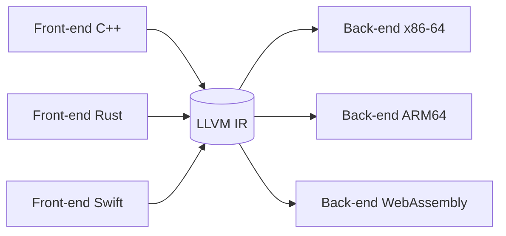

[← Le back-end : du code machine a l'executable](04-le-back-end-du-code-machine-a-lexecutable.md) · [↑ Sommaire](../README.md#table-des-matières) · [Mise en pratique →](06-mise-en-pratique.md)

# 5. Compilateurs modernes et execution

## Les compilateurs modernes

Les compilateurs actuels exploitent ce pipeline en y ajoutant des techniques avancées.

### Inlining

L'*inlining* remplace un appel de fonction par le corps de la fonction appelée. On évite le coût de l'appel (sauvegarde de registres, saut, retour) et on ouvre la voie à d'autres optimisations (propagation de constantes au-delà des frontières d'appel).

```c
// Avant inlining
static inline int carre(int x) { return x * x; }
int hypothenuse_carree(int a, int b) { return carre(a) + carre(b); }

// Après inlining (équivalent vu par l'optimiseur)
int hypothenuse_carree(int a, int b) { return a * a + b * b; }
```

L'inlining excessif gonfle la taille du binaire ; les compilateurs appliquent des heuristiques (taille, fréquence d'appel, profil d'exécution).

### Vectorisation

La vectorisation utilise des instructions **SIMD** (*Single Instruction, Multiple Data* : SSE, AVX, NEON) pour appliquer la même opération à plusieurs éléments en parallèle.

> **Que veut dire « SIMD » et « vectorisation » ?** SIMD signifie « une seule instruction, plusieurs données ». Au lieu d'additionner les nombres un par un, le processeur en additionne quatre ou huit d'un seul coup, comme un tampon encreur qui imprime toute une rangée d'un geste au lieu de timbrer chaque case séparément. La « vectorisation » est la transformation par laquelle le compilateur repère une boucle qui fait la même chose sur chaque élément et la remplace par ces instructions groupées. SSE, AVX et NEON sont les noms de ces jeux d'instructions selon les processeurs.

```c
// Boucle scalaire
for (int i = 0; i < n; i++) a[i] = b[i] + c[i];

// Vectorisée par le compilateur (SIMD AVX, 4 floats par instruction)
//   *((__m128*)(a+i)) = _mm_add_ps(*(__m128*)(b+i), *(__m128*)(c+i));
```

À ne pas confondre avec le *déroulage de boucle* (loop unrolling), qui duplique le corps de boucle sans utiliser d'instruction vectorielle.

### Parallélisation et compilation distribuée

La parallélisation au sens du compilateur reste limitée : les vrais gains de parallélisme sont souvent à la charge du programmeur ou d'extensions comme [OpenMP](https://www.openmp.org/). En revanche, la compilation **distribuée** (le code source est compilé en parallèle sur plusieurs machines) accélère les gros projets ([icecc](https://github.com/icecc/icecream), [distcc](https://www.distcc.org/)).

### Profile-Guided Optimization (PGO)

> **Que veut dire « PGO » (optimisation guidée par le profil) ?** *Profile-Guided Optimization*. Un profil, c'est l'enregistrement de ce qui se passe vraiment quand le programme tourne : quelles fonctions sont appelées souvent, quelles branches `if` sont prises le plus. La PGO consiste à faire d'abord tourner le programme pour récolter ce profil, puis à recompiler en se servant de ces statistiques pour soigner en priorité les parties chaudes. C'est comme réaménager un magasin après avoir observé les rayons où les clients vont le plus.

Une compilation classique ne connaît pas les fréquences d'exécution réelles. La PGO exécute d'abord un binaire instrumenté (truffé de compteurs) sur des données représentatives, collecte un profil, puis recompile en exploitant ce profil pour orienter l'inlining, l'ordre des branches et l'agencement du code.

### Link-Time Optimization (LTO)

> **Que veut dire « LTO » (optimisation au moment de l'édition de liens) ?** *Link-Time Optimization*. D'habitude, chaque fichier est optimisé seul, dans son coin : l'optimiseur ne voit jamais le programme entier d'un coup. La LTO repousse une partie des optimisations jusqu'au lien, quand tous les morceaux sont enfin réunis, ce qui permet par exemple d'intégrer une fonction d'un fichier dans un autre. C'est comme corriger un livre une fois tous les chapitres rassemblés plutôt que chaque chapitre isolément : on voit les répétitions d'un bout à l'autre.

La LTO repousse l'optimisation au moment de l'édition de liens : chaque `.o` contient en réalité de l'IR (LLVM bitcode, GIMPLE pour GCC), et l'optimiseur voit l'ensemble du programme. Elle débloque l'inlining entre modules, le DCE entre modules, et la dévirtualisation C++ (le remplacement d'un appel indirect, choisi à l'exécution, par un appel direct quand le compilateur prouve quelle fonction est réellement visée).

### Multi-cibles

Des projets comme [LLVM](https://llvm.org/) ou [GraalVM](https://www.graalvm.org/) factorisent les optimisations au niveau de l'IR et déclinent un même front-end vers plusieurs cibles (x86-64, ARM64, WebAssembly, GPU).



[Retour en haut de page](#table-des-matières)

## JIT, AOT et compilation adaptative

### AOT (*Ahead-Of-Time*)

> **Que veut dire « AOT » et « JIT » ?** Ce sont deux moments différents pour compiler. **AOT** (*Ahead-Of-Time*, « en avance ») traduit tout le programme en code machine bien avant qu'on le lance : c'est le modèle de C ou de Rust. **JIT** (*Just-In-Time*, « juste à temps ») attend l'exécution et traduit les parties au moment où elles servent vraiment. Comparaison : l'AOT, c'est cuisiner tout le repas la veille ; le JIT, c'est cuisiner chaque plat à la commande, en s'adaptant à ce que le client demande réellement.

Compilation classique : tout le programme est traduit en code machine **avant** exécution. Modèle de C, C++, Rust, Go, Swift, OCaml. Avantages : démarrage immédiat, optimisations coûteuses possibles. Inconvénient : pas d'accès au profil réel.

### JIT (*Just-In-Time*)

Le code est compilé **pendant** l'exécution, à mesure que des sections deviennent « chaudes ». Avantage majeur : le compilateur connaît les types vus, les valeurs typiques, les chemins fréquentés. Modèle de la JVM HotSpot, V8, .NET CLR, PyPy, GraalVM, LuaJIT.

### Compilation adaptative et OSR

> **Que veut dire « VM », « interpréter », « tiered compilation » et « hot path » ?** Une **VM** (*Virtual Machine*, machine virtuelle) est un programme qui imite un processeur pour exécuter du bytecode. **Interpréter** veut dire exécuter le code instruction par instruction, à la volée, sans le compiler d'abord (lent à démarrer mais immédiat). La *tiered compilation* (« compilation par paliers ») combine plusieurs niveaux : on commence par interpréter, puis on compile vite et grossièrement les parties qui reviennent souvent, puis on les recompile à fond si elles sont vraiment cruciales. Un *hot path* (« chemin chaud ») est justement une partie du code exécutée très fréquemment, qui mérite qu'on investisse dans son optimisation.

Les VM à *tiered compilation* (HotSpot, V8) commencent par interpréter le bytecode, puis compilent à un niveau peu optimisé (C1, *Ignition*+*Sparkplug*), enfin à un niveau agressif (C2, TurboFan, Maglev) après détection d'un *hot path*. Le **On-Stack Replacement** (OSR) permet de remplacer un cadre interprété par un cadre compilé sans attendre le retour de la fonction.

> **Que veut dire « On-Stack Replacement » (OSR) ?** Littéralement « remplacement sur la pile ». Imaginez une boucle qui tourne déjà depuis longtemps en mode interprété (lent) : on aimerait passer à la version compilée (rapide) sans attendre la fin de la boucle. L'OSR fait exactement cela : il échange, en plein milieu, le cadre d'exécution lent contre le cadre rapide, comme remplacer le moteur d'un train sans l'arrêter en gare.

### Spéculation et désoptimisation

> **Que veut dire « spéculer » et « désoptimiser » ?** Un JIT **spécule** quand il parie sur un fait observé pour produire du code plus rapide, par exemple « cette variable est toujours un nombre entier ». Le code optimisé n'est correct que tant que le pari tient. Si un jour le fait devient faux, la VM **désoptimise** : elle jette en catastrophe le code optimisé et revient à une version prudente. C'est comme prendre un raccourci tant que la route est dégagée, et faire demi-tour vers l'itinéraire sûr dès qu'on tombe sur un barrage.

Un JIT spécule : « cet appel vise toujours `Cat.meow` ». Il compile une version *inline* (le corps recopié sur place). Si l'hypothèse est violée, la VM désoptimise : elle revient à l'interprète, recompile une version plus prudente. Cette boucle hypothèse / vérification / désoptimisation est le cœur de V8 et HotSpot.

> **Que veut dire « appel polymorphe » ?** Un appel est polymorphe quand le même bout de code peut appeler des fonctions différentes selon le type réel de l'objet du moment : `animal.crier()` déclenche le miaulement pour un chat, l'aboiement pour un chien. Le processeur ne sait pas d'avance lequel ; le JIT parie sur le cas le plus fréquent.

### LLVM JIT (ORC, MCJIT)

LLVM expose une infrastructure de JIT générique (ORC v2). Julia, le shell PostgreSQL JIT, le moteur de requêtes ClickHouse, et Mojo l'utilisent. Le pipeline complet (IR → optim → codegen) est exécuté dans le processus, et le code émis est lié dynamiquement à l'image en cours.

[Retour en haut de page](#table-des-matières)

---

[← Le back-end : du code machine a l'executable](04-le-back-end-du-code-machine-a-lexecutable.md) · [↑ Sommaire](../README.md#table-des-matières) · [Mise en pratique →](06-mise-en-pratique.md)
