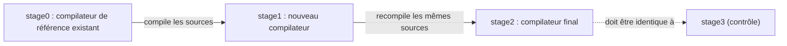

[← Mise en pratique](06-mise-en-pratique.md) · [↑ Sommaire](../README.md#table-des-matières)

# 7. Sujets avances

## Bootstrapping et confiance

> **Que veut dire « bootstrapping » et « stage » ?** Le mot vient de l'expression anglaise « se hisser par ses propres lacets » (*bootstraps*). Pour un compilateur, c'est le fait d'écrire le compilateur du langage `L` dans le langage `L` lui-même, et de le compiler. Cela ressemble à un paradoxe de la poule et de l'œuf : comment compiler un compilateur en `L` s'il n'existe pas encore de compilateur `L` ? On s'en sort par étapes appelées **stages** : `stage0` est un compilateur de référence qui existe déjà (parfois écrit dans un autre langage) ; il compile `stage1` (le nouveau compilateur) ; puis `stage1` se recompile lui-même pour produire `stage2`. À partir de là, le langage se compile tout seul.

### Pourquoi bootstrapper ?

- **Auto-validation** : si le langage est expressif et le compilateur correct, écrire le compilateur dans son propre langage est la meilleure démonstration.
- **Dogfooding** : les concepteurs subissent leur langage en premier ; les imperfections remontent vite.

> **Que veut dire « dogfooding » ?** De l'expression anglaise « manger sa propre nourriture pour chien » : utiliser soi-même le produit qu'on fabrique. En écrivant le compilateur de leur langage dans ce langage, ses créateurs en deviennent les premiers utilisateurs et repèrent vite ce qui est pénible, exactement comme un restaurateur qui goûte ses propres plats.
- **Indépendance** : à terme, le projet ne dépend plus que de son binaire de référence, distribué pour amorcer l'auto-compilation.

### Cas historiques

- Niklaus **Wirth** réimplémenta Pascal en Pascal ; le compilateur P4 a servi de gabarit pédagogique pendant deux décennies.
- **GCC** est écrit en C++ (autrefois C) et se compile lui-même via les fameux *stages* `stage1`/`stage2`/`stage3`. La comparaison binaire entre `stage2` et `stage3` est un test d'intégrité majeur : ils doivent être identiques.
- **Rustc** est écrit en Rust et se compile via un compilateur précédent fourni par `rustup` ; le projet maintient une chaîne d'amorçage manuelle (`mrustc`) qui repart d'un sous-ensemble traduit en C++.
- **OCaml** : `ocamlc` (bytecode) bootstrap `ocamlopt` (natif) qui se recompile lui-même.

### *Reflections on Trusting Trust* (Ken Thompson, 1984)

L'**attaque de Thompson** (« Reflections on Trusting Trust », ACM Turing Award lecture) est l'argument de sécurité le plus cité dans l'histoire des compilateurs. Idée :

1. On modifie le compilateur `C` pour qu'il insère, à la compilation de `login`, une porte dérobée.
2. On modifie en plus `C` pour qu'à la compilation de **lui-même** il réinsère **les deux modifications**.
3. On recompile `C` une fois, puis on retire les sources malveillantes : le binaire `C` reste infecté et propage l'infection à toutes ses descendances, sans laisser de trace dans les sources.

Conséquence : la confiance dans un binaire ne peut pas se dériver uniquement de la lecture de ses sources, ni de celles de son compilateur, ni de celles du compilateur de son compilateur. C'est une régression infinie (un problème qui se repousse sans fin, comme deux miroirs face à face). La parade pratique est la **compilation reproductible** (*reproducible builds*) et le **bootstrapping diversifié** (*Diverse Double-Compiling* de David A. Wheeler) : compiler `C` avec deux compilateurs indépendants `A` et `B`, puis comparer les binaires obtenus en `stage2`.

> **Que veut dire « compilation reproductible » ?** C'est la garantie que recompiler les mêmes sources donne exactement le même fichier binaire, octet pour octet, sur n'importe quelle machine. Cela permet de vérifier qu'un exécutable distribué correspond bien à ses sources et n'a pas été trafiqué : si deux personnes obtiennent le même résultat, c'est qu'aucune porte dérobée ne s'est glissée. C'est l'équivalent d'une recette si précise que deux cuisiniers obtiennent un gâteau strictement identique.

[Retour en haut de page](#table-des-matières)

## WebAssembly et générateurs de code alternatifs

### WebAssembly comme cible de compilation

> **Que veut dire « WebAssembly » et « machine à pile » ?** WebAssembly (abrégé Wasm) est un format de bytecode portable, conçu d'abord pour faire tourner du code rapide dans le navigateur web, et devenu depuis une cible générale. Une « machine à pile » est une machine virtuelle qui calcule en empilant et dépilant des valeurs sur une pile (« mets 2, mets 3, additionne » laisse 5 au sommet), plutôt qu'en utilisant des registres nommés. C'est simple à décrire et à vérifier, donc pratique comme cible commune.

**WebAssembly** (Wasm) est un format binaire de bytecode pour une machine à pile virtuelle, standardisé par le W3C (l'organisme qui normalise les technologies du web). Conçu initialement pour le navigateur, il est devenu une cible générale (Wasmtime, Wasmer, WasmEdge, conteneurs « micro-VM »). Caractéristiques pertinentes pour un compilateur :

- **typé statiquement** : 4 types numériques (`i32`, `i64`, `f32`, `f64`) plus références ;
- **structuré** : pas de `goto` libre, mais des blocs (`block`, `loop`, `if`) à branches étiquetées ;
- **sandboxé** : la mémoire linéaire est un tableau d'octets borné, pas d'accès direct au système d'exploitation ;
- **ABI** définie par WASI (*WebAssembly System Interface*) pour les appels au système.

> **Que veut dire « sandboxé » et « mémoire linéaire » ?** Un code « sandboxé » (« mis en bac à sable ») tourne dans un espace clos d'où il ne peut pas toucher au reste de la machine : il ne lit pas vos fichiers, n'accède pas au réseau sans permission, exactement comme un enfant qui joue dans un bac à sable sans pouvoir en sortir. La « mémoire linéaire » est l'unique grand tableau d'octets dont dispose ce code, de taille bornée et surveillée, ce qui rend toute fuite hors limites impossible.

> **Que veut dire « CFG réductible » ?** Un graphe de flot de contrôle est « réductible » quand toutes ses boucles sont bien structurées, avec une seule porte d'entrée chacune, sans sauts sauvages qui entrent au milieu d'une boucle. WebAssembly n'accepte que ce type de structure ordonnée (pas de `goto` libre). Le compilateur doit donc remettre le flot du programme dans cette forme propre avant de produire du Wasm.

Côté compilateur, viser Wasm impose une forme réductible du CFG (toutes les boucles ont un en-tête unique). LLVM y parvient via une passe de *relooper* dérivée des travaux d'Emscripten ; `wasm-ld` joue le rôle du linker.

Cas industriels : `clang --target=wasm32-wasi`, `rustc --target=wasm32-unknown-unknown`, Go (depuis 1.21), Swift, .NET (Blazor), AssemblyScript.

### Cranelift : un back-end alternatif à LLVM

**Cranelift** est un générateur de code écrit en Rust, hébergé par Bytecode Alliance. Conçu d'abord pour Wasmtime (JIT WebAssembly), il sert aussi de back-end alternatif à `rustc` (`-Zcodegen-backend=cranelift`) pour les *debug builds* rapides.

| Critère | LLVM | Cranelift |
|---------|------|-----------|
| Qualité du code optimisé | très haute (>30 ans d'optims) | moyenne |
| Vitesse de compilation | lente | très rapide (objectif principal) |
| Surface (taille binaire, dépendances) | énorme (\~15 millions de lignes C++) | modérée (Rust pur) |
| Cibles | x86, ARM, RISC-V, GPU, Wasm, MIPS… | x86-64, ARM64, s390x, RISC-V |
| IR | LLVM IR (textuel + bitcode) | CLIF (Cranelift IR) |
| Modèle d'usage | AOT et JIT (ORC) | JIT prioritaire, AOT possible |

Le compromis est explicite : Cranelift sacrifie une partie des optimisations agressives de LLVM pour offrir des temps de compilation comparables à un interprète, ce qui est précieux pour un JIT Wasm ou une boucle d'itération `cargo check`. D'autres alternatives existent : QBE (minimaliste, pédagogique), Go SSA backend (interne au compilateur Go), .NET RyuJIT.

### Front-end / back-end : quelle réutilisabilité ?

L'argument *N + M ≪ N × M* de l'IR commune n'est pas gratuit. En pratique :

- **Front-ends partageant LLVM IR** : Clang (C/C++/Obj-C), Rust, Swift, Julia, Crystal, Zig (en transition), Pony, Pyston. Chaque front-end maintient malgré tout son **HIR/MIR** spécifique pour les vérifications langagières (emprunt Rust, ARC Swift, types dépendants Julia) avant d'abaisser vers LLVM IR.
- **Back-ends partagés** : un même back-end LLVM accepte des dizaines d'IR sources en passant par LLVM IR. La réutilisation est réelle pour la phase de codegen (sélection d'instructions, allocation de registres, ordonnancement, formats objet).
- **Limites** : LLVM IR est typé mais sans notion de *traits* Rust, de classes Swift, de *generics* Java ; toute information sémantique perdue dans l'abaissement n'est pas récupérable. D'où la tendance moderne à **conserver une MIR de haut niveau** spécifique au langage (MIR Rust, SIL Swift, GIMPLE GCC) avant l'abaissement vers l'IR partagée.

[Retour en haut de page](#table-des-matières)

---

[← Mise en pratique](06-mise-en-pratique.md) · [↑ Sommaire](../README.md#table-des-matières)
